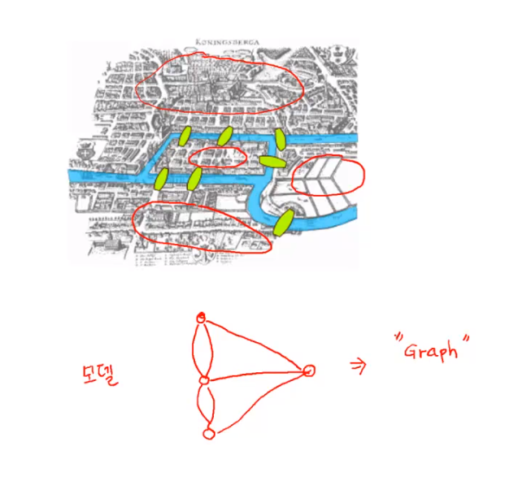
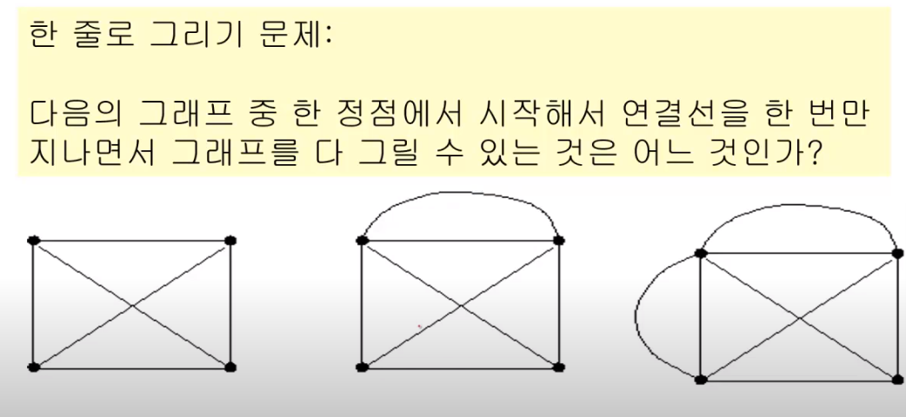
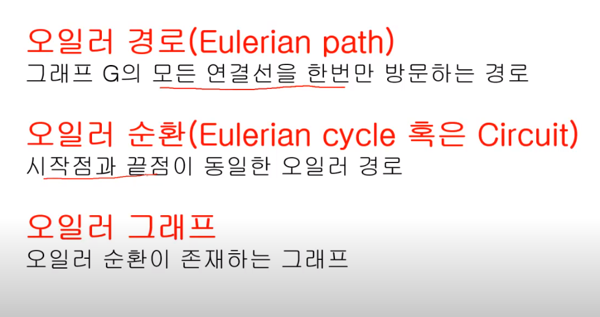
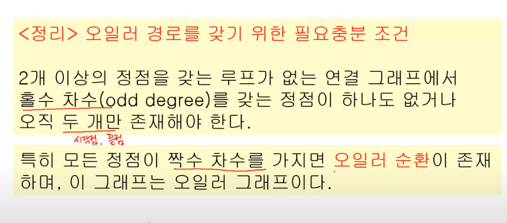
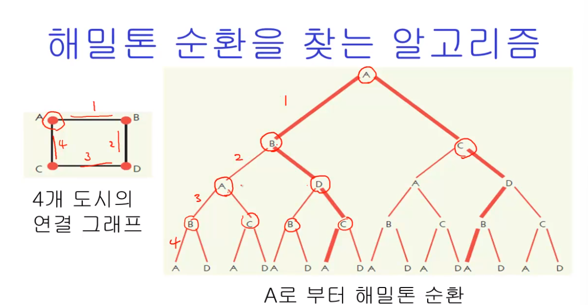
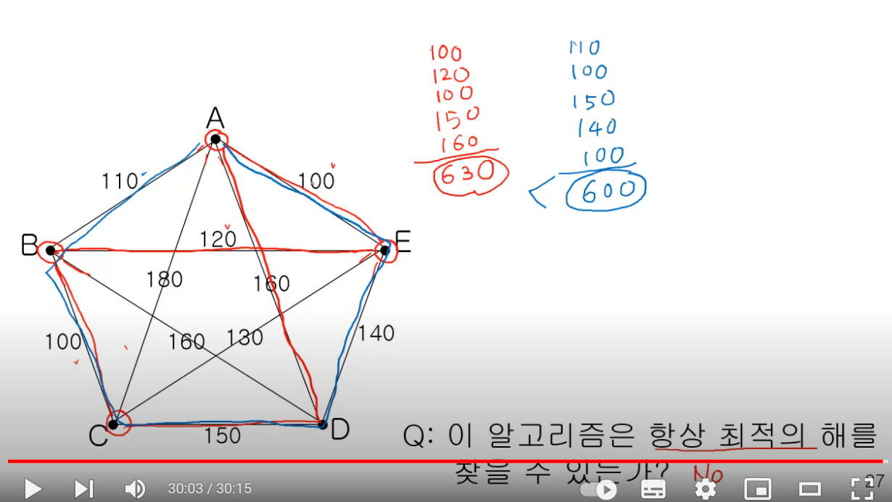

# 그래프 1
- 왜 그래프인가?
- 오일러 그래프와 해밀턴 그래프

< 모델링 >

현실 문제 -> 모델 -> 해결법



그래프 라는 개념과 그래프 알고리즘

## 그래프의 정의

정점과 정점들을 연결하는 선으로 이루어진 모형

## 한 줄로 그리기 문제

다음의 그래프 중 한 정점에서 시작해서 연결선을 한 번만 지나면서 그래프를 다 그릴수 있는 것은 어느 것인가? 



> 이걸 해결한게 오일러



- 차수
 - 정점에 접합된 연결선의 수
 - 루프의 경우엔 하나로 치지 않고, 각각을 따로 계산한다

### 오일러 경로 - 차수의 짝수, 홀수 기준으로 생각
- 모든 *연결선*을 지나야 한다.

- 중간 정점
    - 연결선이 무조건 짝수로 있어야 한다.
        - '중간'이기 때문에, '들어오는 선'과 '나가는 선'으로 구분된다
- 시작 정점
    - 나가는 선이 기준이 되므로 홀수로 연결되어야 한다
- 끝점 
    - 얘도 마찬가지로 홀수

> 오일러 정리



- 2 개 이상의 정점을 갖는 루프가 없는 연결 그래프에서, 홀수 차수를 갖는 정점이 하나도 없거나 혹은 오직 2개(시작,끝)만 존재해야 한다
- 특히 모든 정점이 짝수 차수를 가지면 **오일러 순환**이 존재하며, 이 그래프는 오일러 그래프이다.

#### 오일러 정리의 알고리즘 복잡도
- 모든 정점 n * 차수
- n*(n-1) 보단 작다 -> 최대 O(n**2)

### 해밀턴 경로 
- 연결선이 아닌 *모든 정점*을 한 번만 지나는 경로
- 해밀턴 순환 : 시작점과 끝점이 같은 해밀턴 경로
- 안 지나는 연결선이 존재할 수 있다

#### 해밀턴 알고리즘 (= 해밀턴 정리)

존재하지 않는다. 모두 직접 해봐야 함

> shb) 이건 완탐으로 해보면 충분히 가능할 듯



node의 수가 n개라면 2^n개의 가지

- 알고리즘 복잡도 : O(X**n)(n:정점의 수)
- 복잡도 함수가 지수식
- 몹시 어려운 문제
- 유사한 복잡도 문제
    - 암호 해독
    - 바둑
    - Bin packing

#### 해밀턴 순환 예시
- 방문 판매원 문제
    - 연결선에는 비용이 주어진다(weighted edge)
    - 일반적으로 완전 그래프
    - 이 그래프에서 비용이 최소가 되는 해밀톤 순환을 찾는 문제 (shb.최소 신장 트리 문제)

### TSP 알고리즘 1
- 모든 해밀톤 순환을 찾아서 합한 비용이 가장 작은 순환을 선택 -> 완탐

### TSP 알고리즘 2

#### 단순 TSP 알고리즘
1. 하나의 정점을 선택하여 출발점으로 한다.
2. 이 정점에 연결된 연결선의 비용이 가장 작은 정점을 선택한다
3. 이 정점에서부터 아직 선택되지 않은 정점들 중에서 연결선의 비용이 가장 작은 정점을 선택한다
4. 모든 정점을 선택할 때까지 2와 3의 절차를 반복한다

> PRIM 알고리즘


```py
''' 
7 11
0 1 32
0 2 31
0 5 60
0 6 51
1 2 21
2 4 46
2 6 25
3 4 34
3 5 18
4 5 40
4 6 51
'''

import sys
sys.stdin = open("input.txt","r")

V,E = map(int,input().split())
#인접행렬로 시작
# - [실습] 인접 리스트로 저장

graph = [[0] * V for _ in range(V)]

for _ in range(E):
    s,e,w = map(int,input().split())
    # 가중치 저장


    # [기존] 3-> 4로 갈 수 있다
    # graph[3][4] = 1

    # [가중치 그래프] 3->4로 가는데 31이라는 비용이 든다
    # graph[3][4] = 31

    graph[s][e] = w
    # 무방향 그래프
    graph[e][s] = 2

from heapq import heappop, heappush # 우선순위 큐
def prim(start):
    pq = [] # 힙
    mst = [0]*V # visited

    #최소비용
    sum_weight = 0

    # 시작점
    # [기존 BFS] 노드 번호만 관리 -> pq.append(start)

    # [PRIM] 우선 순위가 가중치에 따라 => 가중치가 낮으면 먼저 나와야 한다
    #  => 관리해야할 데이터 : 가중치, 노드번호 2가지
    # -> 동시에 두 가지 데이터 다루기
    # 1. 노드를 class로 만들기, 쓰진 않을거임 3개부턴 고려
    # 2. 튜플로 관리

    heappush(pq,(0,start))

    while pq:
        weight,now = heappop(pq)

            
        # 방문했다면 continue
        if mst[now]:
            continue
        # 얘가 BFS엔 없고 PRIM에 있는 이유>
        # BFS: 무조건 방문.
        # PRIM:: 일단 pq에 넣고 방문 x => 마지막에 남아있음
        # 우선순위 큐의 특성 상 더 먼거리로 가는 방법이 큐에 저장이 되어 있기 떄문에 기존에[ 미이 더 짧은 거리로 방문했다면, continue

        
        # 방문처리
        mst[now] = 1
        # 누적합 추가
        sum_weight += weight


        # 갈 수 있는 노드들을 보면서 
        for to in range(V):

            # print(now,'/',mst)

           

     
            # 갈 수 없거나 이미 방문했다면 pass
            if not graph[now][to] or mst[to]:
                continue

            heappush(pq,(graph[now][to],to))

        
    
    print(f'최소비용: {sum_weight})
```
> 이 알고리즘은 항상 최적해를 구할 수 있는가? NO

- why? 일종의 그리디



