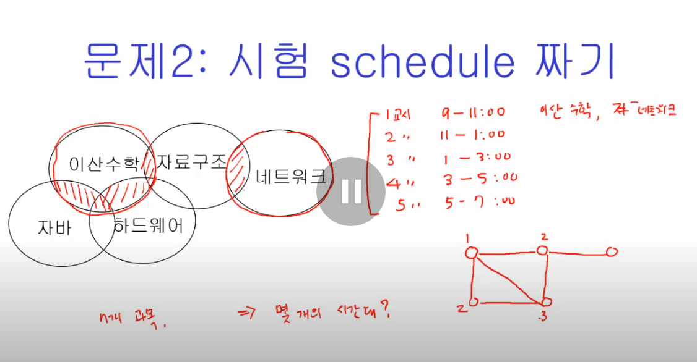
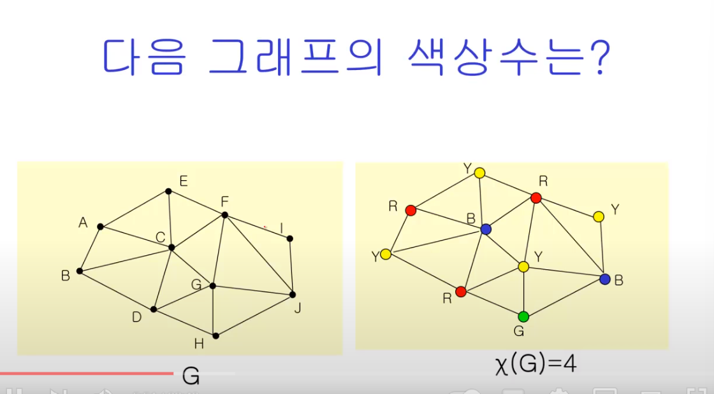
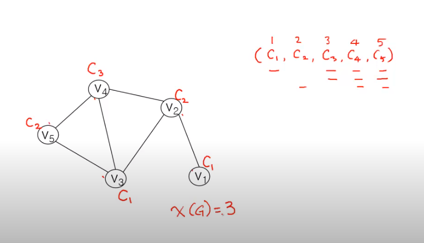
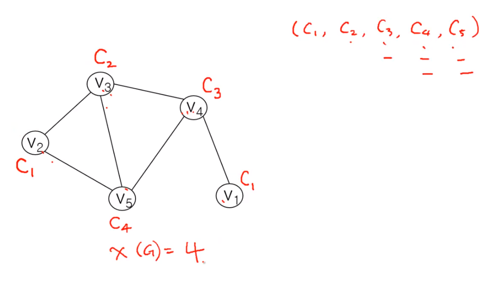
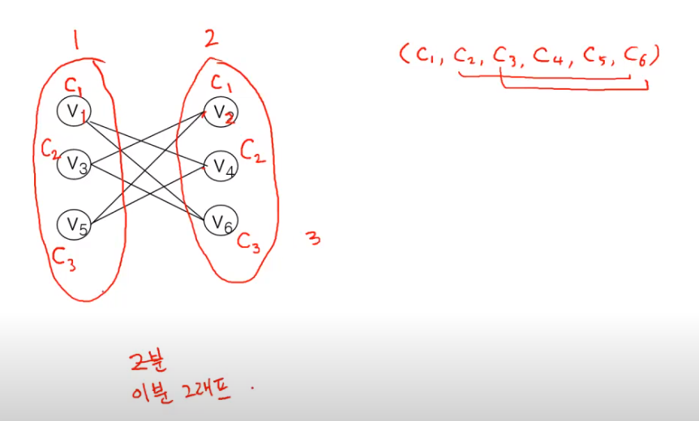
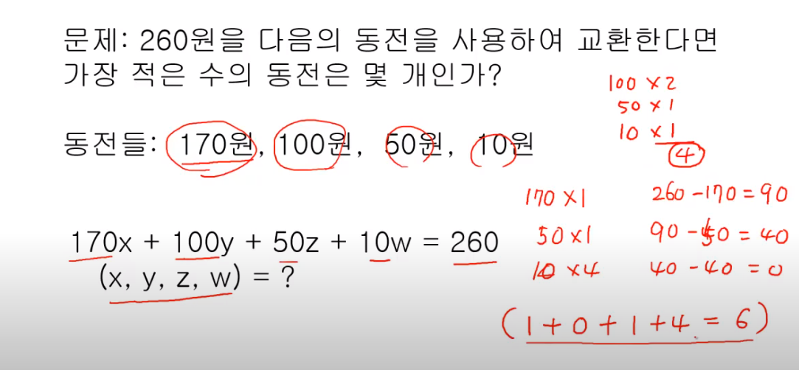

# 그래프 3 - 그래프 채색 문제와 탐욕 알고리즘

### 문제 1 : 주파수 할당

n개의 cell이 있을 때, 몇 개의 주파수를 사용해야 하나?

### 문제 2 : 시험 schedule 짜기

n개 과목, 몇 개의 시간대?

### 문제 3 : 지도 색칠하기

최소 몇 개의 크래파스?

#### 문제 1,2,3 모두 같은 문제다.

## 그래프의 채색

- 그래프 채색
     - 인접하고 있는 정점들은 서로 다르 색을 갖도록 하면서, 그래프의 모든 정점에 색을 할당

- 색상 수
    - 그래프 채색에 필요한 최소한의 색의 수
    - x(G)로 표현

> 완전 그래프의 색상 수? 노드 수만큼
> 이분 그래프의 경우? 2개

### Simple coloring algorithm

1. 모든 정점들의 순서를 정한다.
2. 모든 색상들의 순서를 정한다.
3. From v1 to vn
    - 그래프 채색의 조건을 만족하는 색상 중에서 가장 낮은 번호의 색상으 선택하여 vi에 배정한다. 

> 근데 정점의 순서에 따라 값이 달라지지 않을까?

> 정점들의 순서에 따라서 값이 달라진다. => 이 순서를 정하는 알고리즘이 다시 필요해진다

## Greedy algorithm
- 단순히 '그 순간에서' '최선'의 선텍
- 앞에서 simple coloring이 그리디의 일종
- 최종적으로 다를 수 있다.

### 동전 정하기

 
매순간 최적의 선택이지만, 모든 정보를 갖는게 아니기에 당연히 완전히 최적해를 구하는건 아니다.
