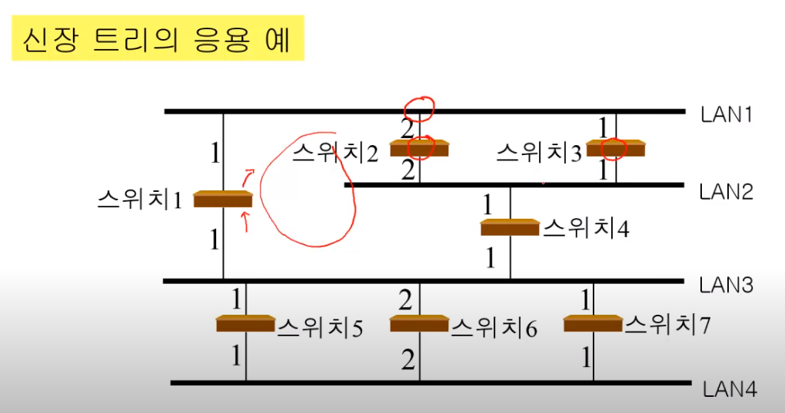
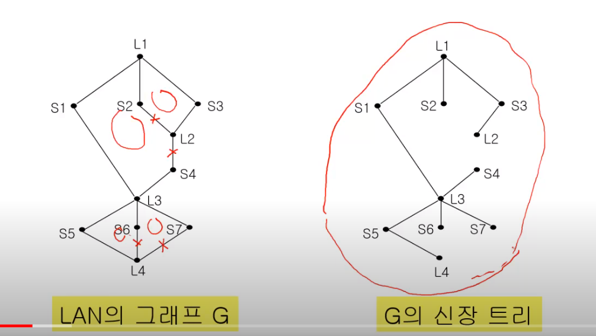
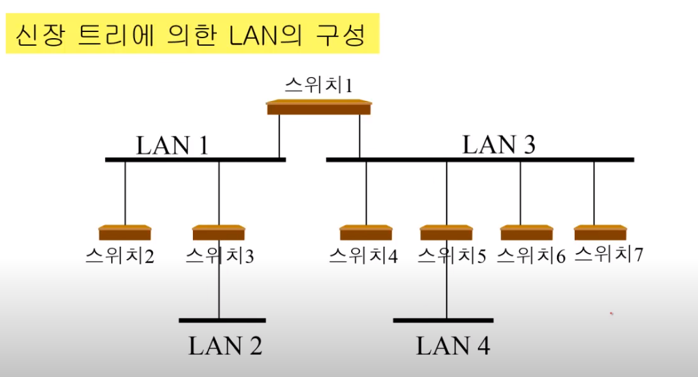
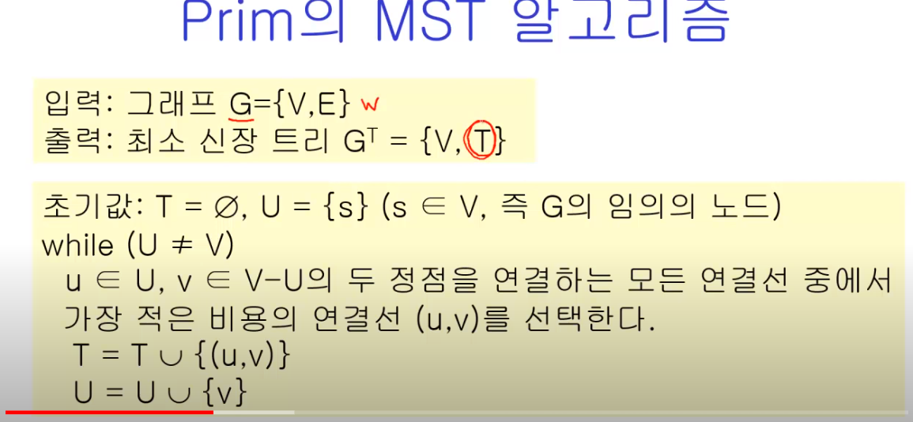
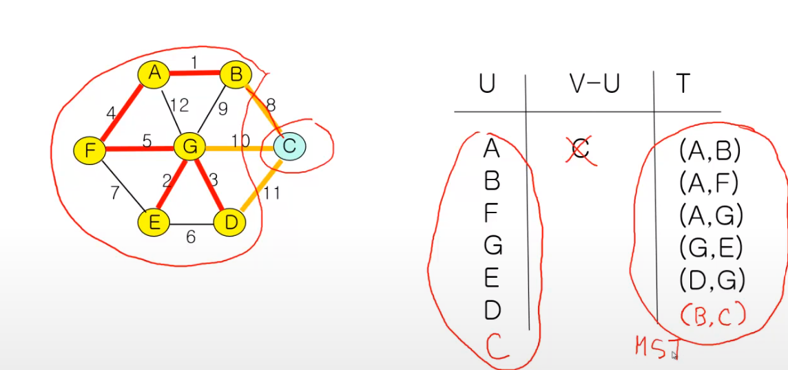
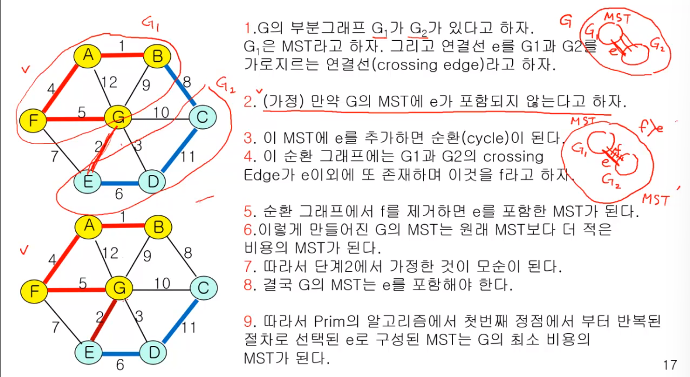
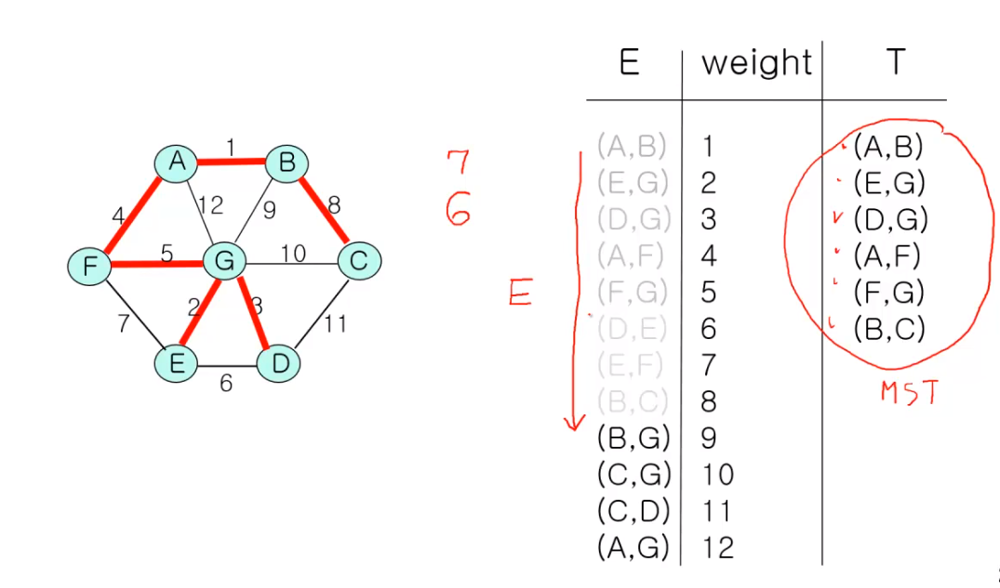

# 최소 신장 트리 (Minimum Spaning Tree)

## 신장 트리

- 모든 정점을 포함하면서(신장) 순환이 존재하지 않는 부분 그래프(트리)








## 최소 신장 트리

- 가중 그래프에서 가중치의 합을 최소로 하는 신장 트리

- 알고리즘
    - Prim
    - Kruskal

### Prim



특정 노드를 선택하고, 그 노드와 다른 노드 집합(덩어리)끼리의 연결선 중 '최소값'을 선택하는 것을 반복



- 그리디 알고리즘
- 하지만, prim은 모든 그래프에서 최적해를 구할 수 있다.
- 증명? A와 B를 연결하는 간선 중 최소값이 아닌 다른 걸 연결한다 생각하면 무조건 최종 값이 더 커짐



> 복잡도? (모든 정점)*(모든 정점)보다는 작다
> 구현(data struccture)에 따라 달라진다


```py
''' 
7 11
0 1 32
0 2 31
0 5 60
0 6 51
1 2 21
2 4 46
2 6 25
3 4 34
3 5 18
4 5 40
4 6 51
'''

import sys
sys.stdin = open("input.txt","r")

V,E = map(int,input().split())
#인접행렬로 시작
# - [실습] 인접 리스트로 저장

graph = [[0] * V for _ in range(V)]

for _ in range(E):
    s,e,w = map(int,input().split())
    # 가중치 저장


    # [기존] 3-> 4로 갈 수 있다
    # graph[3][4] = 1

    # [가중치 그래프] 3->4로 가는데 31이라는 비용이 든다
    # graph[3][4] = 31

    graph[s][e] = w
    # 무방향 그래프
    graph[e][s] = 2

from heapq import heappop, heappush # 우선순위 큐
def prim(start):
    pq = [] # 힙
    mst = [0]*V # visited

    #최소비용
    sum_weight = 0

    # 시작점
    # [기존 BFS] 노드 번호만 관리 -> pq.append(start)

    # [PRIM] 우선 순위가 가중치에 따라 => 가중치가 낮으면 먼저 나와야 한다
    #  => 관리해야할 데이터 : 가중치, 노드번호 2가지
    # -> 동시에 두 가지 데이터 다루기
    # 1. 노드를 class로 만들기, 쓰진 않을거임 3개부턴 고려
    # 2. 튜플로 관리

    heappush(pq,(0,start))

    while pq:
        weight,now = heappop(pq)

            
        # 방문했다면 continue
        if mst[now]:
            continue
        # 얘가 BFS엔 없고 PRIM에 있는 이유>
        # BFS: 무조건 방문.
        # PRIM:: 일단 pq에 넣고 방문 x => 마지막에 남아있음
        # 우선순위 큐의 특성 상 더 먼거리로 가는 방법이 큐에 저장이 되어 있기 떄문에 기존에[ 미이 더 짧은 거리로 방문했다면, continue

        
        # 방문처리
        mst[now] = 1
        # 누적합 추가
        sum_weight += weight


        # 갈 수 있는 노드들을 보면서 
        for to in range(V):

            # print(now,'/',mst)

           

     
            # 갈 수 없거나 이미 방문했다면 pass
            if not graph[now][to] or mst[to]:
                continue

            heappush(pq,(graph[now][to],to))

        
    
    print(f'최소비용: {sum_weight})

```

### Kruskal

- 우선 모든 간선을 정렬한다.
- 주의 : 순환(사이클)이 만들어지면 안된다



> 복잡도?
> 구현에 따라 다른데, 최소 E*V

```py
# 1. 전체 그래프를 보고, 가중치가 제일 작은 간선부터 뽑자
#   -> 코드로 구현 : 전체 간선 정보를 저장 + 가중치로 *정렬*

# 2. 방문 처리 : *사이클이 발생하면 안된다!* -> 크루스칼의 가장 중요한 2가지는 정렬과 사이클 탐색
# 사이클 여부? union-find 알고리즘 활용

V,E = map(int,input().split())
edges = [] # 간선 정보들을 모두 저장

for _ in range(E):
    s,e,w = map(int,input().split())

    edges.append([s,e,w])

edges.sort(key=lambda x:x[2]) #가중치를 기준으로 정렬

parents = list(range(V))
def find_set(x):
    if parents[x] == x:
        return x
    
    # 경로 압축
    parents[x] = find_set(parents[x])
    return parents[x]


def union(x,y):
    x = find_set(x)
    y = find_set(y)

    if x== y:
        return
    
    if x<y:
        parents[y] = x
    
    else:
        parent[x] = y


cnt = 0

for s,e,w in edges: #간선들을 모두 확인한다.
    # 사이클이 발생하면 pass, 사이클-> 이미 같은 집합에 속해있다. 1-2-3-1 => 1,2,3이 모두 1을 가리킴
        # how? 이미 같은 집합에 속해 있다면 pass
    if find_set(s) == find_set(e):
        print(s,e,w.'/사이클 발생. 탈락.')
        continue
    
    print(s,e,w)
    #k
    cnt += 1

    # 사이클이 없으면 통과
    # 사이클이 없으면 방문 처리
    union(s,e) # 얘가 방문처리, 둘에게 같은 대표자를 부여해서 사이클이 나오지 않도록 함
    sum_weight += w

    #k
    if cnt == V -1: # MST 완성! 간선 갯수 V-1
        break
```