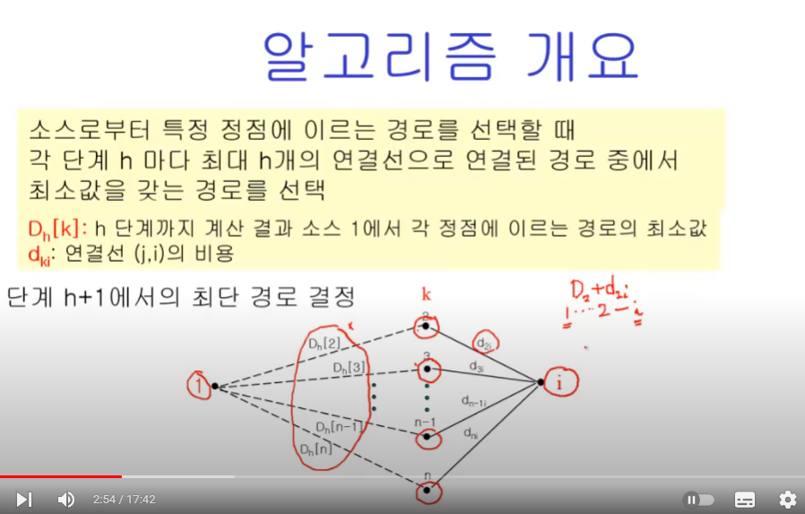
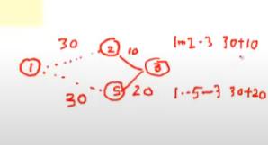
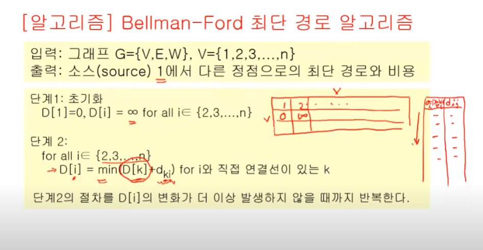
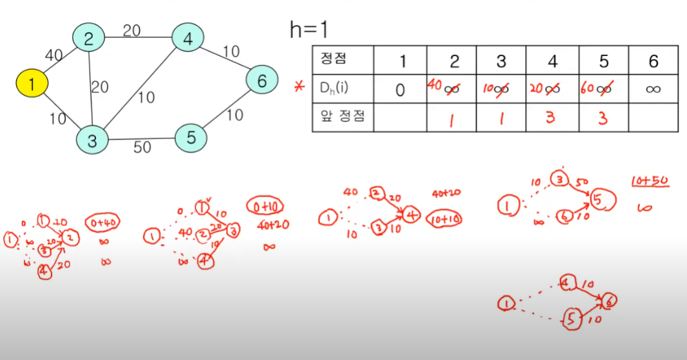
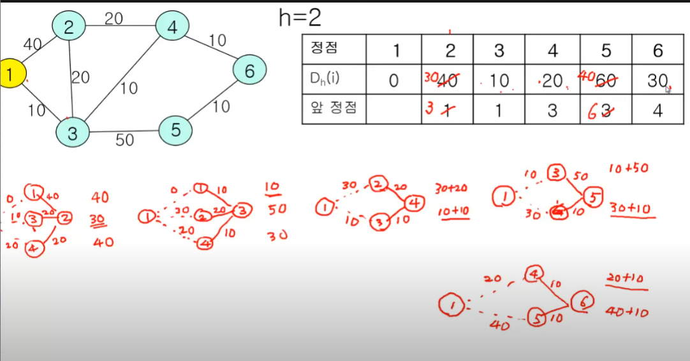

# 최단경로 알고리즘
## Bellman-Ford 알고리즘
- Single-Source에서 모든 정점까지의 최단거리 결정
- 방향, 비방향 모두 적용
- 가중치가 음수일 때도 적용
  - 하지만 *순환*의 노선은 가중치 합이 양수여야 함
- 인터넷의 라우팅 프로토콜에서 사용
  - RIP, BGP

### 알고리즘 개요

> shb : 일종의 DP





### 알고리즘





1번에서 한걸 완성했고, 이제 이걸 지속적으로 갱신해줘야함



이걸 몇 번 update 해줘야 하나?

-> 더 이상 cost의 변경이 없을 때까지


```py
import sys
input = sys.stdin.readline
INF = int(1e9) # 무한을 의미하는 값으로 10억을 설정

# 노드의 개수, 간선의 개수를 입력받기
n, m = map(int, input().split())
# 모든 간선에 대한 정보를 담는 리스트 만들기
edges = []
# 최단 거리 테이블을 모두 무한으로 초기화
distance = [INF] * (n + 1)

# 모든 간선 정보를 입력받기
for _ in range(m):
    a, b, c = map(int, input().split())
    # a번 노드에서 b번 노드로 가는 비용이 c라는 의미
    edges.append((a, b, c))

def bf(start):
    # 시작 노드에 대해서 초기화
    distance[start] = 0
    # 전체 n - 1번의 라운드(round)를 반복
    for i in range(n):
        # 매 반복마다 "모든 간선"을 확인하며
        for j in range(m):
            cur_node = edges[j][0]
            next_node = edges[j][1]
            edge_cost = edges[j][2]
            # 현재 간선을 거쳐서 다른 노드로 이동하는 거리가 더 짧은 경우
            if distance[cur_node] != INF and distance[next_node] > distance[cur_node] + edge_cost:
                distance[next_node] = distance[cur_node] + edge_cost
                # n번째 라운드에서도 값이 갱신된다면 음수 순환이 존재
                if i == n - 1:
                    return True
    return False

# 벨만 포드 알고리즘을 수행
negative_cycle = bf(1) # 1번 노드가 시작 노드

if negative_cycle:
    print("-1")
else:
    # 1번 노드를 제외한 다른 모든 노드로 가기 위한 최단 거리를 출력
    for i in range(2, n + 1):
        # 도달할 수 없는 경우, -1을 출력
        if distance[i] == INF:
            print("-1")
        # 도달할 수 있는 경우 거리를 출력
        else:
            print(distance[i])
```
- shb 추가
  - 매번 모든 간선을 전부 확인한다.
    - 따라서 다익스트라 알고리즘에서의 최적해를 항상 포함한다
  - 모든 간선을 확인하므로 시간이 좀 오래걸리지만, *음수 간선 순환*을 **탐지**할 수 있다.

1. 출발 노드를 설정한다.
2. 최단 거리 테이블을 초기화한다.
3. 다음의 과정을 노드개수-1번 반복한다.
    1. 전체 간선 E개를 하나씩 확인한다.
    2. 각 간선을 거쳐 다른 노드로 가는 비용을 계산하여 최단 거리 테이블을 갱신한다.
    → 출발 노드가 방문한 적 없는 노드(출발거리 == INF)일 때 값을 업데이트 하지 않는다.
    → 출발 노드의 거리 리스트값 + 에지 가중치 < 종료 노드의 거리 리스트 값 일 때 종료 노드의 거리 리스트 값을 업데이트 한다.
4. 만약 음수 간선 순환이 발생하는지 체크하고 싶다면 3번의 과정을 한 번 더 수행한다.
→ 이 때 최단 거리 테이블이 갱신된다면 음수 간선 순환이 존재하는 것이다.

### 알고리즘 복잡도

O(V*E)