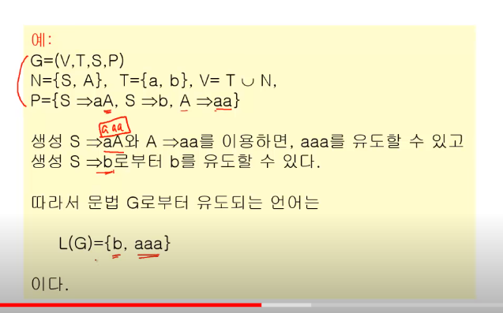
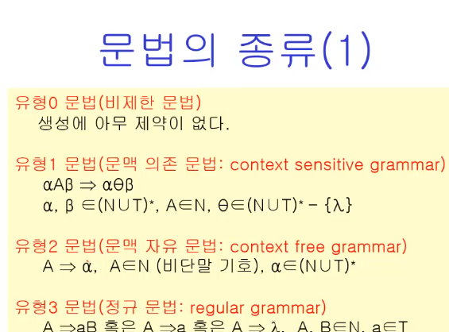
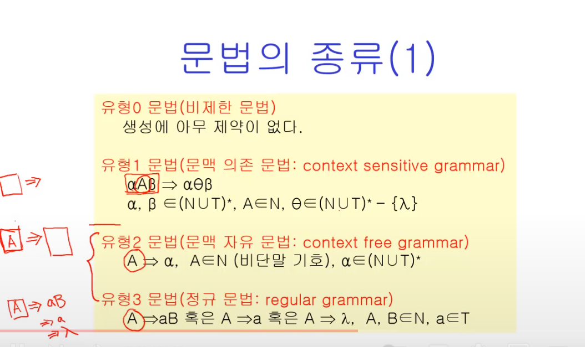
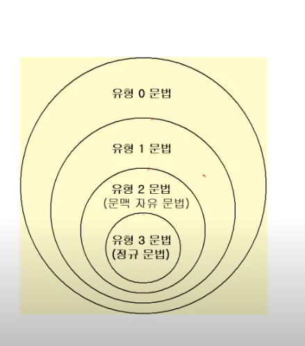
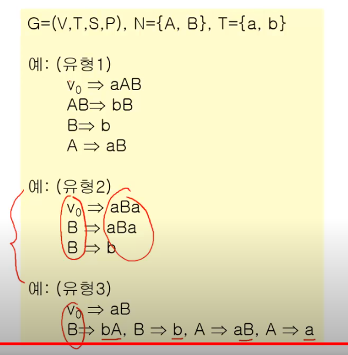
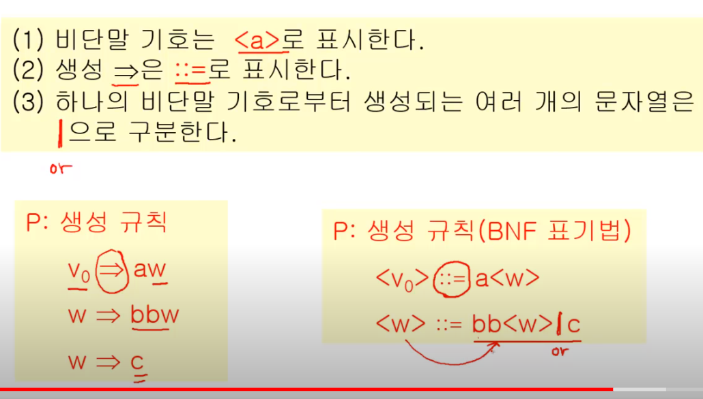
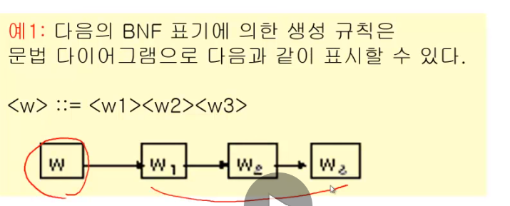
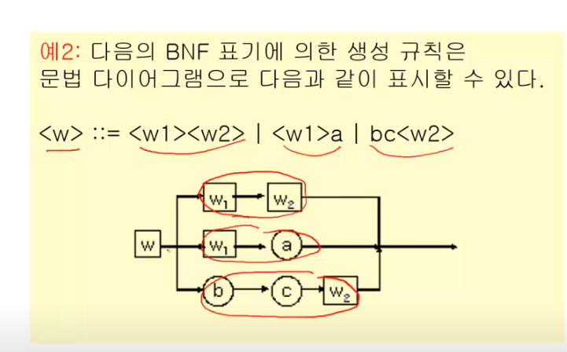
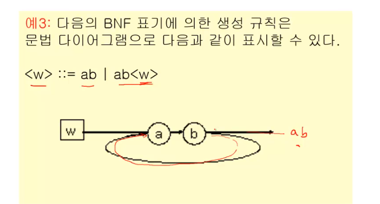

# 형식 언어와 오토마타
- 형식 언어와 문법
- 정규식과 정규 집합
- 유한상태기계
- 오토마타와 정규 문법

## 형식 언어와 문법

### 언어
S: 기호들의 집합

S*: S로부터  만들어지는 모든 유한 문자열들

예) S: 알파벳, S*: 모든 가능한 문장들

    S = {정수,+,-,X,/,(,)}, S* : 모든 가능한 수식들 

### 언어의 구성요소

1. 기호들의 집합 S
2. 문장들의 집합을 만드는 규칙(문법) S*
3. 합당한 의미 (semantics), 의미론

문법과 의미는 다르다.

### 형식 언어

V(심벌)를 규칙(문법)에 따라 V*(언어)을 만든다.

### 구-구문 문법

G = (V,T,S,P)

- V: 기호의 집합 == TUN(비단말기호)
- T : 단말기호
- S : 시작기호(N으로 쓰기도 함)
- P : 생성규칙 (=>로 표시)

>shb, 생성 조건에서 뭐가 먼저 적용되는건가??

### 언어와 문법

#### 문법의 종류

갈수록 제약이 늘어난다.

컴퓨터 문법은 유형 2 내에서 끝난다. (유형2~유형3)

여기선 유형 3만

왼쪽엔  비단말 기호 하나만 들어간다.

### 문법의 표현

- BNF (Backus-Naur Form) 형식
- 문법 다이어그램
- 유도트리

#### BNF

1) 비단말 기호는 < a >로 표시한다,
2) 생성 => 는 ::= 로 표시한다.
3) 하나의 비단말 기호로부터 생성되는 여러 개의 문자열은 |로 구분한다.  

#### 문법 다이어그램

1) 비단말 기호는 사각형으로, 단말 기호는 원으로 그린다
2) 생성 과정은 화살표로 표시한다
3) 하나의 비단말 기호로부터 생성되는 여러 개의 문자열은 병렬로 놓고 화살표로 표시한다.

