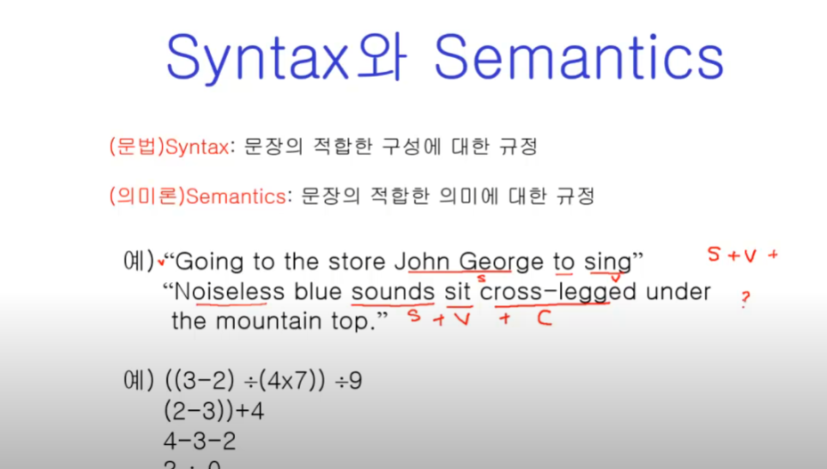
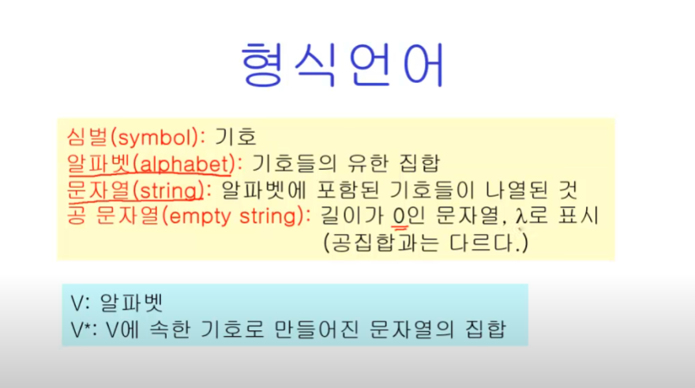
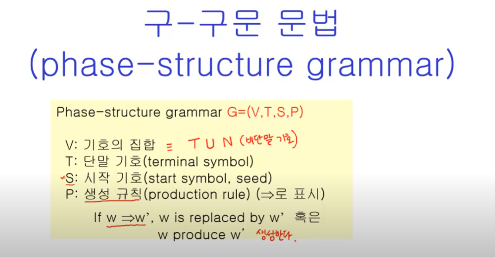
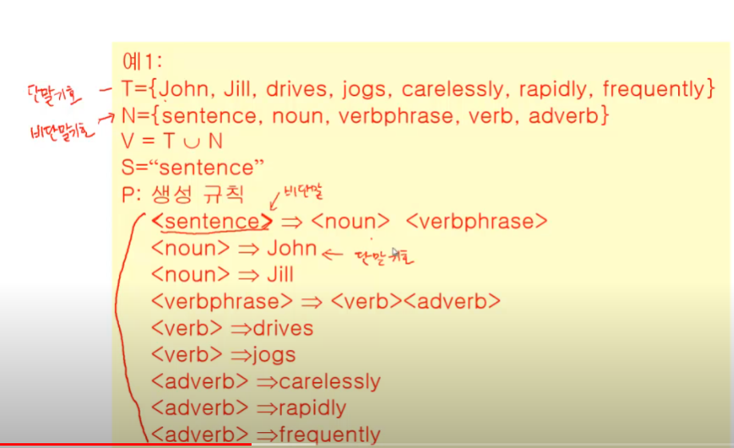
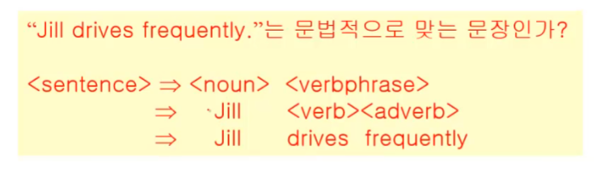
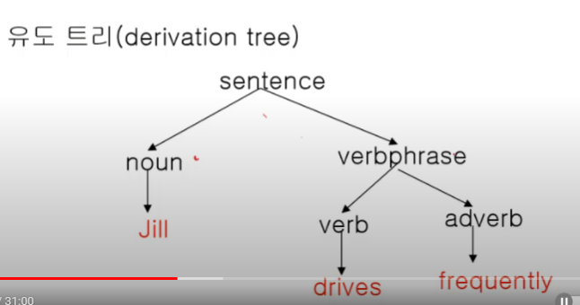
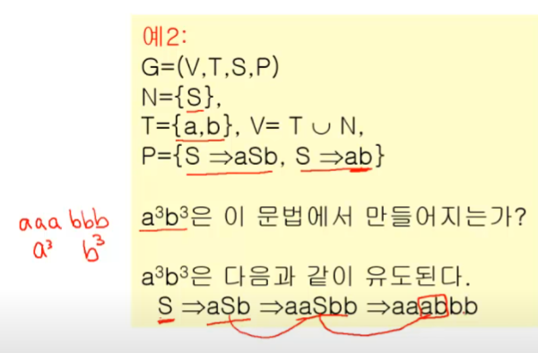
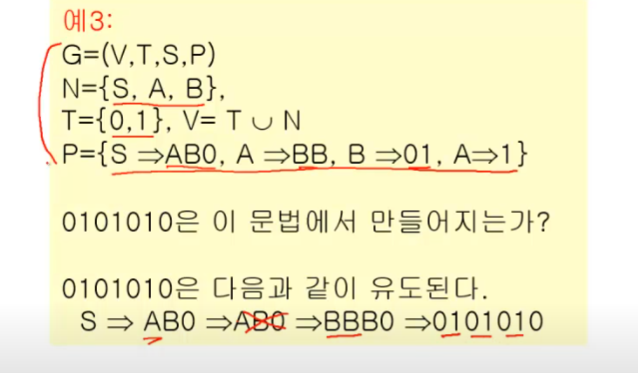

# 형식 언어와 오토마타
- 형식 언어와 문법
- 정규식과 정규 집합
- 유한상태기계
- 오토마타와 정규 문법

## 형식 언어와 문법

### 언어
S: 기호들의 집합

S*: S로부터  만들어지는 모든 유한 문자열들

예) S: 알파벳, S*: 모든 가능한 문장들

    S = {정수,+,-,X,/,(,)}, S* : 모든 가능한 수식들 

### 언어의 구성요소

1. 기호들의 집합 S
2. 문장들의 집합을 만드는 규칙(문법) S*
3. 합당한 의미 (semantics), 의미론

문법과 의미는 다르다.

### 형식 언어

V(심벌)를 규칙(문법)에 따라 V*(언어)을 만든다.

### 구-구문 문법

G = (V,T,S,P)

- V: 기호의 집합 == TUN(비단말기호)
- T : 단말기호
- S : 시작기호(N으로 쓰기도 함)
- P : 생성규칙 (=>로 표시)

>shb, 생성 조건에서 뭐가 먼저 적용되는건가??

