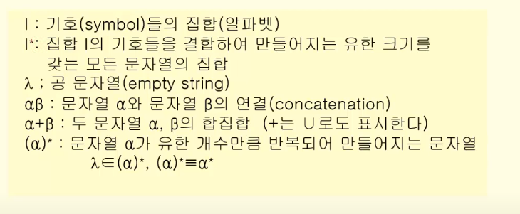
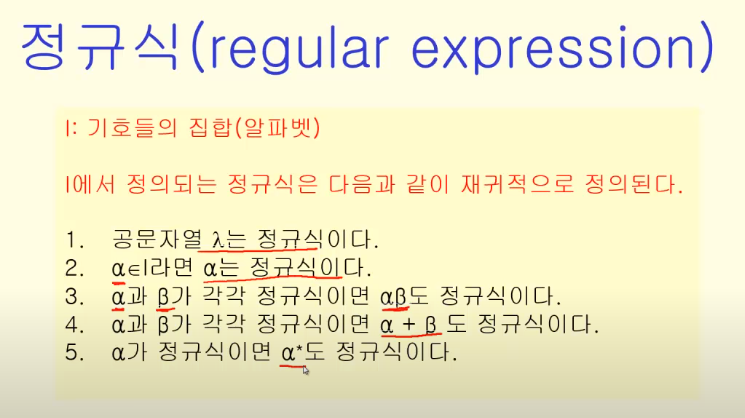
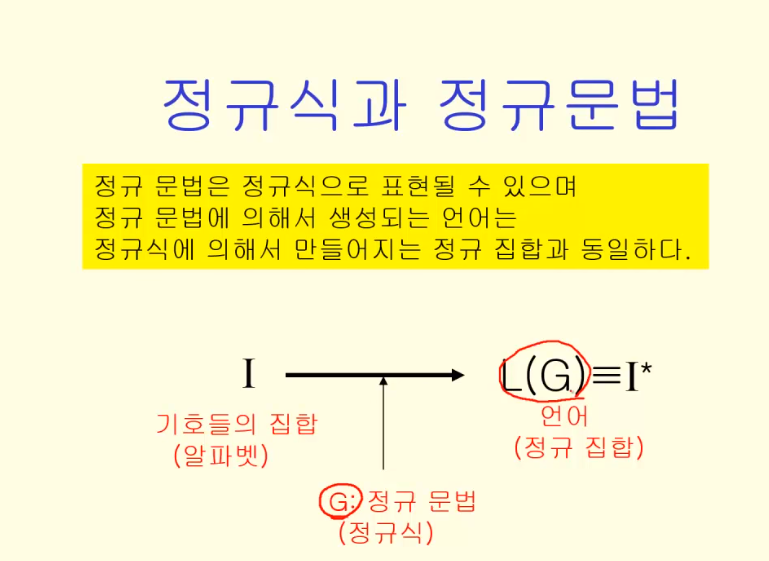

## 정규식과 정규 문법

### 정규식

I = {0,1}일 때, 다음의 정규식은?

1) (0+1)(0+1)*

(0+1)* ->공백, 0과 1로 이루어진 모든 문자열

(0+1) -> 무조건 공백 없이 0과 1이 나올 수 있도록 붙여준것

2) 0(0+1)*1:

0으로 시작해서 1로 끝나는 모든 문자열

3) (01)* (01+1*)

(01)* -> 람다, 01,0101,010101,....

(01+1*) -> 01+ 람다, 1, 11, 11...

### 정규 집합

정규식으로 만들어지는 집합

정규식과 정규 문법은 같은거다.