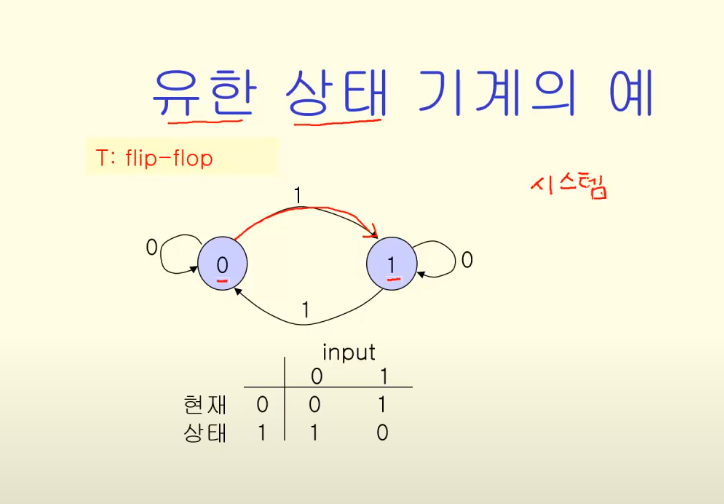
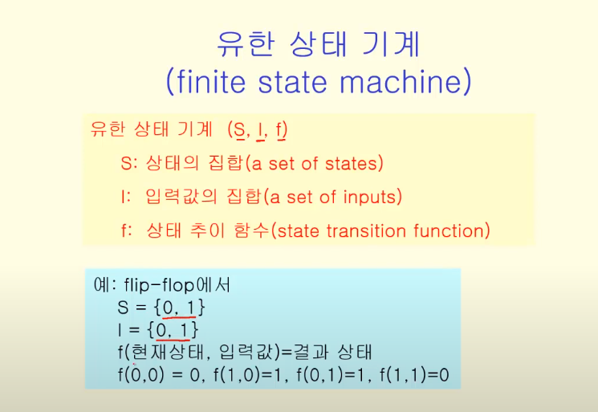
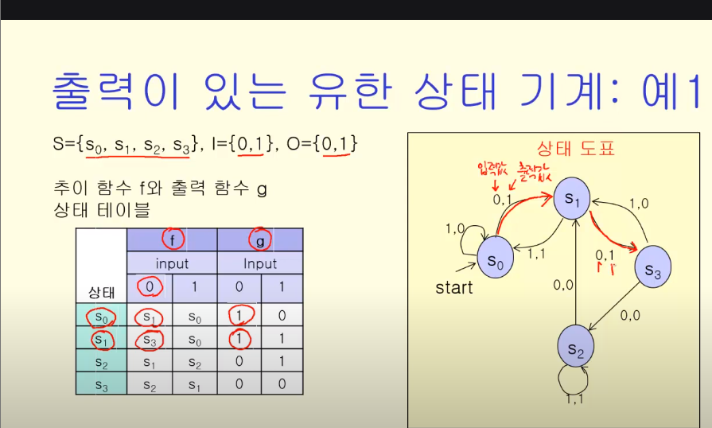
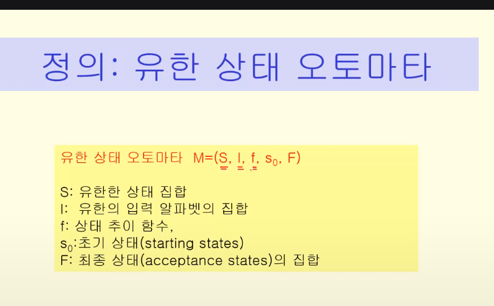
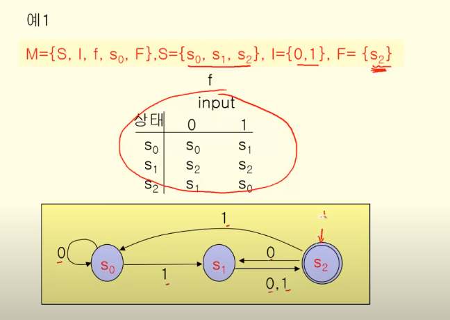
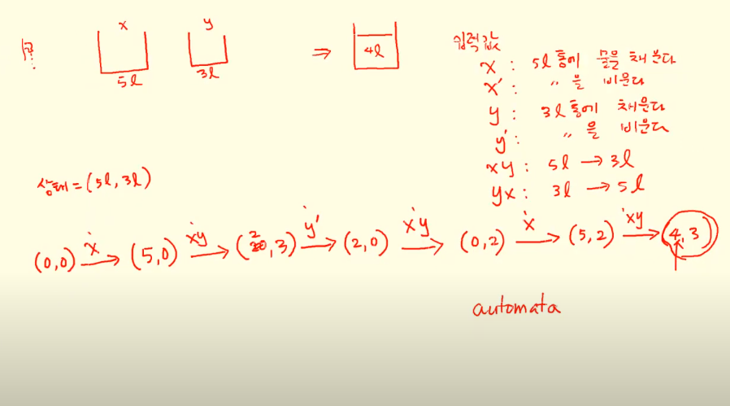

## 유한 상태 기계

말 그대로 상태가 유한한거

Flip-flop : 상태 2개, 인풋 2개

심리현상, 경계현상,생태계 등도 모델링을 할 때 많이 사용

### 유한상태기계 유형

- 출력 o
    - 

- 출력 x
    - Finite-State Automata
- 이외(튜링머신 같은거)

#### 출력 o

대표적인 예시? 자동 판매기

 
 
 #### 출력 x

 유한 상태 오토마타

 -> 출력이 없고, 최종 상태의 집합이 존재.

 시작 상태에서 최종 상태에 도달하는 입력값들만 인식

 *언어를 인식하는 기계를 모델링할 때*

다른 점은 출력함수가 아닌 최종 상태인 F

예시) 5L와 3L 통으로 4L 만들기

