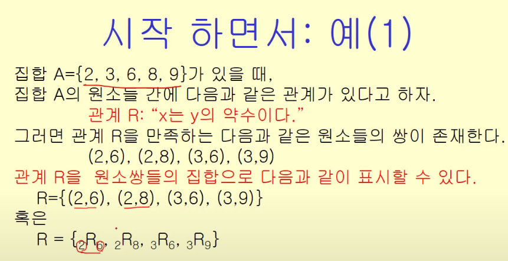
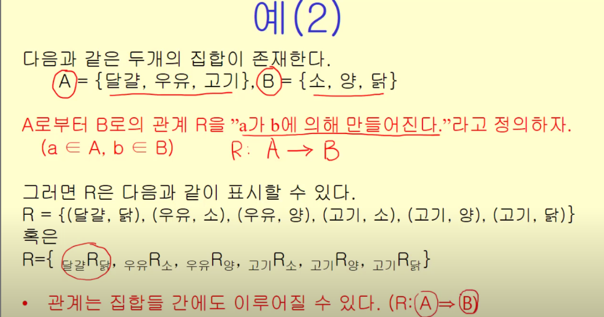
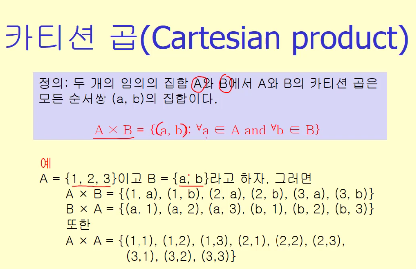
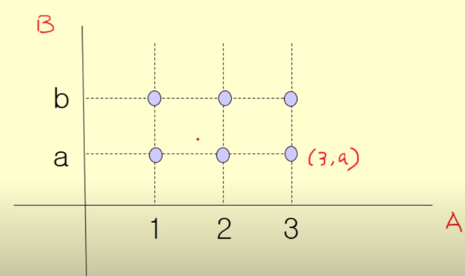
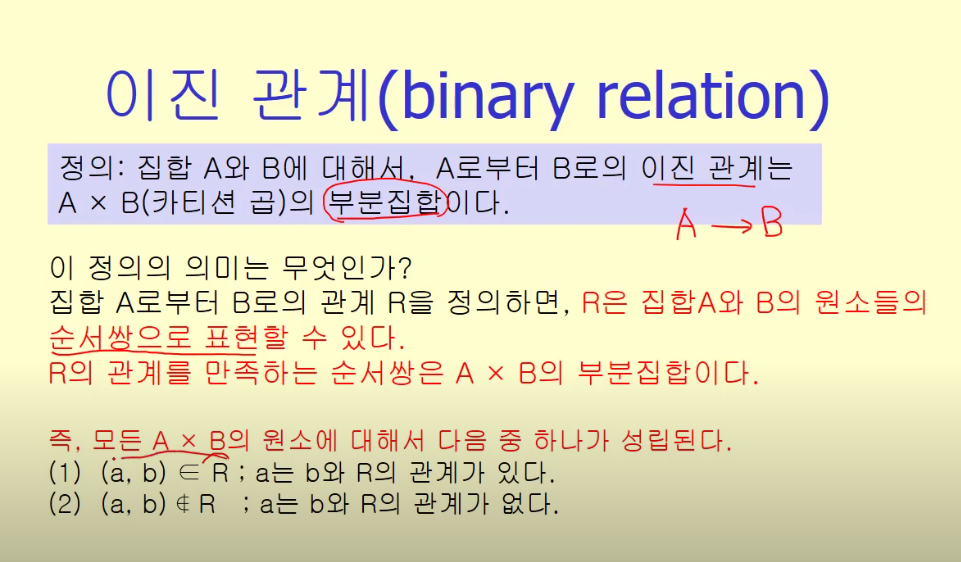
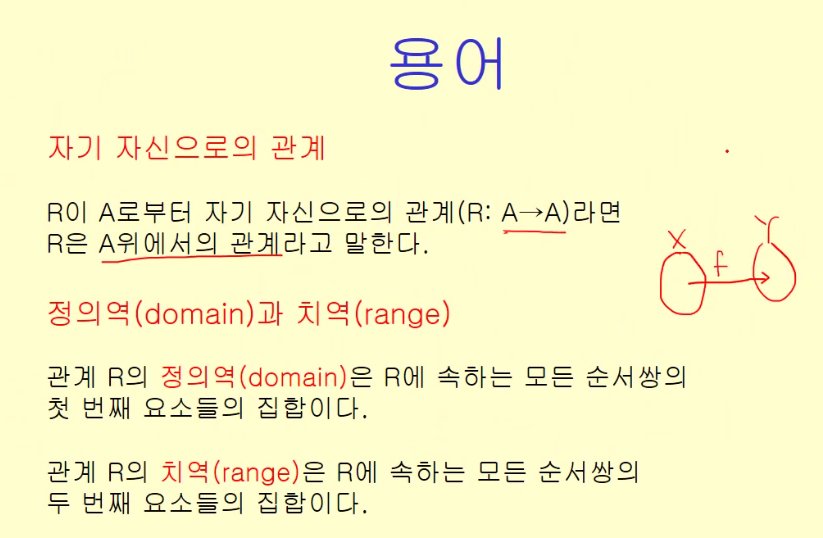

# 관계(Relation)

- 관계의 개념
- 관계의 표현
- 관계들의 합성
- 관계들의 유형
- 관계의 닫힘
- 동치관계
- 순서관계

## 관계의 개념

### 예시1

> 관계 R은 집합 A의 원소들 사이에서 정의된다
> 관계를 구성하는 쌍들은 '순서'쌍이다 -> 순서가 중요

### 예시2

서로 다른 집합 사이의 관계 표시

> 관계는 집합들 간에도 이루어질 수 있다.

### 카티션 곱

집합 A와 B의 카티션 곱은 각각의 원소 a와 b의 모든 순서쌍의 집합

이런 식으로 표현할 수도 있다

- 주요 특징
1. 순서가 중요
2. 그 수는 A의 원소수와 B의 원소수의 곱
3. 집합 2개가 아니라 집합 N개에서도 가능
    - 만약 같은 집합의 순서쌍이면 승수로 표현할 수도 있다

### 이진관계

- 두 집합 사이의 관계
- A로부터 B로의 이진관계는 AXB의 부분집합이다.

결국 A와 B의 관계는 모두 카티션 곱의 일부이다.

