# 8장 데이터 베이스 언어 SQL

- SQL의 소개
- SQL을 이용한 데이터 정의
- SQL을 이용한 데이터 조작

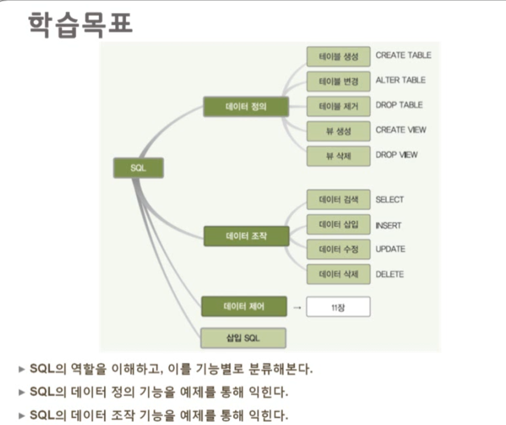

## 1. SQL의 소개

### SQL

> 데이터 베이스와 소통하기 위한 언어

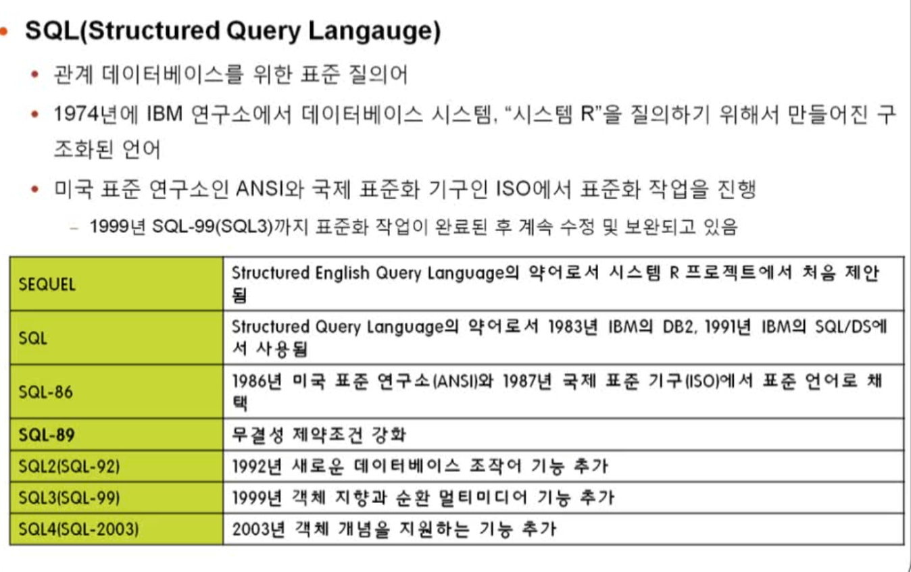

### SQL의 분류

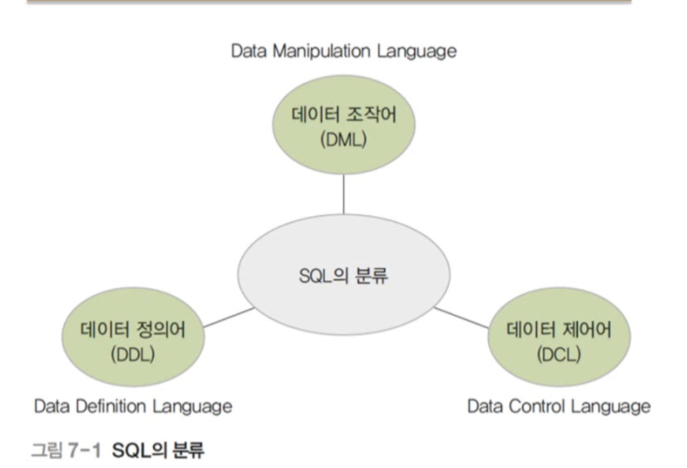

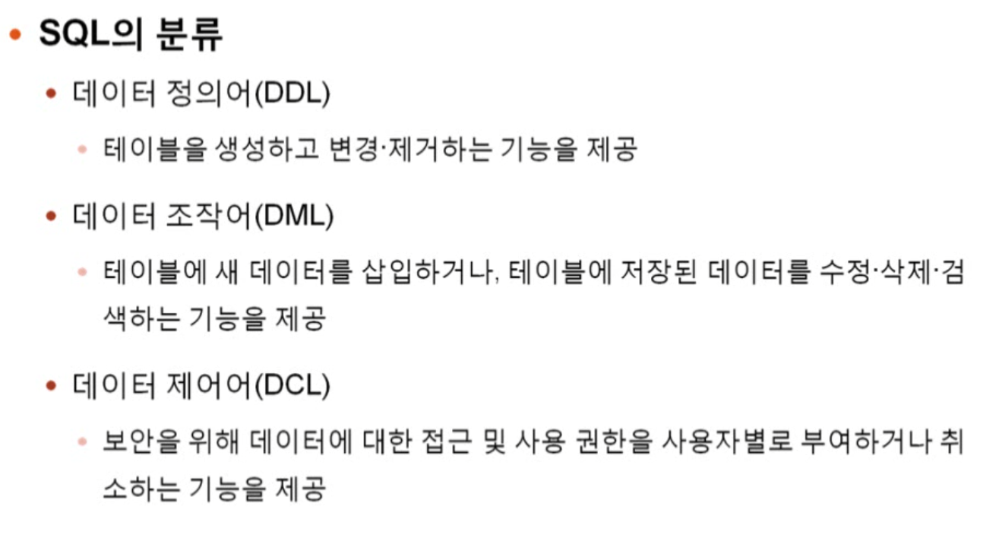

- 데이터 정의어
- 데이터 조작어
- 데이터 제어어
  - 보안을 위한 것
- 8장에선 데이터 정의어와 조작어 위주

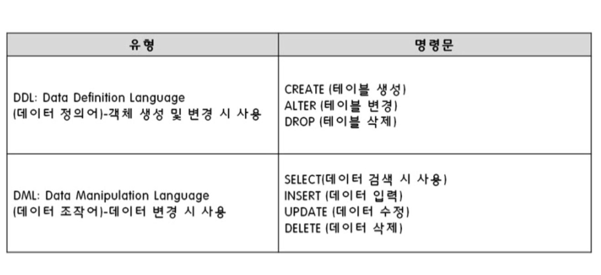

## 2. SQL을 이용한 데이터 정의

### SQL의 데이터 정의 기능

- 테이블을 생성, 변경, 제거

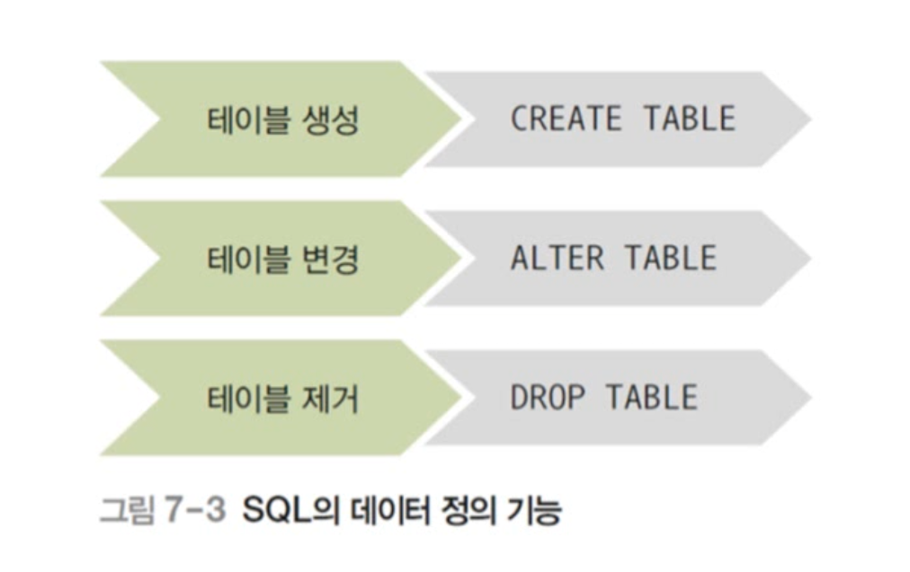

> 테이블 단위로 조작이 이루어짐

### 테이블 생성

- CREATE TABLE 문

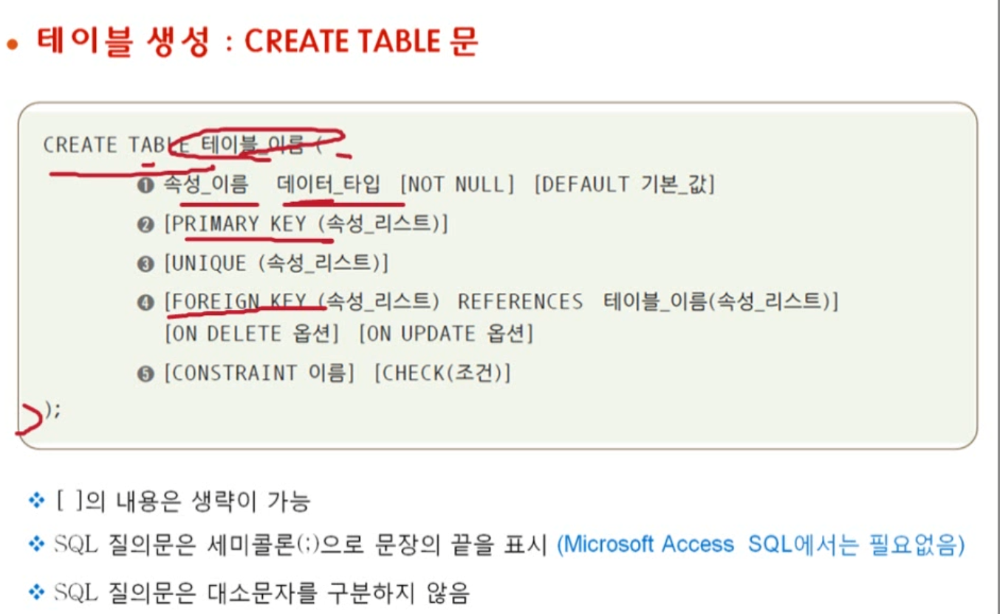

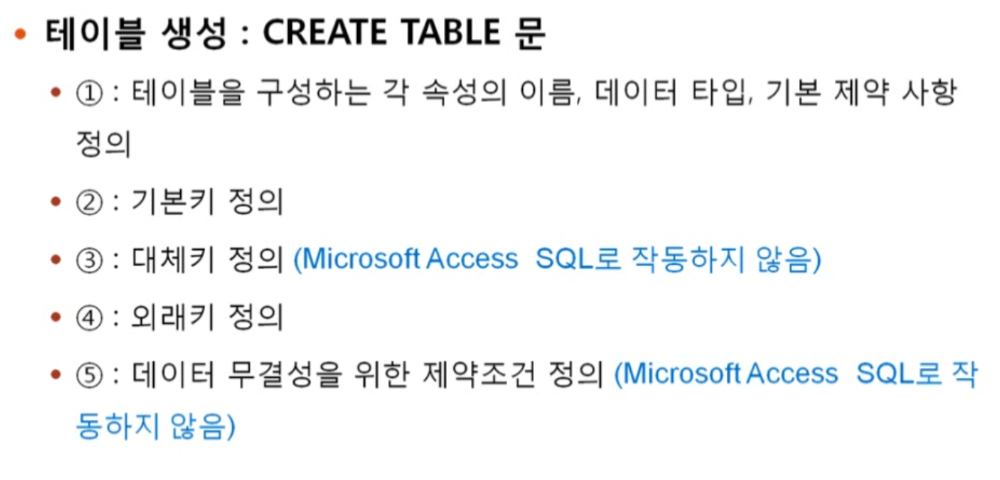

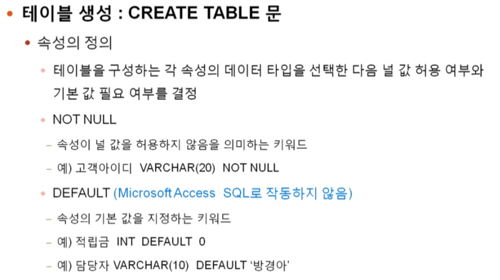

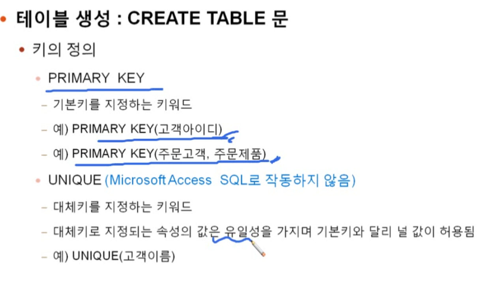

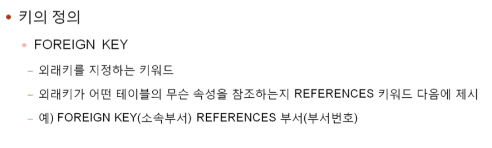

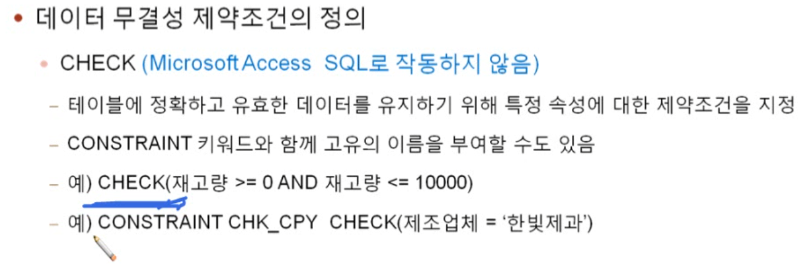

16m
