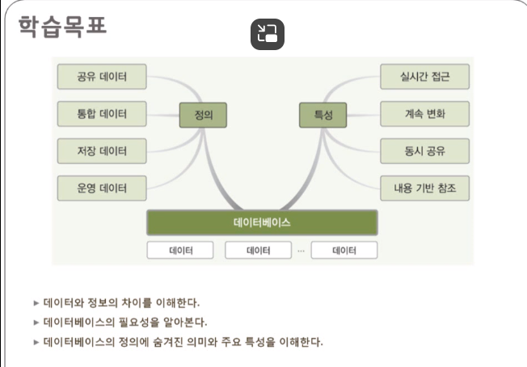
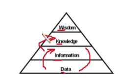
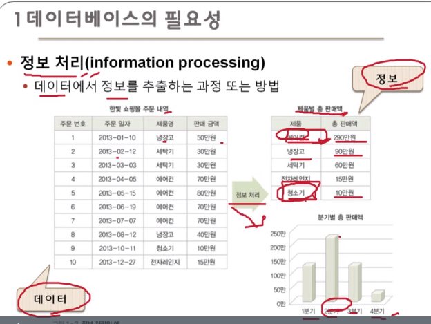
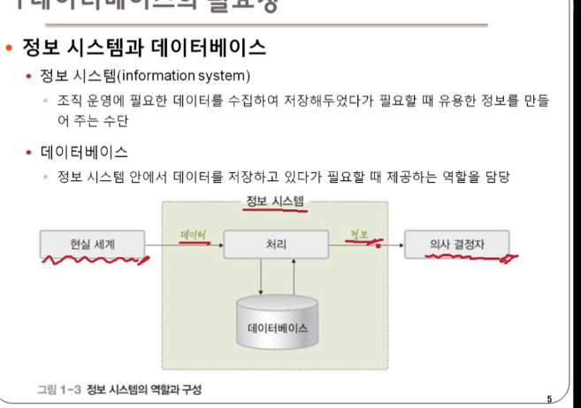
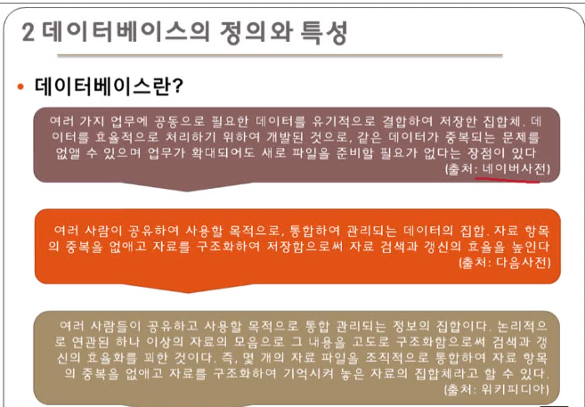
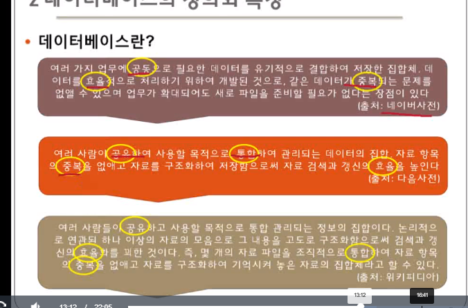
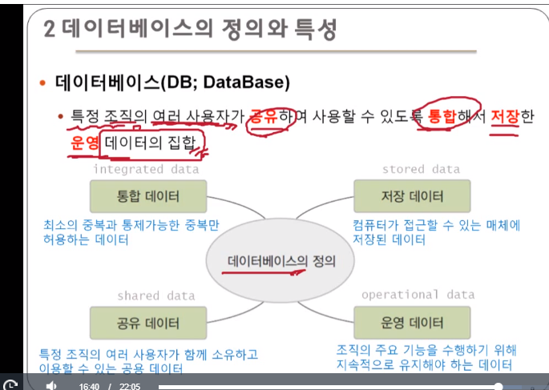
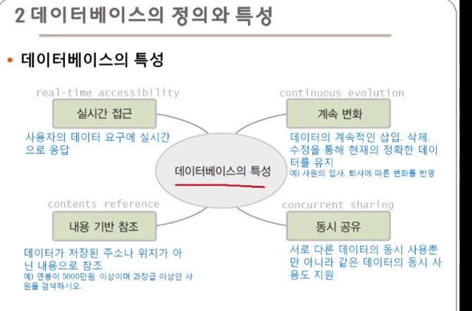

# 1 데이터베이스 기본 개념

- 데이터 베이스의 필요성
- 데이터 베이스의 정의와 특성

> 데이터와 정보의 차이
> 데이터 베이스의 필요성
> 데이터 베이스의 정의에 숨겨진 의미와 주요 특성

데이터 베이스 -> 데이터들의 덩어리, 이걸 토대로 사용자에게 정보를 전달

## 1. 데이터 베이스의 필요성

- 데이터와 정보
    - 데이터
        - 현실 세계에서 단순히 관찰하거나 측정해 수집한 사실이나 값
    - 정보 
        - 의사 결정에 유용하게 활용할 수 있도록 데이터를 처리한 결과물
    - 원유와 치즈, 우유, 아이스크림 등의 차이

> 의미가 부여되었냐, 의사 결정에 활용될 수 있냐 등의 차이를 가짐

점점 위에서 아래 단계에 접근할 수 있는 방법이 커짐

예전에는 책에서 지식을 얻었지만, 점점 정보화 사회에서 정보를 얻었고 이제 데이터를 다룸

### 정보 처리

- 데이터에서 정보를 추출하는 과정 또는 방법

### 정보 시스템과 데이터베이스

- 정보 시스템
    - 조직 운영에 필요한 데이터를 수집하여 저장해두었다가 필요할 때 유용한 정보를 만들어 주는 수단
- 데이터베이스
    - 정보 시스템 안에서 데이터를 저장하고 있다가 필요할 떄 제공하는 역할을 담당

## 2. 데이터 베이스의 정의와 특성

> 공유, 공동, 저장 등의 키워드

가계부와 전화번호부 등도 데이터베이스라 할 수 있음

### 데이터 베이스

- 특정 조직의 여러 사용자가 **공유**하여 사용할 수 있도록 **통합**해서 **저장**한 **운영** 데이터의 집합

### 데이터 베이스의 특성

- 실시간 접근
- 계속 변화
- 내용 기반 참조
- 동시 공유

