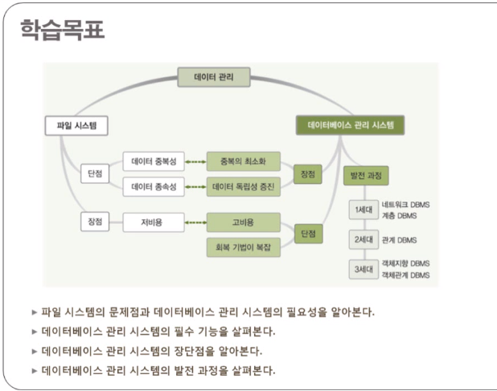

# 2. 데이터베이스 관리 시스템

- 데이터 베이스 관리 시스템의 등장 배경
- 데이터 베이스 관리 시스템의 정의 및 특성
- 데이터 베이스 관리 시스템의 발전 과정

< 학습 목표 >

## 1. 데이터베이스 관리 시스템의 등장 배경

### 파일 시스템

- 데이터를 파일로 관리하기 위해 파일을 C,R,U,D하는 기능을 제공하는 소프트웨어
- 응용 프로그램마다 필요한 데이터를 별도의 파일로 관리함

- 파일 시스템은 각각의 역할에 맞는 소프트웨어마다 서로 다른 데이터파일을 갖게 된다.(*응용 프로그램마다 필요한 데이터를 별도의 파일로 관리함*)

> 문제점

1. 같은 내용의 데이터가 여러 파일에 중복 저장
2. 응용 프로그램이 데이터 파일에 종속적 -> 데이터 파일이 바뀌면 응용 프로그램도 새롭게 설계해야함
3. 데이터 파일에 대한 동시 공유, 보안(중복 때문에), 회복 기능(모든 데이터가 일관적인 형태로 저장)이 부족
4. 응용 프로그램 개발이 쉽지 않음(데이터에 따라, 파일에 따라 소프트웨어가 달라지므로)

<데이터 중복성>

데이터 중복 문제를 해결하기 위해 데이터 베이스 관리 시스템을 이용(데이터를 한 번에 관리)

<데이터 종속성>

## 2. 데이터 베이스 관리 시스템의 정의 및 특성

### 데이터 베이스 관리 시스템

- DBMS
- 파일 시스템의 문제를 해결하기 위해 제시된 소프트웨어
- 조직에 필요한 데이터를 데이터베이스에 통합하여 저장하고 관리함

> 지금까진 회사마다 장부를 따로 써서 세금 걷기 힘들었는데, 이제 회사 장부 처리를 세무서에서 공통된 모듈로 진행해서 편해졌다고 생각하면 된다.

### DBMS의 주요 기능

#### 장단점

## 3. 데이터베이스 관리 시스템의 발전 과정

### 1세대 : 네트워크, 계층

- 네트워크 DBMS : 데이터 베이스를 그래프 형태로 구성
    - 복잡하고 변경이 어려움
    - ex) IDS (Integrated Data Store)
- 계층 DBMS : 데이터 베이스를 트리 형태로 구성
    - 구조가 단순하지만, 현실을 표현하기 어렵고, 구조 변경이 어렵다
    - ex) IMS(Information Management System)

### 2세대: 관계 DBMS -> 현재까지 사용

- 관계 DBMS : 데이터베이스를 테이블 형태로 구성

### 3세대: 객체지향 , 객체관계

3세대까지 발전했지만, 아직은 관계를 주로 사용하고, 객체관계가 점점 커지는 중

