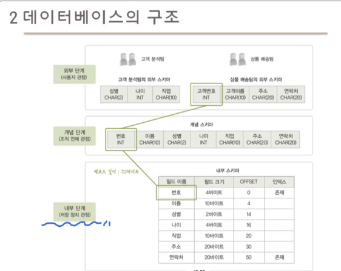

# 3장 데이터베이스 시스템

<학습목표>

사용자, 데이터언어, 데이터베이스, 데이터베이스 관리시스템(DBMS)으로 구성되는 상위개념

## 데이터베이스 시스템의 정의

### 데이터베이스 시스템(DBS)

- 데이터베이스에 데이터를 저장하고, 이를 관리하여 조직에 필요한 정보를 생성해주는 시스템

## 데이터베이스의 구조

### 스키마와 인스턴스

- 스키마 : 데이터베이스에 저장되는 데이터 구조와 제약조건을 정의한 것(변수와 속성, 제약조건 등)
    - 일종의 뼈대
    - 동적 변동하는 값이 아님. 일종의 설계도 혹은 청사진
- 인스턴스 : 스키마에 따라 데이터베이스에 실제로 저장된 값
    - 실제 값이므로 동적 변동이 가능
    - 나이 먹을떄마다 나이 데이터 바꿔야지

### 3단계 데이터베이스 구조

- 데이터 베이스를 쉽게 이행하고 이용할 수 있도록 하나의 데이터베이스를 관점에 따라 세 단계로 나눈 것

- 외부단계: 특정 위치에 있는 데이터(우리집)만 확인 가능, 사용자 관점

- 개념단계: 각 호수까지 확인 가능, 스키마 정도, 우리 수업 내용

- 내부단계: 완전히 아는 설계자 관점, 저장장치 관점

#### 외부 단계

- 데이터베이스를 개별 사용자 관점에서 이해하고 표현하는 단계

- 데이터 베이스 하나에 외부 스키마가 여러 개 존재할 수 있음

    - 외부 스키마
        - 외부 단계에서 사용자에게 필요한 데이터베이스를 정의한 것
        - 각 사용자가 생각하는 데이터 베이스의 모습, 즉 논리적 구조로 사용자마다 다름
        - 서브 스키마라고도 함

#### 개념 단계

#### 내부 단계

#### 정리

16m 