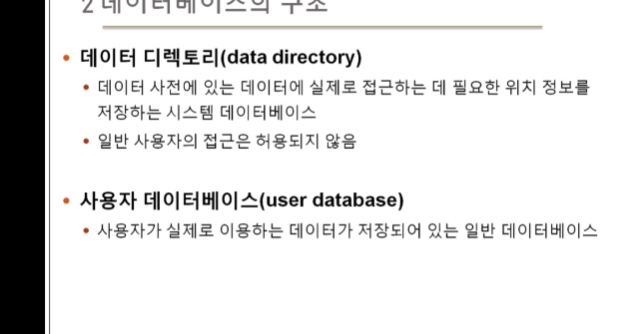

# 3장 데이터베이스 시스템

<학습목표>

사용자, 데이터언어, 데이터베이스, 데이터베이스 관리시스템(DBMS)으로 구성되는 상위개념

## 데이터베이스 시스템의 정의

### 데이터베이스 시스템(DBS)

- 데이터베이스에 데이터를 저장하고, 이를 관리하여 조직에 필요한 정보를 생성해주는 시스템

## 데이터베이스의 구조

### 스키마와 인스턴스

- 스키마 : 데이터베이스에 저장되는 데이터 구조와 제약조건을 정의한 것(변수와 속성, 제약조건 등)
  - 일종의 뼈대
  - 동적 변동하는 값이 아님. 일종의 설계도 혹은 청사진
- 인스턴스 : 스키마에 따라 데이터베이스에 실제로 저장된 값 - 실제 값이므로 동적 변동이 가능 - 나이 먹을떄마다 나이 데이터 바꿔야지
  

### 3단계 데이터베이스 구조

- 데이터 베이스를 쉽게 이행하고 이용할 수 있도록 하나의 데이터베이스를 관점에 따라 세 단계로 나눈 것

- 외부단계: 특정 위치에 있는 데이터(우리집)만 확인 가능, 사용자 관점

- 개념단계: 각 호수까지 확인 가능, 스키마 정도, 우리 수업 내용

- 내부단계: 완전히 아는 설계자 관점, 저장장치 관점

#### 외부 단계

- 데이터베이스를 개별 사용자 관점에서 이해하고 표현하는 단계

- 데이터 베이스 하나에 외부 스키마가 여러 개 존재할 수 있음

  - 외부 스키마
    - 외부 단계에서 사용자에게 필요한 데이터베이스를 정의한 것
    - 각 사용자가 생각하는 데이터 베이스의 모습, 즉 논리적 구조로 사용자마다 다름
    - 서브 스키마라고도 함

#### 개념 단계

#### 내부 단계

#### 정리

### 3단계 데이터 베이스 구조의 사상 또는 매핑

### 데이터 독립성

- 하위 스키마를 변경하더라도 상위 스키마가 영향을 받지 않는 특성
- 논리적 데이터 독립성 : 개념과 외부 사이 독립성

  - 개념 스키마를 변경하더라도 외부 스키마가 변하지 않도록
  - 개념 스키마가 변경되면 관련된 외부/개념 사상만 정확하게 수정해주면 됨

- 물리적 데이터 독립성 : 개념과 내부 사이 독립성
  - 내부 스키마가 변경되어도 개념 스키마는 영향을 받지 않음
  - 내부 스키마가 변경되면 관련된 개념/내부 사상만 정확하게 수정해주면 됨

### 데이터 사전

DBMS가 알아서 만들어줌

## 3. 데이터베이스 사용자

- 데이터베이스를 이용하기 위해 접근하는 모든 사람

- 이용 목적에 따라 DB 관리자, 최종 사용자, 응용프로그래머로 구분

## 4. 데이터 언어

- 사용자와 데이터 베이스 관리 시스템 간의 통신수단
- 사용 목적에 따라 데이터 정의어, 조작어, 제어어로 구분
- 대표적으로 SQL

## 5. 데이터베이스 관리 시스템의 구성

### 데이터베이스 관리 시스템

- 데이터 베이스 관리와 사용자의 데이터 처리 요구 수행
- 주요 구성요소
  - 질의 처리기(query processor)
    - 사용자의 데이터 처리 요구를 해석하여 처리
    - DDL 컴파일러, DML 컴파일러, DML 프리 컴파일러, 런타임 데이터베이스 처리기, 트랜잭션 관리자 등을 포함
  - 저장 데이터 관리자(stored data manager)
    - 디스크에 저장된 사용자 데이터베이스와 데이터사전을 관리하고, 여기에 실제로 접근하는 역할을 담당

