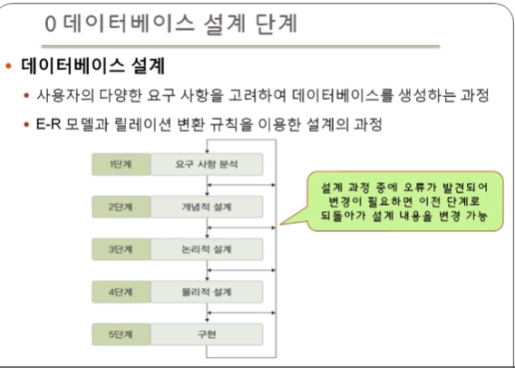
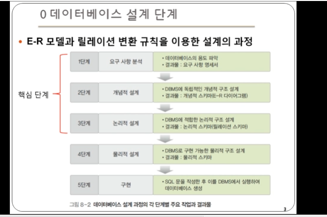

# 4장 데이터 모델링

- 데이터 베이스 설계단계
- 데이터 모델링과 데이터 모델의 개념
- 개체-관계 모델

## 0. 데이터 베이스 설계 단계

### 데이터 베이스 설계

- 사용자의 다양한 요구 사항을 고려하여 데이터베이스를 생성하는 과정
- E-R 모델과 릴레이션 변환 규칙을 이용한 설계의 과정

> 본 강의에선 1~3 단계 위주

- 1단계 : 현실세계와 관련해서 필요 요구 사항을 확인
- 2단계 : D
