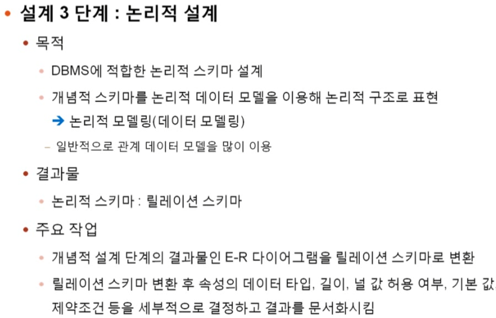

# 관계 데이터 모델 : 실습

> ERD를 어떻게 릴레이션으로 만들 수 있을까

개념적 설계를 통한 ERD 이후로(개념적 스키마 완성), 실질적 설계(논리적 설계)를 하는 단계

> ERD를 릴레이션으로 만드는 과정

## 2 요구사항 분석

## 3 논리적 설계

데이터 베이스에 적합한 논리적 스키마(릴레이션 스키마)를 설계

- ERD를 릴레이션 스키마로 변환
- 릴레이션 스키마 변환 이후로 데이터 타입, 길이, 널 값 허용 여부, 기본 값, 제약조건등을 세부적으로 결정하고 결과를 문서화시킴

### ERD를 릴레이션 스키마로 변환하는 규칙

1. 모든 개체는 릴레이션으로 변환

- 고객이란 개체 하나는 하나의 릴레이션으로 변환된다

2. 다대다 관계는 릴레이션으로 변환

- 관계 또한 하나의 릴레이션으로 변환 가능
- shb) M:N 관계에서 manyTomany field를 통해 하나의 별개 테이블이 생성되었던걸 생각

3. 일대다 관계는 외래키로 표현

- 별도 릴레이션이 x

4. 1대1 관계 또한 외래키로 표현

5. 다중 값 속성은 릴레이션으로 변환

- 하나의 객체가 여러 속성을 가질 경우 하나의 릴레이션으로 만드는게 힘드므로 그냥 새로운 릴레이션을 하나 더 만든다고 생각

### 규칙 적용

### 1. 개체의 릴레이션 변환

> 복합 속성의 릴레이션 변환

4개의 개체와 4개의 릴레이션

### 2. *다대다 관계*는 릴레이션으로 변환

### 3. *일대다 관계*는 외래키로 표현한다

> 외래키는 다수에 존재

#### 규칙 3-1

- _일반적인_ 일대다 관계는 외래키로 표현한다

  - 일대다 관계에서 일인 부분의 릴레이션의 기본키를 n측 릴레이션에 포함시켜 외래키로 지정

    - 결국 외래키는 다수인 부분에 존재

  - 관계의 속성들도 n측 개체 릴레이션에 포함시킨다
    - 관계 자체도 속성을 가질 수 있다. '공급'이라는 관계가 있다면 공급일자, 공급량이라는 속성이 있을 수 있음
    - 이것들도 n측에 넣는것

> ex) 학생(n)과 지도교수(1)

> 만약 외래키를 반대로 가진다면?
>
> 상품이 회사의 외래키를 갖는게 아니라 회사가 상품을 외래키로 가진다면 회사에 굉장한 양의 외래키가 발생할 것이다. 심지어 상품이 늘어날 때마다 스키마도 늘려야 함.(인스턴스가 아니라 튜플이 늘어나게 된다.) => 굉장히 비효율적

#### 규칙 3-2

- 약한 개체가 참여하는 일대다 관계는 외래키를 포함해서 기본키를 지정한다.
  - 3-1 과 규칙 자체는 같음
  - 다만 *약한 개체*와의 관계라면n측에 외래키를 포함하여 기본키를 지정한다.
  - 결국 n측의 기본키는 (외래키+기본키)의 형태인 것

> 질문) 약한 개체가 뭔데?

비행기(오너 개체)와 비행기 좌석(약한 개체)의 관계

### 규칙 4. *일대일 관계*는 외래키로 표현한다

- 일대일 관계는 외래키로 표현한다.

  - 4.1 일반적인 일대일 관계는 외래키를 **서로** 주고 받는다
  - 4.2 일대일 관계에 필수적으로 참여하는 개체의 릴레이션만 외래키를 받는다
  - 4.3 모든 개체가 일대일 관계에 필수적으로 참여하면 릴레이션을 하나로 합친다.

#### 4-1 일반적인 일대일 관계는 외래키를 **서로** 주고 받는다

- 관계에 참여하는 개체 릴레이션들이 서로의 기본키를 주고 받아 외래키로 지정
- 관계의 속성들도 모든 개체 릴레이션에 포함시킴
- 불필요한 데이터 중복이 발생할 수 있음
  - 한 쪽에만 있어도 표현 가능하긴 함

> ex) 혼인 관계

#### 4-2 일대일 관계에 필수적으로 참여하는 개체의 릴레이션만 외래키를 받는다

- 관계에 필수적으로 참여하는 개체 릴레이션만 외래키를 포함시킴
- 관계의 속성들은 관계에 필수적으로 참여하는 개체 릴레이션에 포함시킨다.

- 해당 경우에서 남자는 모두 결혼이라는 관계에 필수적으로 참여하게 됨.
- 이럴 경우 외래키와 관계의 속성 모두 남자의 릴레이션 스키마에 작성하게 된다.

> why? 여자 릴레이션 같은 경우 Null값을 가질 수 있다. 굳이 그럴 필요가 없음.

#### 4-3 모든 개체가 일대일 관계에 필수적으로 참여하면 릴레이션을 하나로 합친다.

- 관계에 참여하는 개체 릴레이션들을 하나의 릴레이션으로 합쳐서 표현
- 관계의 이름을 릴레이션 이름으로 사용하고 관계에 참여하는 두 개체의 속성들을 관계 릴레이션에 모두 포함시킴
- 두 개체 릴레이션의 키 속성을 조합하여 관계 릴레이션의 기본 키로 지정

> 결국 관계에 모든 인스턴스가 참여하게 된다면 굳이 외래키를 활용해 릴레이션 2개(남자, 여자)로 표현할 필요 없이, '결혼'이라는 릴레이션을 만들어서 하나의 테이블에 작성하면 된다.

=> 해당 테이블에 남자릴레이션, 여자 릴레이션이 중복과 빠짐 없이 전부 작성할 수 있다.

### 규칙 5. 다중 값 속성은 릴레이션으로 변환한다.

- ERD의 다중값 속성은 독립적인 릴레이션으로 변환
  - 다중값 속성과 함께 그 속성을 가지고 있던 개체 릴레이션의 기본키를 외래키로 가져와 새로운 릴레이션을 만들어서 거기에 포함시킴
  - 새로운 릴레이션의 기본키는 다중값 속성과 외래키를 조합하여 지정

> shb) 일종의 트리 형태로 릴레이션을 작성

- A라는 사원이 B, C,D를 부하직원으로 뒀다?

  - 기존대로 하면, A의 부하직원 속성에 B,C,D라는 다중 값이 들어가게 된다.
  - 그렇기에 그냥 사원-부하직원 릴레이션을 만들어서 작성
  - A-B, A-C, A-D 형태로 인스턴스가 저장될거다.

> 그럼, 왜 독립적인 릴레이션을 만드냐? 그냥 부하직원이라는 속성을 하나 더 만들어서 기존 릴레이션에 추가하면 되는거 아님?

> 독립적인 릴레이션으로 만들지 않는다면, 불필요한 중복 저장 문제가 발생한다.

### 기타 고려사항

- 모든 관계를 독립적인 릴레이션으로 변환할 수 있다.
  - 속성이 많은 관계는 유형에 상관없이 독립적인 릴레이션으로의 변환을 고려할 수 있다. (굳이 기존 릴레이션에 속성 잔뜩 넣을 필요가 없음)

- 개체가 자기 자신과 관계를 맺는 *순환 관계*도 기본 규칙을 그대로 적용

## 최종 형태

