# 5. 관계 데이터 모델

- 관계 데이터 모델의 개념
- 관계 데이터 모델의 제약

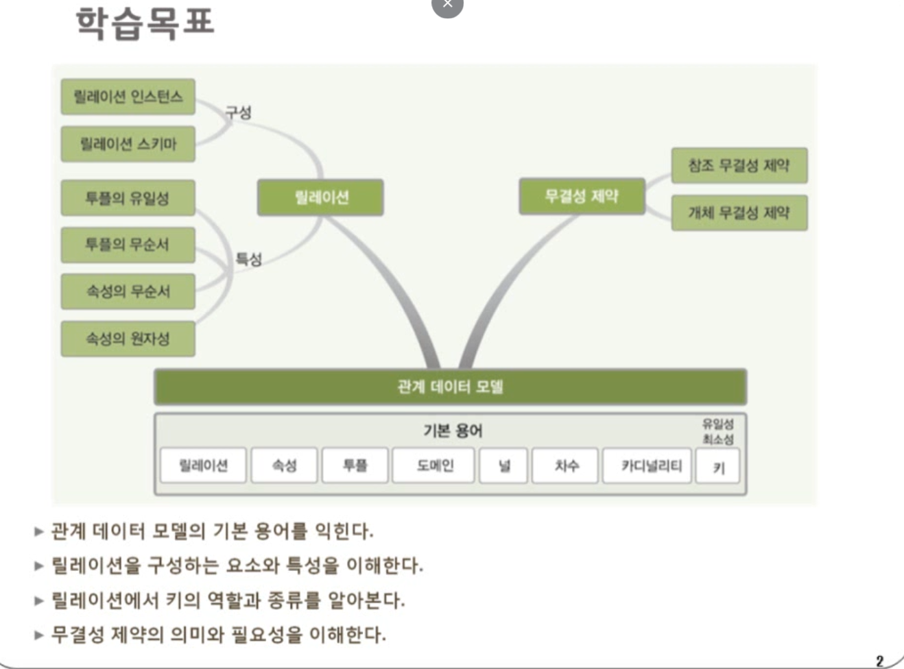

## 0. 데이터 베이스 설계 단계

### 데이터 베이스 설계

- 사용자의 다양한 요구 사항을 고려하여 데이터 베이스를 생성하는 과정
- E-R 모델과 릴레이션 변환 규칙을 이용한 설계의 과정

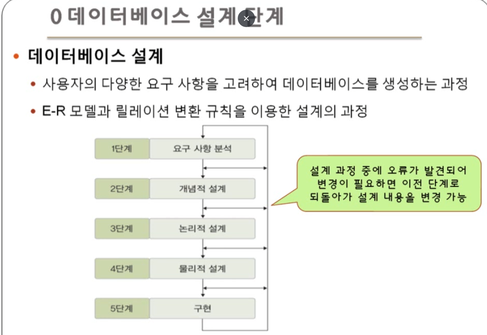

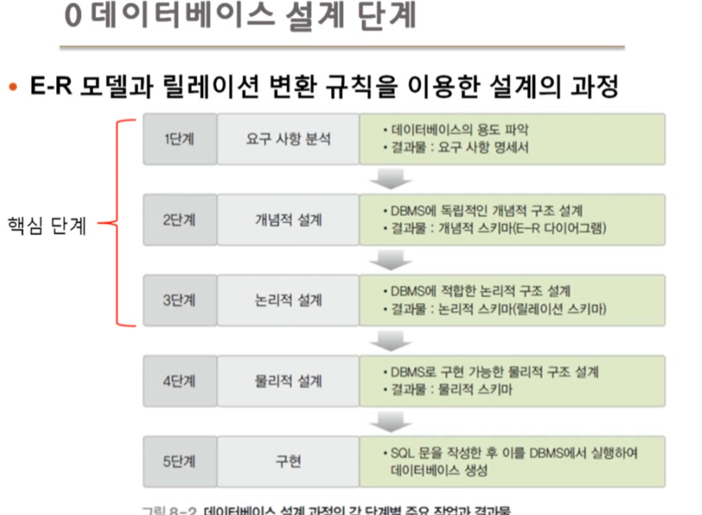

논리적 설계 -> 이전에 만들어 놓은 E-R 다이어그램(개념적 스키마)을 바탕으로 실제 테이블 형태의 구조를 만드는 단계

## 1. 관계 데이터 모델의 개념

### 관계 데이터 모델의 기본 개념

- 개념적 구조를 논리적 구조로 표현하는 논리적 데이터 모델
- 하나의 개체에 대한 데이터를 하나의 릴레이션에 저장

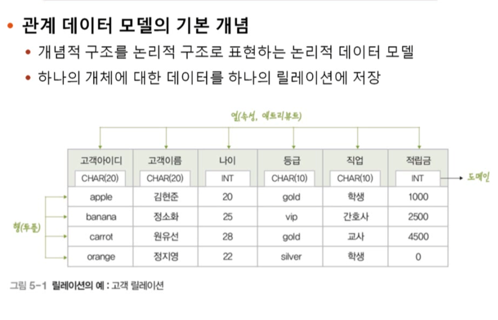

열에는 값의 속성인 어트리뷰트, 행에는 실질적 값(튜플)

### 관계 데이터 모델의 기본 용어

- 릴레이션

  - 하나의 개체에 관한 데이터를 2차원 테이블의 구조로 저장한 것
  - 파일 관리 시스템 관점에서 파일(file)에 대응

- 속성

  - 릴레이션의 열
  - 파일 관리 시스템 관점에서 필드(field)에 대응

- 투플(tuple)

  - 릴레이션의 행
  - 파일 관리 시스템 관점에서 레코드(record)에 대응

- 도메인
  - 하나의 속성이 가질 수 있는 모든 값의 집합
  - 속성 값을 입력 및 수정할 때 적합성의 판단 기준이 됨
  - 일반적으로 속성의 특성을 고려한 **데이터 타입**으로 정의
- 널(NULL)
  - 속성 값을 아직 모르거나 해당되는 값이 없음을 표현
- 차수(degree)
  - 하나의 릴레이션에서 속성의 전체 개수 -> 열의 갯수
- 카디널리티
  - 하나의 릴레이션에서 투플의 전체 개수 -> 인스턴스가 몇 개인지, 행의 개수

### 릴레이션의 구성

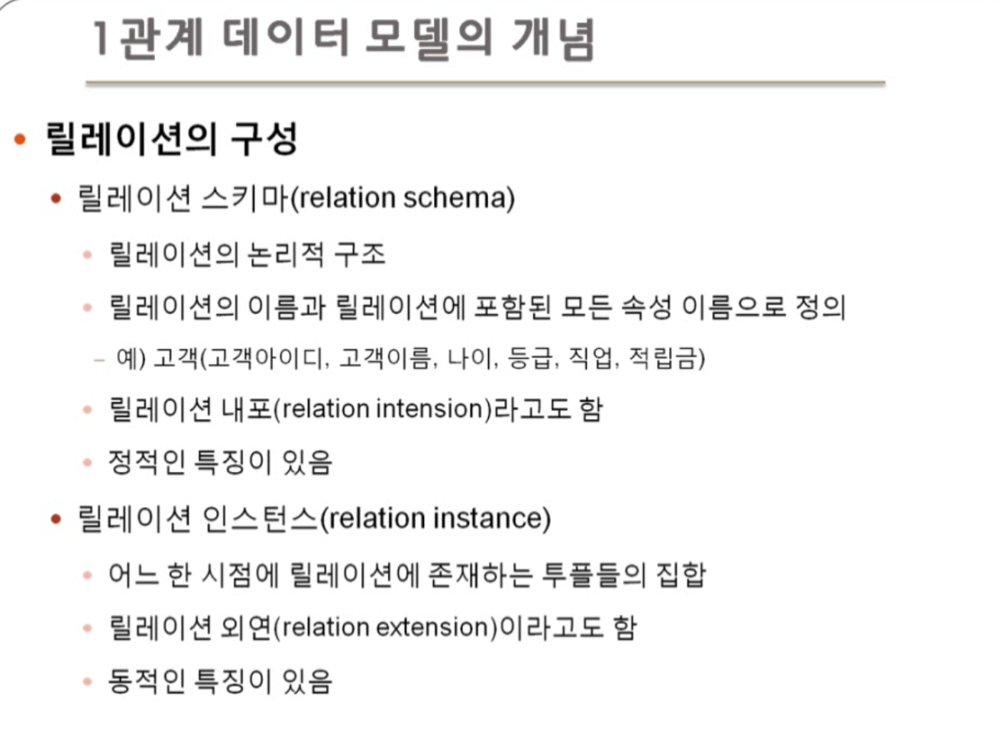

- 릴레이션 스키마 : 뼈대

  - 결국 릴레이션에 대해서 설명해주는 방식
  - 스키마는 변하지 않음
  - 일종의 뼈대

- 릴레이션 인스턴스 : 실제 값

  - 실제 값들의 집합이기 때문에, 동적임
  - ex) 인터파크의 10월 3일의 회원

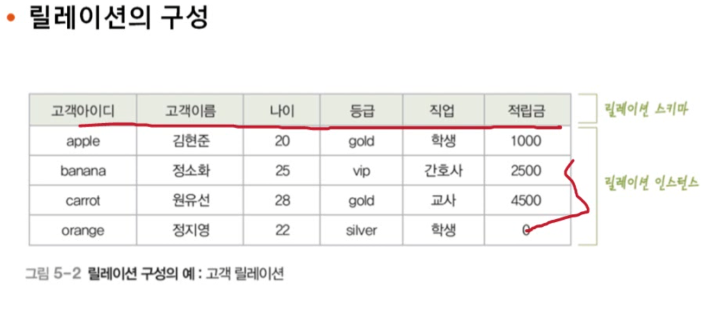

### 데이터베이스의 구성 -> 릴레이션의 모음

> 결국 데이터베이스는 릴레이션의 모음이라 생각하면 편함

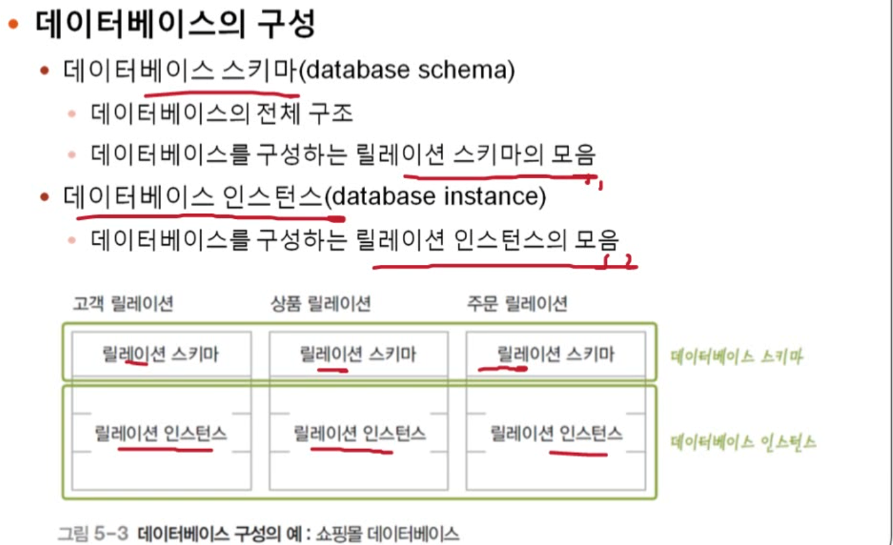

### 릴레이션의 특성

1. 튜플의 유일성

- 하나의 릴레이션에 동일한 튜플은 존재할 수 없다
- 튜플은 실제 값. 이걸 중복해서 센다면 DB의 정의에 위배된다

2. 튜플의 무순서

- 하나의 릴레이션에서 튜플 사이의 순서는 무의미하다
- 누가 첫 번째 행에 있건 의미는 없음

3. 속성의 무순서

- 하나의 릴레이션에서 속성 사이의 순서는 무의미하다
- 속성도 어떤 속성을 먼저 쓰는지가 중요하지 않음

4. 속성의 원자성

- 속성 값으로 원자 값만 사용할 수 있다
- ERD와 다르게 다중 값을 가질 수 없다

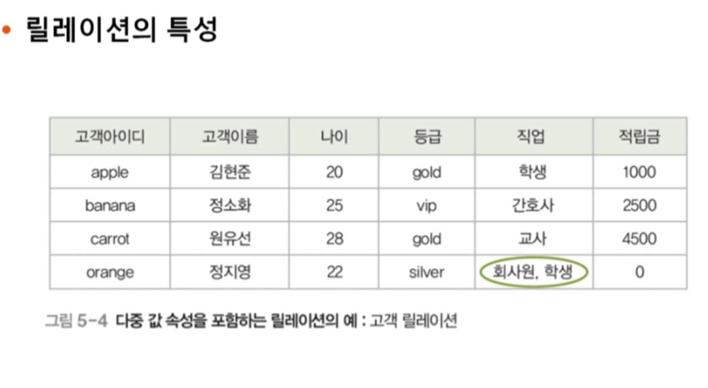

> 얘는 4번을 위배해서 릴레이션이라 할 수 없음

### 키

- 릴레이션에서 튜플들을 유일하게 구별하는 속성 또는 속성들의 집합

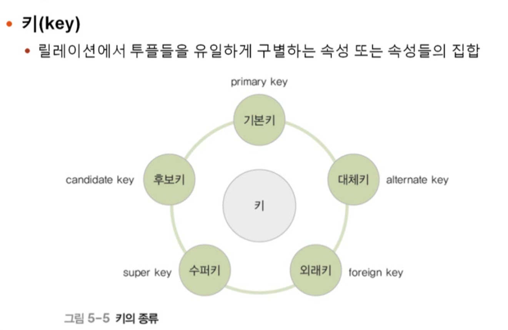

> shb) 솔직히 시험용 말고는 기본키, 대체키, 외래키 말고는 크게 알 필요 없음

### 키의 특성

- 유일성

  - 하나의 릴레이션에서 모든 튜플은 서로 다른 키 값을 가져야 함 -> 얘로 구분해야하니깐

- 최소성
  - 꼭 필요한 최소한의 속성들로만 키를 구성한다

> 이 특성들을 기준으로 키를 구분하게 된다.

### 키의 종류

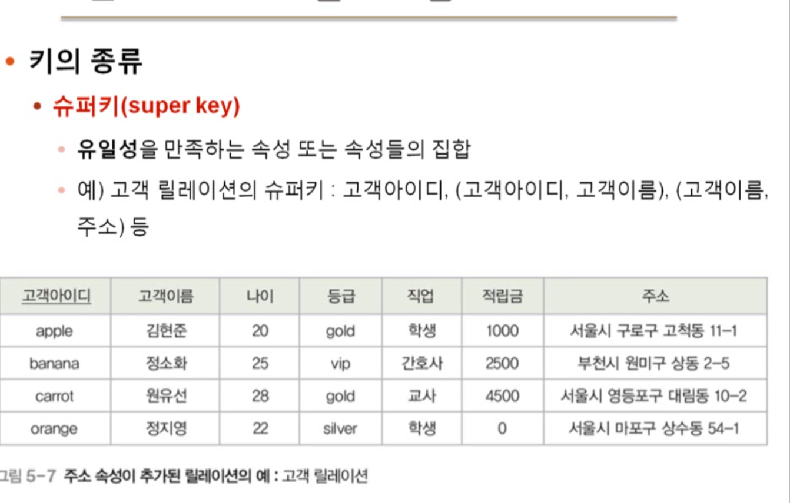

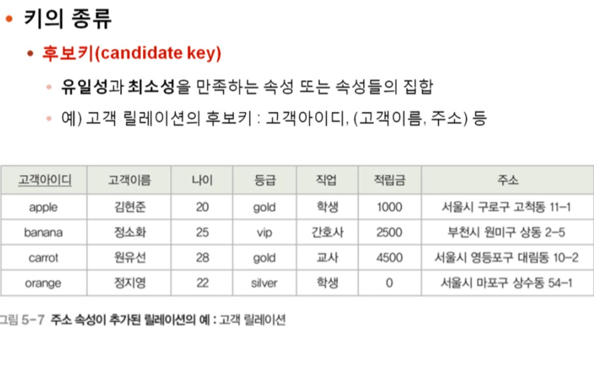

> 고객 아이디로도 식별이 가능한데, (고객아이디,고객이름) 조합은 최소성을 만족하지 못해서 후보키가 되지 않는 것
