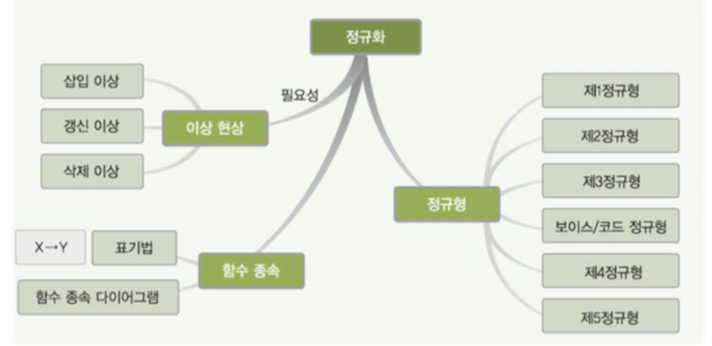
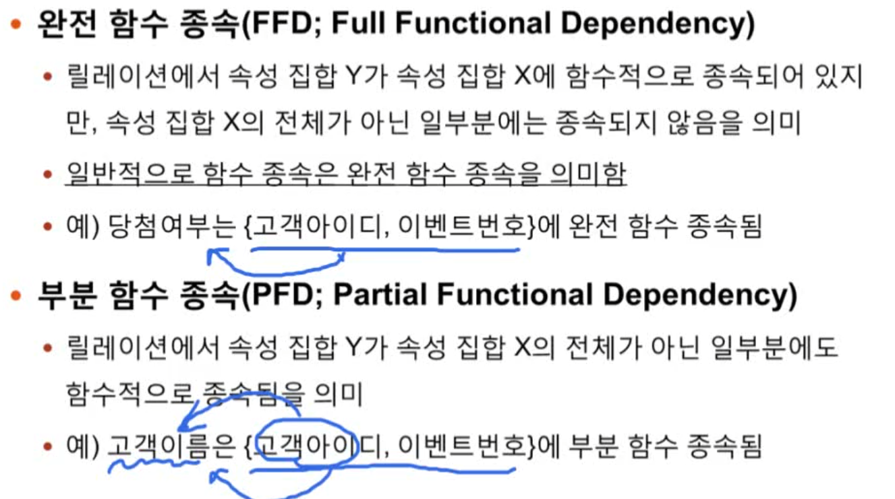
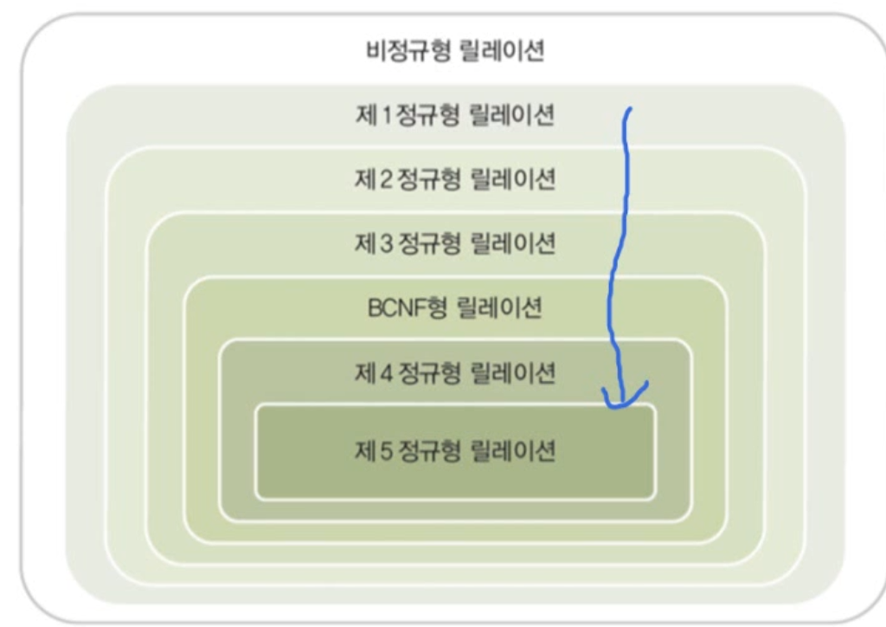
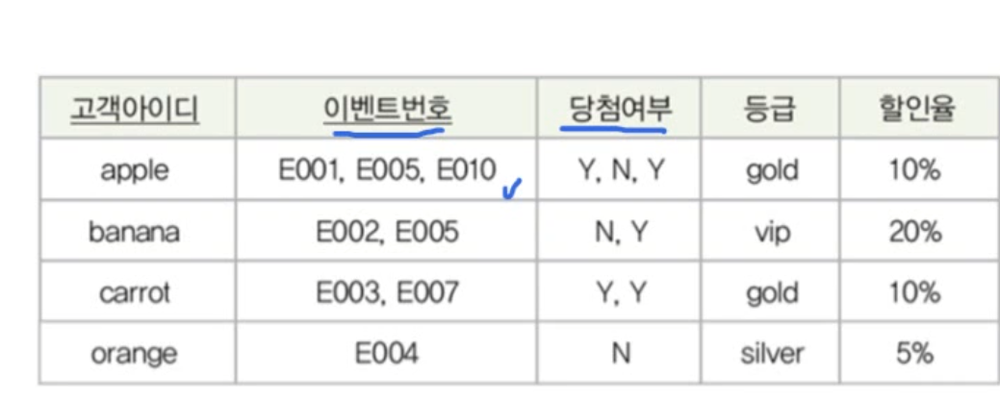

# 6장. 정규화

> 데이터베이스를 어떻게 제대로 설계할 수 있을까

> 이상현상을 바로 잡는 것이 정규화

- 정규화의 개념과 이상 현상
- 함수 종속
- 기본 정규형과 정규화 과정

## 학습 목표

1. 정규화의 필요성과 이상 현상의 의미 이해
2. 정규화를 수행하기 위해 함수 종속성의 개념을 이해
3. 정규형의 유형과 관계를 이해하고, 실제 예를 통해 정규화 과정을 연습해본다.

## 1. 정규화의 개념과 이상 현상

- 이상현상
  - 불필요한 **데이터 중복**으로 인해 릴레이션에 대한 데이터 삽입,수정,삭제 연산을 수행할 때 발생할 수 있는 부작용
- 정규화
  - 이상 현상을 제거하면서 DB를 올바르게 설계해 나가는 과정

### 이상 현상의 종류

> 예시를 통한 확인
>
> 고객 데이터가 **이벤트 참여 릴레이션**에 모두 저장되어있다 가정

### 1. 삽입이상

- 키에 존재하는 이벤트 번호 때문
- 아직 이벤트에 참가하지 않은 고객은 삽입이 불가능
- 만약 참가하려면 아직 참가하지 않은 _임시_ 이벤트 번호를 줘야 함

### 2. 갱신 이상

- apple이라는 고객의 등급이 gold에서 vip로 승급되었다면?
- 중복된 튜플들의 등급 속성이 모두 바뀌어야 함

### 3. 삭제 이상

- orange라는 고객이 이벤트 참여를 취소했다고 가정하자
- 해당 튜플을 삭제한다면 고객 데이터가 전부 사라진다.
- 이벤트 참여에 관한 내용만 삭제해야하는데 orange,김용욱,silver가 모두 사라지게 됨

> shb) 그럼 어떻게 하면 해결될까?
>
> 모든 고객 데이터가 이벤트 참여 릴레이션에 있다는 것이 문제
>
> => 쪼개버리면 된다.

### 정규화

- 이상 현상이 발생하지 않도록 릴레이션을 _관련 있는 속성들_(함수적 종속성)로만 구성하기 위해 **릴레이션을 분해**하는 과정
- **함수적 종속성**을 판단하여 정규화를 수행함

### 함수적 종속성(Functional Dependency, FD)

- 속성들간의 관련성
- 함수 종속성을 이용하여, 릴레이션을 연관성이 있는 속성들로만 구성되도록 분해하여 이상 현상이 발생하지 않는 바람직한 릴레이션으로 만들어 나가는 과정이 **정규화**

## 2. 함수 종속

- 속성들의 부분집합?
  - 고객이란 속성을 X, 이벤트란 속성을 Y라 생각하고 이 둘의 종속 관계를 확인하는 것

<!--  -->

> 함수 종속 다이어그램 : 함수 종속 관계를 도식화하여 표현한 것

### 함수 종속 관계 판단 시 유의 사항

- 속성 자체의 특성과 의미를 기반으로 함수 종속성을 판단
  - 속성 **값은** 계속 변할 수 있음. 현재 릴레이션에 포함된 속성 값만으로 판단하면 안됨.
    - 고객이름은 동명이인이 될 수 있으므로 등급과의 종속 관계가 성립하지 않을 수 있음
    - 나중에 추가되는 값도 고려해야함
- 일반적으로 기본키와 후보키는 다른 모든 속성에 대한 종속 키가 될 수 있음
- 그러나 기본키나 후보키가 아니어도 결정자가 될 수 있음

- 고객 이름은 고객 아이디가 결정
- 당첨 여부는 (고객아이디, 이벤트번호)가 결정

> 고객 이름은 (고객아이디, 이벤트번호)의 일부분(부분집합)에 종속된다.

### 완전함수 종속과 부분함수 종속

### 이행적 함수 종속

- x->y , y->z라면 자연스럽게 x->z도 가능. 이것을 z가 x에 **이행적으로 함수 종속**되었다고 함.

- 예시
  - x : 고객 ID
  - y : 등급
  - z : 할인율

### 고려할 필요가 없는 함수 종속 관계

- 결정자와 종속자가 같음
- 결정자가 종속자를 포함
- -> 너무 당연해서 따지지 않는다

## 3. 기본 정규형과 정규화 과정

### 정규화

- 이상 현상이 발생하지 않도록 릴레이션을 _관련 있는 속성들_(함수적 종속성)로만 구성하기 위해 **릴레이션을 분해**하는 과정

  - 이를 통해 **이상 현상이 발생하지 않는** 바람직한 릴레이션으로 만들어가는 과정

- 정규화를 통해 릴레이션은 **무손실 분해(nonloss decomposition)**되어야 한다
  - 릴레이션은 의미적으로 동등한 릴레이션들로 분해되어야 하고, 분해로 인한 **정보의 손실이 없어야 함**
  - -> 분해된 릴레이션들을 자연 조인하면 분해 전의 릴레이션으로 복원 가능해야함

### 정규형

- 크게 6가지
- 이에 대한 분류는 정규화된 정도에 따라
- 정규화된 정도? 각 정규형에 대한 제약 조건
  - 차수가 높을 수록 제약조건이 많고 엄격해짐
  - 차수가 높아질수록 데이터 중복이 줄어 이상 현상이 발생하지 않는 바람직한 릴레이션이 됨
- 릴레이션의 특성을 고려하여 적합한 정규형을 선택

### 제 1정규형 : 릴레이션의 최소 조건

- 다중값만 가지지 않으면 된다.
- 일단 이게 되어야 릴레이션의 자격이 있는것(릴레이션 규칙 4번)

> 이건 제 1을 만족했을까?
>
> X

하지만 제 1을 만족해도 이상 현상이 발생할 수 있다.

> 삽입, 갱신, 삭제 이상이 모두 발생한다.

**해당 예시는 부분함수 종속 관계와 이행함수 종속관계가 모두 존재한다.**

> 이상 현상의 발생 이유? 완전 종속이 아니기 때문

### 제 2 정규형

- 릴레이션이 제 1 정규형이고, 기본키가 아닌 모든 속성이 기본키에 **왼전 종속**

> 그러나 이래도 이상현상이 발생할 수 있음

> why? 이행함수 종속관계가 아직 남아있다.

1. 갱신 이상이 발생
2. 삭제 이상도 발생
3. 새로운 등급에 대한 삽입 이상도 발생

> how? 이행적 함수 종속이 제거되도록 분해

### 제 3정규형

- 릴레이션이 제 2 정규형이고, 기본키가 아닌 모든 속성이 기본 키에 이행적 함수 종속되지 않으면 제 3정규형

> 제 1은 다중 속성, 제 2와 제 3은 결국 부분 종속이 아닌지/ 이행 종속이 아닌지를 확인해봐야 한다.

## 정규화 예제

### (1)

1. 학생이 아직 아무 수업도 신청하지 않았다면?
   - 키가 되는 과목번호가 Null 값이 된다
   - 생성오류
2. 학생이 여러 과목을 수강한다면?
   - 학번만으로 정해지는 정보들이 중복되어서 기재된다.
   - 이렇게 된다면, 학번만으로 정해지는 정보에 대한 갱신 오류가 발생할 수 있다
3. 학생이 수강신청을 하고 삭제한다면?
   - 학생 정보 뿐만 아니라 강의 정보도 같이 삭제된다.
   - 삭제 오류

### (2)

> 모든 속성이 완전 종속되어야 한다.

- 먼저 다이어그램을 그려야 한다.

- 이런 식으로 3개의 릴레이션으로 구분해야 한다.

### (3)

> 제 3정규형
>
> 모든 속성이 이행 종속을 가지면 안된다.

- 이행 종속을 가진 릴레이션?
  - 학번, 학과이름, 학과 전화번호
  - 학번, (회장이름, 동아리이름),방번호

5개의 릴레이션으로 다시 구분
