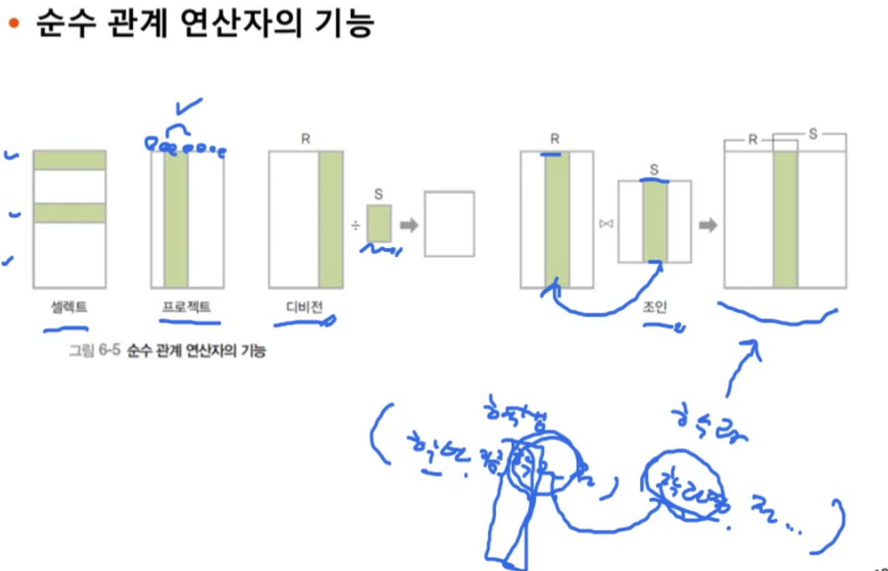

# 7장. 관계 데이터 연산

- 관계 데이터 연산의 개념
- 관계 대수

> - 기존 릴레이션에서 새로운 릴레이션을 생성할 때
>
>   -> 정규화 같은거
>
> - 아니면 분해된걸 다시 합칠 때

## 학습 목표

- 관계 데이터 연산의 개념과 종류
  - 절차와 비절차 -> 절차는 과정에, 비절차는 결과에 초점
  - 릴레이션끼리 연산하는게 **관계 데이터 연산**
- 일반 집합 연산자와 순수 관계 연산자의 차이 이해
- 일반 집합 연산자와 순수 관계 연산자를 이용해 질의를 표현하는 방법 익히기

## 1. 관계 데이터 연산의 개념

데이터 구조와 제약조건은 5장, 6장에서 배움

### 관계 데이터 연산

- 원하는 데이터를 얻기 위해 릴레이션에 필요한 처리 요구를 수행하는 것
- 관계 대수와 관계 해석이 있음
  - 기능과 표현력 측면에서는 둘의 능력이 동등함
  - 그러나 처리절차를 얼마나 자세히 기술하냐에 따라 차이가 존재

> 수업은 관계 대수 위주

### 관계 대수(relational algebra)의 개념

#### 관계 대수 연산자

- 일반 집합 연산자 : 집합 특징 응용
  - 합집합
  - 교집합
  - 차집합
  - 카티션 프로덕트
- 순수 관계 연산자 : 릴레이션의 구조와 특성을 응용
  - 셀렉트
  - 프로젝트
  - 조인
  - 디비전

#### 일반 집합 연산자(4개)

- 릴레이션이 튜플의 **집합이라는** 개념을 이용

> 예시 : 인터파크와 지마켓

- 둘이 합병했다고 한다면
  - 합집합 : A의 전체 고객
  - 교집합 : 기존에 둘 다 고객이었던
  - 차집합 : 하나에만 존재했던 고객
  - 카티션 프로덕트 : 고객과 손님이 연결된 모든 경우의 수
    - ex) 인터파크 - a , 지마켓 - a , 지마켓 - b ...

#### 순수 관계 연산자(4개)

- 릴레이션의 구조와 특성을 이용하는 연산자

- 셀렉트
  - 특정 조건을 만족하는 고객을 뽑아내고 싶을 때 -> 로우를 추출
- 프로젝트
  - 특정 속성만 반환 -> 컬럼을 추출
- 조인과 디바인은 정규화와 관련이 깊다

### 일반 집합 연산자의 특성

- 피연산자가 두 개 필요함
  - 두 개의 릴레이션
- 합집합,교집합,차집합은 두 릴레이션이 합병 가능해야함
  > 합병 가능 조건?
  >
  > 1.  두 릴레이션의 **차수가** 같아야 함(속성의 갯수가 같아야 함)
  > 2.  두 릴레이션에서 서로 대응되는 속성의 **도메인이** 같아야 함(속성의 데이터 타입이 같아야 함)

#### 1. 합집합

- 결과 릴레이션의 특성
  - 차수는 릴레이션 R과 S와 같음
  - 카디널리티(인스턴스 수)는 릴레이션 R과 S의 카디널리티를 더한 것과 같거나(중복 없음) 적어짐(중복 있음)
- 교환 법칙이 성립함 (AUB == BUA)
- 결합 법칙이 성립함 (AU(BUC) == AU(BUC))

#### 2. 교집합

#### 3. 차집합

- 중복된 결과를 빼주는것

> 결과 릴레이션의 주요 특성?
>
> - 교환 법칙이 성립하지 않는다!
> - 결합 법칙도 마찬가지

#### 4. 카티션 프로덕트

- 투플끼리 모두 연결해서 만드는 것.
- 일반 집합 연산자 중 유일하게 **합병 조건 만족 여부가 없음**
  - 사실 당연한 것. 둘을 완전히 섞어 버린다고 생각.

- 결과 릴레이션의 특성
  - 투플끼리 연결해서 계산하므로 차수는 R과 S의 차수를 더한 것과 같음
  - 카디널리티는 경우의 수이므로 두 카디널리티의 곱
- 교환 O
- 결합 O

### 순수 관계 연산자의 특성

#### 1. 셀렉트

> DB에서 배웠던 where 조건식

> **투플을** 골라내는 것!!!!!!!!!!!!!!
>
> 이 점이 셀렉트와 프로젝트의 차이

> 예시

- 투플을 골라내는 것이니깐 셀렉트 연산이다.

- 결과 릴레이션은 연산 대상 릴레이션의 _수평적 부분_

> 만약 조건이 여러개라면?

> 셀렉트 연산의 특징

- 교환적 특성이 존재 -> 순서가 딱히 상관이 없다
  - A인것과 B인것을 뽑는거랑, B인것과 A인 것을 뽑는 것에 순서가 상관 없다

#### 2. 프로젝트

35m 47s

'http://www.kocw.net/home/cview.do?lid=3549cbece149172f'
