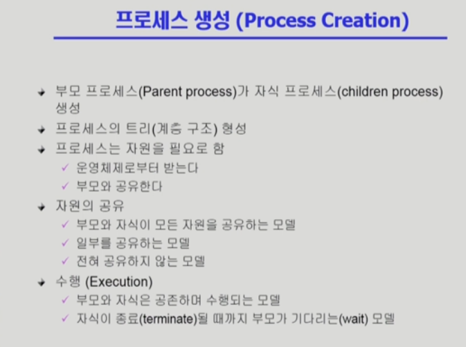
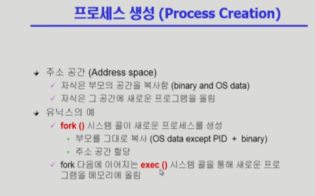
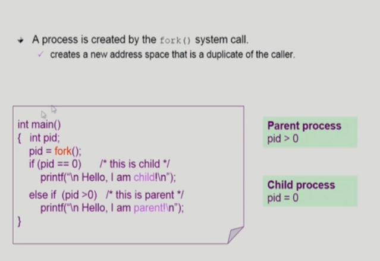
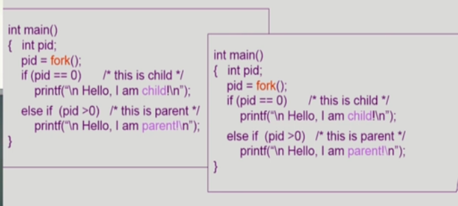

# 	Process Management 2

- 자원의 공유
  - 자식 프로세스가 부모의 프로세스를 그대로 복사
  - 이렇다면 결국 메모리 오류
  - 일단 카피하지 않고 공유할 수 있는건 최대한 공유하고(얕은 복사), 변수 값이 달라지면 그제서야 메모리 공간을 일부만 변경
  - 이걸 Copy-on-Write(COW) -> Write가 발생해야(변경점 발생) '필요한 부분만' 카피

## fork() 시스템 콜 -> 새로운 시스템 프로세스를 만들어라

- 전체 하나가 부모. fork가 시작할 때, 자식 프로세스가 시작.(무한히 fork 되는게 아님)

