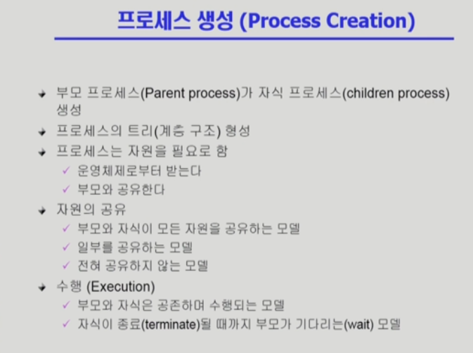
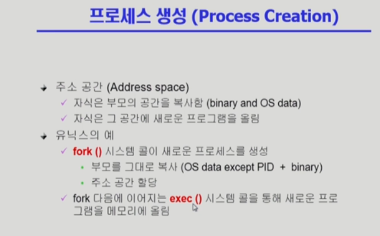
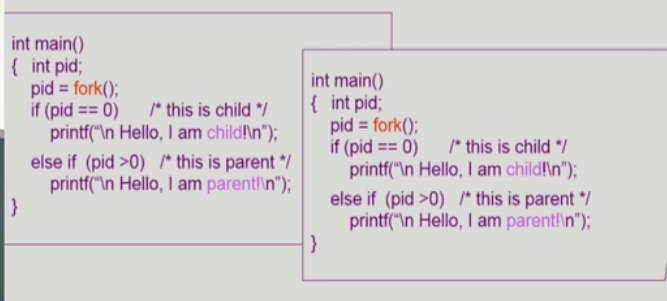

# 04_01_ProcessManagement1

- 복제(fork)와 덮어쓰기인 exec 과정 2개로 나뉜다.

# 04_02_ProcessManagement2

- 자원의 공유
  - 자식 프로세스가 부모의 프로세스를 그대로 복사
  - 이렇다면 결국 메모리 오류
  - 일단 카피하지 않고 공유할 수 있는건 최대한 공유하고(얕은 복사), 변수 값이 달라지면 그제서야 메모리 공간을 일부만 변경
  - 이걸 Copy-on-Write(COW) -> Write가 발생해야(변경점 발생) '필요한 부분만' 카피

- fork 이후로 필요한 내용만 exec.
- ppt 만들 때 템플릿을 복사하고 안에 있는 내용을 변경하는걸 생각하면 된다.

## fork() 시스템 콜 -> 새로운 시스템 프로세스를 만들어라

- 전체 하나가 부모. fork가 시작할 때, 자식 프로세스가 시작.(무한히 fork 되는게 아님)

- 그럼 코드는 자식과 부모를 어떻게 구분하냐? pid -> parent id. 부모 프로세스는 이게 0이다.

## exex() 시스템 콜 -> 프로세스를 새롭게 태어나게 하는 것

- 프로세스 덮어 씌우기.

- exec을 한 번 하면 되돌리수 없다.

> exec이 꼭 fork와 함께 나와야하는건 아니다.

- exec 이후에 나오는 코드는 절대 실행될 수 없다.

- 24
