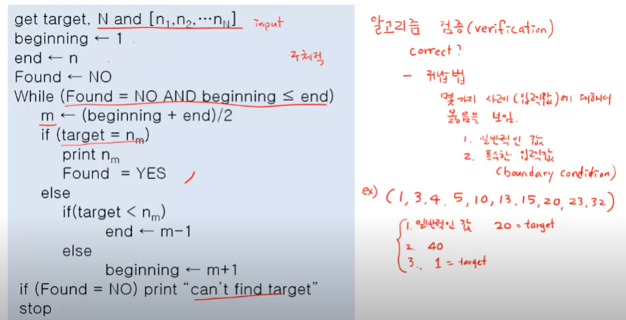

영상: https://www.youtube.com/playlist?list=PLD8rdlfZeJk6evHY9NsnBqXKrreNbTqFv

# 알고리즘
- 문제를 해결하기 위한 절차를 기술한 것.
- 누구나 정해진 절차대로 실행할 수 있어야 한다
- 누구나 동일한 입력값이 주어지면 이 절차대로 실행하면 동일한 출력값을 얻을 수 있어야 한다.
- 일정한 시간 안에 출력값을 구할 수 있어야 한다.
  
### 정리
- 순서대로 정의된 절차
  - 분명한 순서가 있음
  - 한 동작을 실행하면 다음 실행 동작이 무엇인지 분명해야함
- 명확성
  - 모든 동작이 명확하게 정의
  - 모든 동작은 실행 가능해야함
- 반드시 원하는 결과가 나와야 함
마치 요리 레시피 같음

## 알고리즘의 기술 방법

### < 알고리즘 구조 >
1. 순차적 구조- 단계별로 작성
2. 분기 구조 - 조건에 따라 나뉘는 경우
3. 반복 구조
4. 점프 구조

이외의 구조도 존재할 수 있음

### 알고리즘 적기

1. 플로우 차트
2. 프로그램 언어의 코드
   - 특정 프로그램 언어의 문법을 알아야 함
   - 코드 수준으로 자세히 적을 필요는 없다
3. Pseudo(유사)code
   - 프로그램 언어의 코드 전 단계. 프로그램 언어들이 사용하는 구조를 그대로 이용

### 오일러 순환과 해밀턴 순환
-

### 기본 용어
-

### 그래프 채색
-

### 최소신장 트리
-

### 최단경로 알고리즘
-
