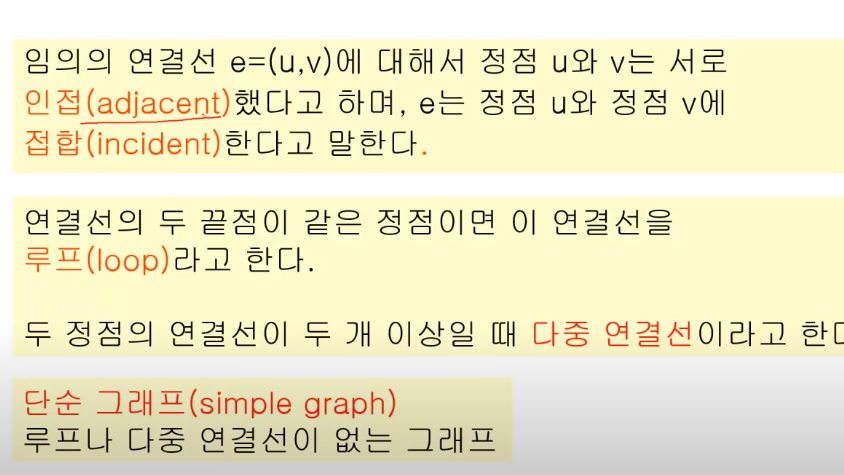
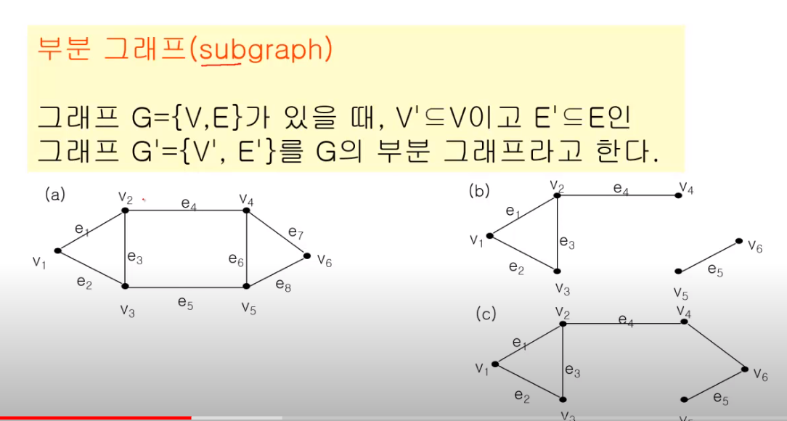
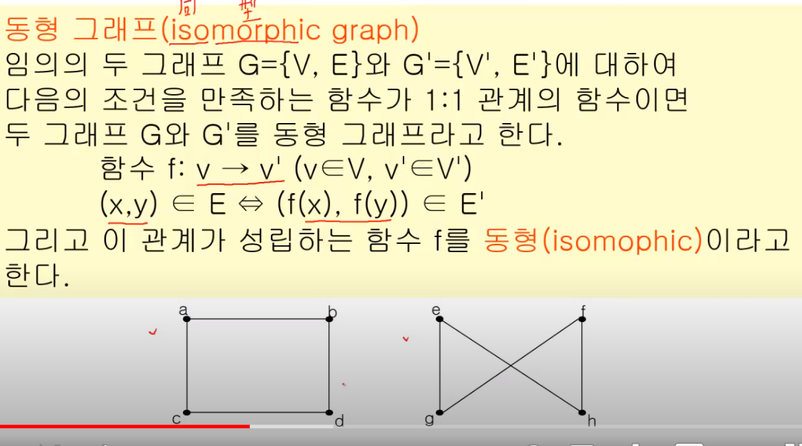
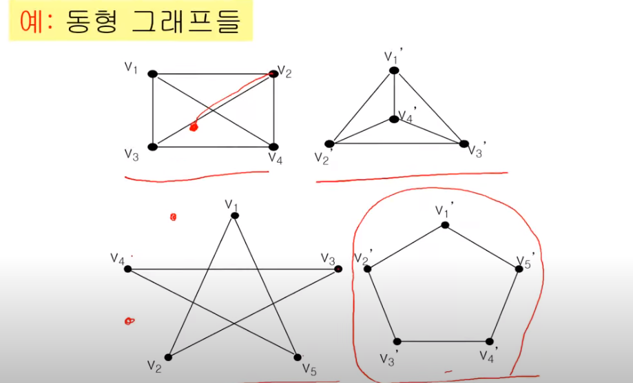
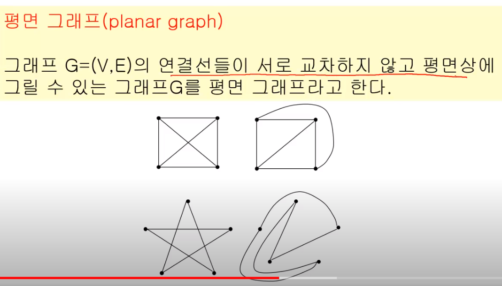
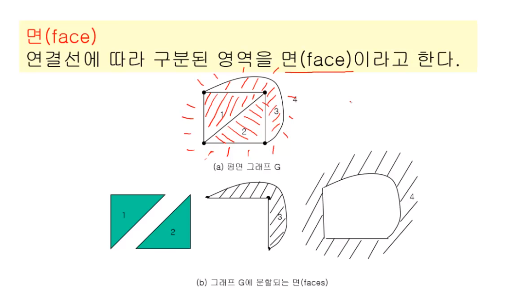
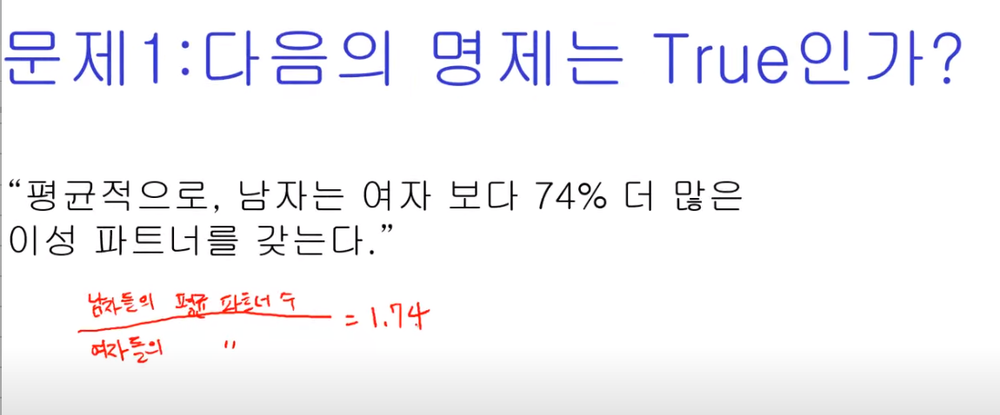
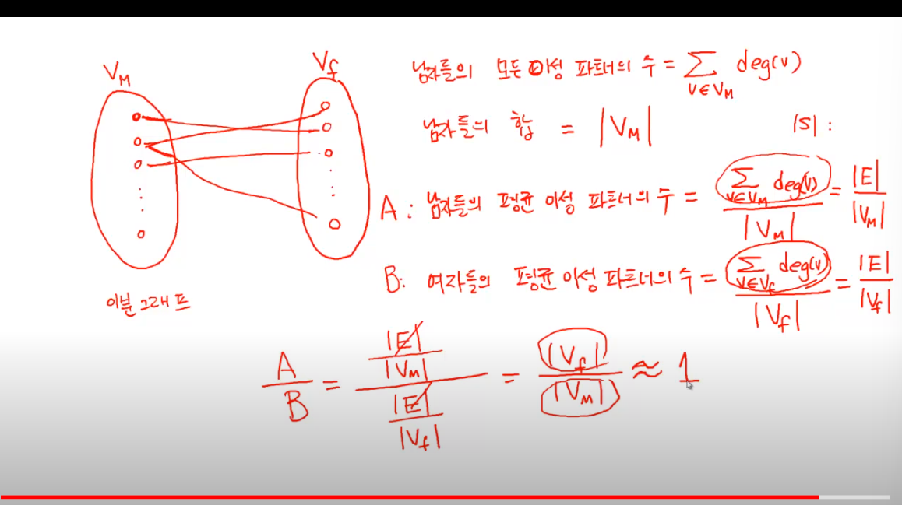

# 그래프 용어와 기본 문제

## 기본 용어

### 그래프

- 단순 그래프: 루프나 다중 연결선이 없는 경우

- 차수 : 루프의 경우는 서로 다른 연결선이라 생각한다
- 하나의 연결선은 2개의 차수를 만든다
    - => 모든 정점의 차수의 합은 모든 연결선 수의 2배이다( 이러니깐 루프를 2개로 계산)
- 모든 정점이 연결되면 '연결 그래프'

< 부분 그래프 >

< 동형 그래프 >

정점을 일대일 대응 시켰을 때, 매핑 정보가 같은 경우

오른쪽 그래프의 꼬인 부분을 펼쳐보면 확인 가능

a-e, b-h, c-g , d-f

> 동형 그래프의 경우, 판단 알고리즘이 매우 어렵다

> shb : 완탐이 아닌 다른 방법이 존재할까?
> 완탐으로 할 경우, 본인의 생각으론 nC2 * n**2이 되는데, 더 줄일 방법은?

< 완전 그래프 >

모든 정점 사이에 연결선이 존재할 때

<이분 그래프>

정점이 2개로 나눠진다. 

> shb 백준에 이분그래프 문제 풀어보면 이해가 쉬움

< 평면 그래프>

연결선들이 *교차하지 않고* 평면상에 그릴 수 있는 그래프

> 회로 그래프에서 서로 교차하면 안되니깐, 이 여부를 판단함

+) 면: 연결선에 따라 구분된 영역

< 방향 그래프 >

보통의 그래프는 양방향 연결로, 비방향 그래프

특정 방향으로만 가능하다면, 방향그래프

## 그래프 문제

이걸 어떻게 그래프로? 이분 그래프

