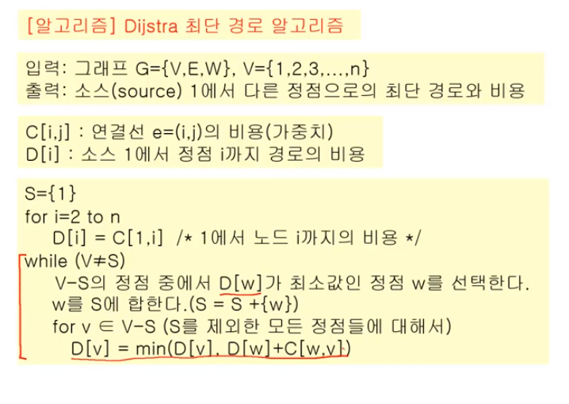
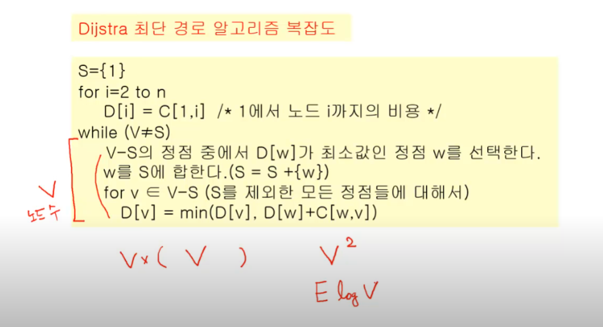

# 최단경로 알고리즘(shoerest path algorithm)

- Dijkstra -> OSPF에서 주로 사용
- Bellman-Ford -> RIP,BGP에서 주로 사용


최단경로 알고리즘은 네트워크 등 현실에서 가장 많이 볼 수 있는 케이스 중 하나다.

3개로 나뉨

- 한 노드 - 한 노드
- 한 노드 - 모든 노드
- 모든 노드 - 모든 노드
각 경우에 따라 다른데, 여기선 일단 '한 노드(소스)-> 모든 노드'


## 다익스트라

- 하나의 소스에서 다른 모든 소스로의 최단경로 알고리즘
- 방향그래프, 비방향 그래프 모두 적용 가능
- *가중치값이 음수가 아니어야 한다.*
- shb : 왜 가중치의 값이 음수가 아니어야 하나?



```py
from heapq import heappush, heappop

INF = int(1e9) # 엄청 큰 수, 얘는 대충 10억 

V,E = map(int,input().split())
start = 0 # 시작 노드 번호

# 인접 리스트

graph = [[] for _ i n range(V)]

# 누적 거리를 저장할 변수
distance = [INF] * V

# 간선 정보 저장
for _ in range(E):
    s,e,w = map(int,input().split())
    graph[s].append([w,e])

def dijkstra(start):
    pq = []

    # 시작점의 weight,node번호 한 번에 저장
    heappush(pq,(0,start)) 

    #**시작 노드 초기화 -> 현재는 INF라 안 하면 더 작은 누적거리가 존재해서 사이클 발생 가능
    distance[start] = 0

    while pq:
        #최단거리 노드에 대한 정보
        dist,now = heappop(pq)

        # pq의 특성 때문에 더 긴 거리가 미리 저장되어 있음.
        # now가 이미 더 짧은 거리로 온 적이 있다면 pass
        if distance[now] < dist:
            continue

        # now에서 인접한 다른 노드 확인
        for to in graph[now]:
            next_dist = to[0]
            next_node = to[1]

            # 누적거리 게산
            new_dist = dist + next_dist # 지금까지 온 거리 + 다음 가중치

            # 이미 더 짧은 거리로 간 경우 pass

            if new_dist >= distance[next_node]:
                continue
            
            # 만약 가장 적은 거리라면 최단 거리로 갱신
            distance[next_node] = new_dist
            heappush(pq,(next_dist,next_node)) # next_node의 인접 노드들을 pq에 추가

# path를 추가하는건 힘들다
# 팁: vst를 append 하는게 아니라 vst를 초기화    
```

### 시간복잡도



최대: 노드수^2 ,  최소: ElogV

