## 오토마타와 언어

유한상태 오토마타는 최종상태에 가는 언어만 인식한다

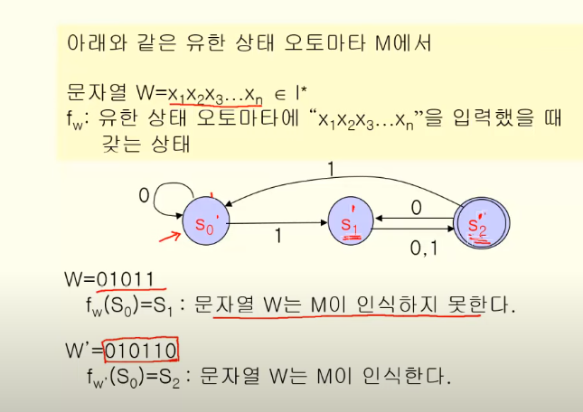

> 유한상태 오토마타 M과 언어 L(M)

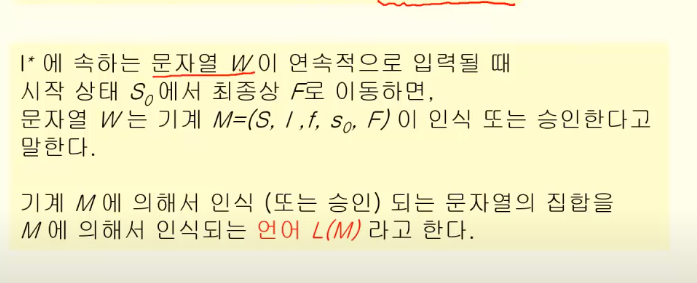

결국 최종 상태로 갈 수 있게 하는 언어의 집합 L(M)

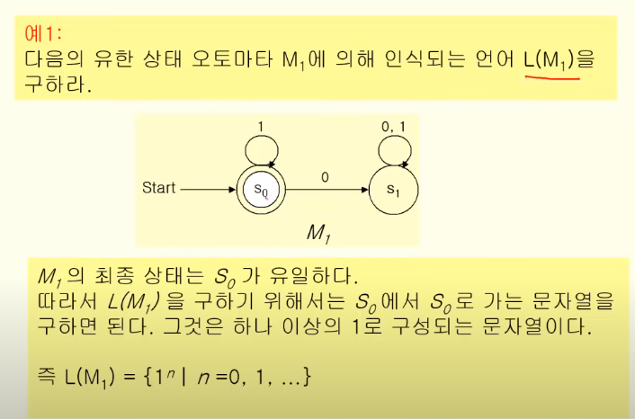

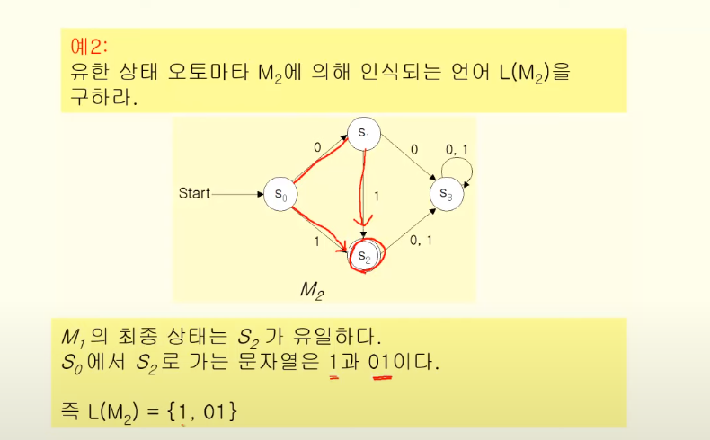 

1+01

### L(M)과 L(G)

언어 L(M)에 대응하는 문법 L(G)를 만들 수 있다.

L(M) == L(G)

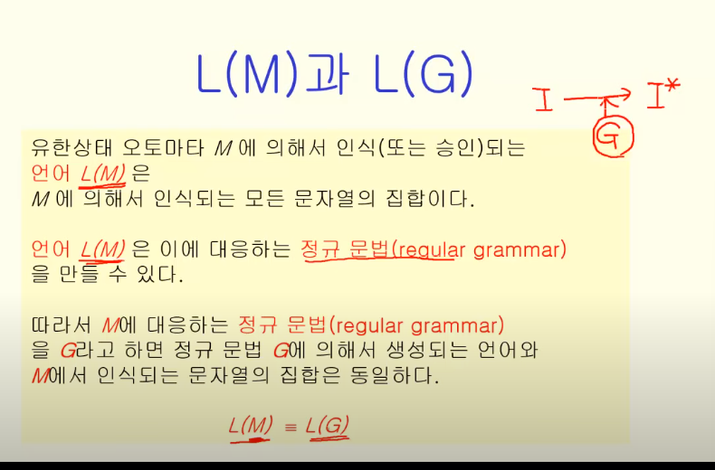

오토마타는 정규 문법이므로, 유형 3에 대응된다

유형2는 Pushdown Automata(PDA)

유형1은 튜링 머신

#### 그럼 이걸 어떻게 만드냐?

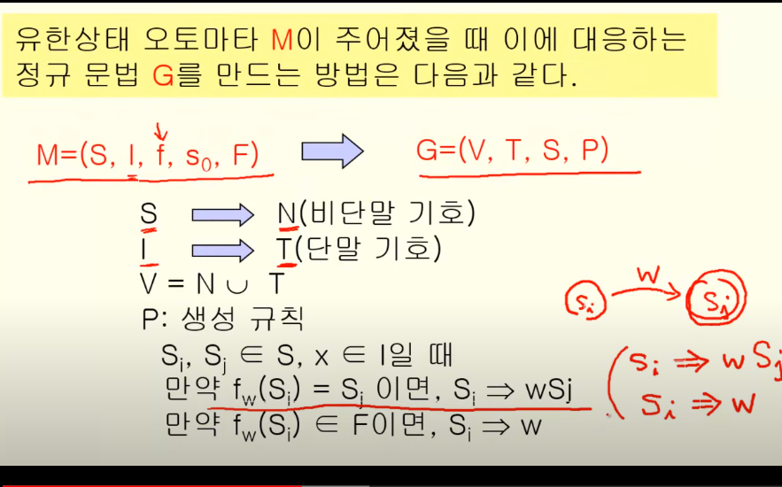

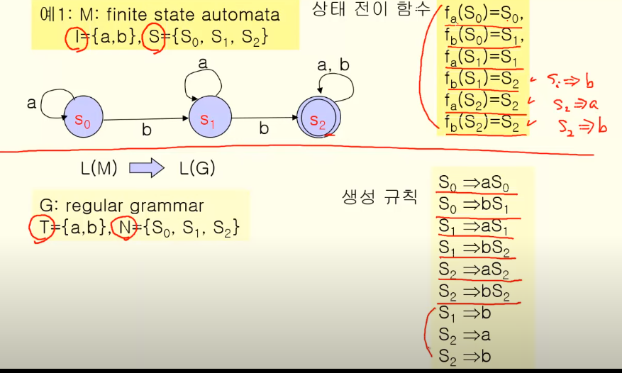

기존에 하는거랑 똑같이 하지만, 최종상태의 경우엔 이에 대한 출력을 추가해준다

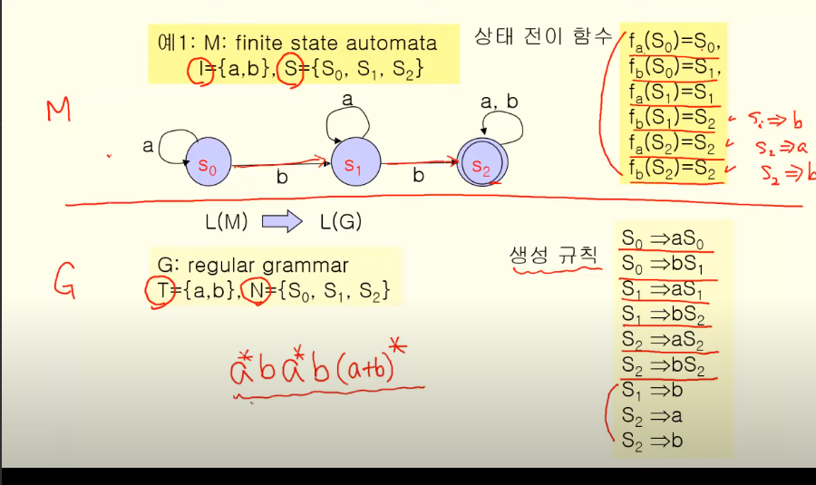

S0, S1, S2 차례대로 다음과 같다.

### 역으로, 언어가 주어졌을 때 이를 읽는 오토마타는 어떻게 설계?

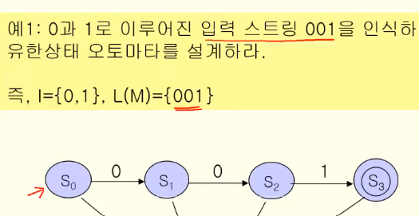

0 0 1 을 인식시키고

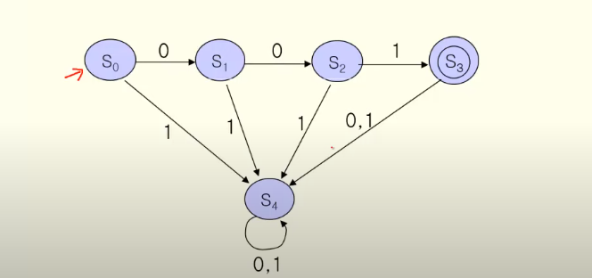

이외엔 꼬아버린다.

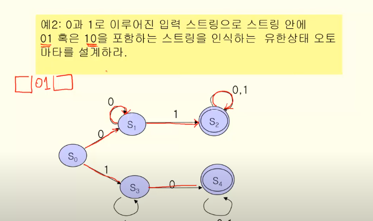

#### 그럼 이렇게 만든 애를 어떻게 최적화?

 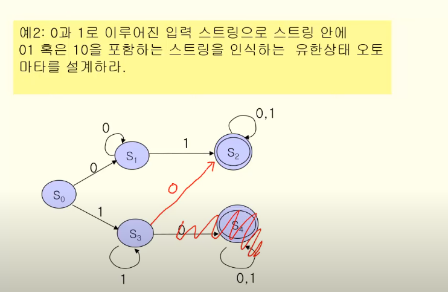

#### 결정 오토마타(DFA) -> 우리가 지금까지 얘기한거

#### 비결정 오토마타(NFA)

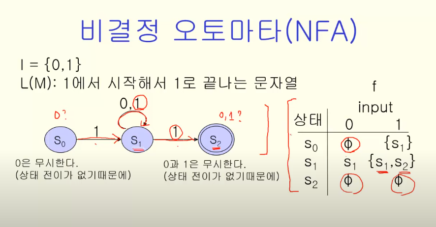

- 결정 오토마타: 입력값에 대해서 전이되는 상태가 정확하게 결정

- 비결정 오토마타: 
    - 입력값에 대해서 상태 전이가 '다수' 존재 가능
    - 입력값에 대해서 상태 전이가 발생하지 않을 수도 있음(이 경우엔 입력 무시)

비결정 오토마타와 결정 오토마타는 서로 대응된다.(바꿀 수 있음)

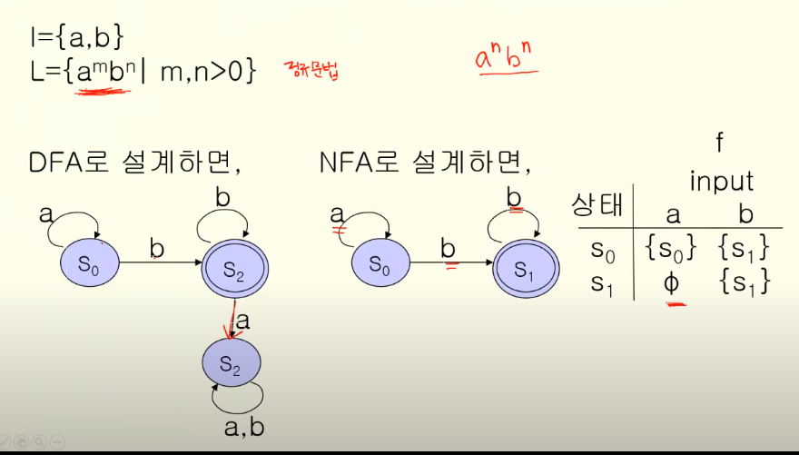

