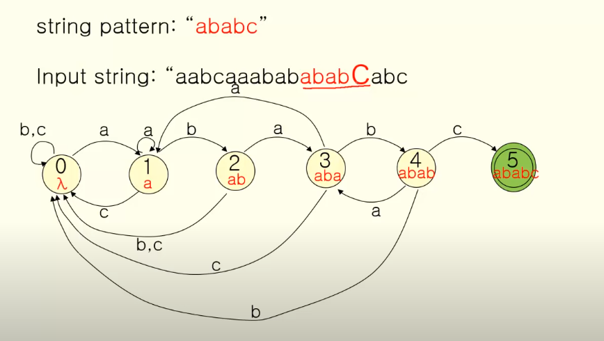
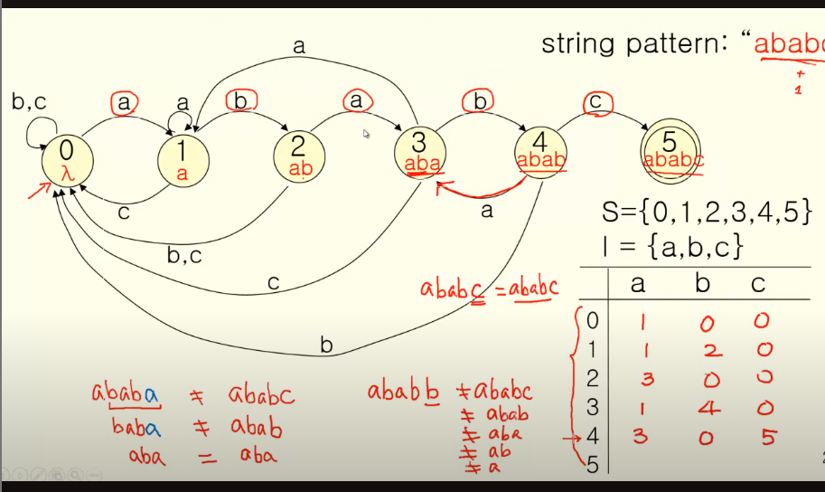
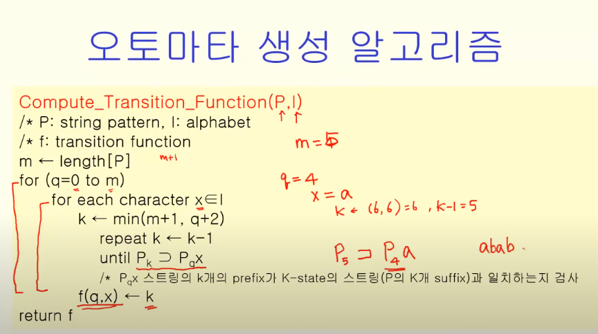

## 스트링 매칭 문제

- 입력된 스트링에서 정해진 패턴 찾기
- 검색, 혹은 파싱에 응용
- 오토마타를 이용한 스트링 매칭 알고리즘
    - 여러가지 스트링 매칭 알고리즘 중 하나
    - 가장 효율적인 알고리즘은 아님

> 그럼 이걸 어떻게 설계하냐?

상태는 패턴 + 1

해당 상태에서 특정 입력값이 나왔을 떄, 원하는 패턴의 어느 단계인지

