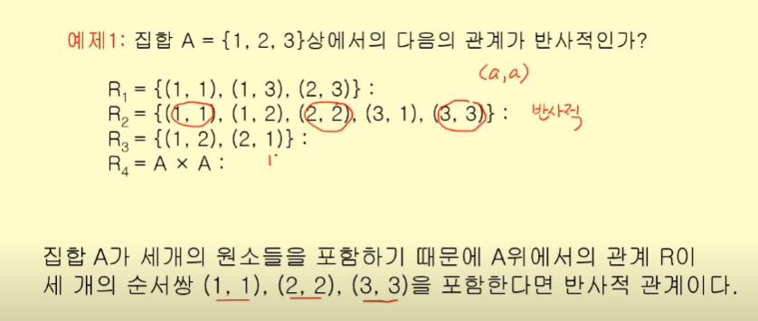
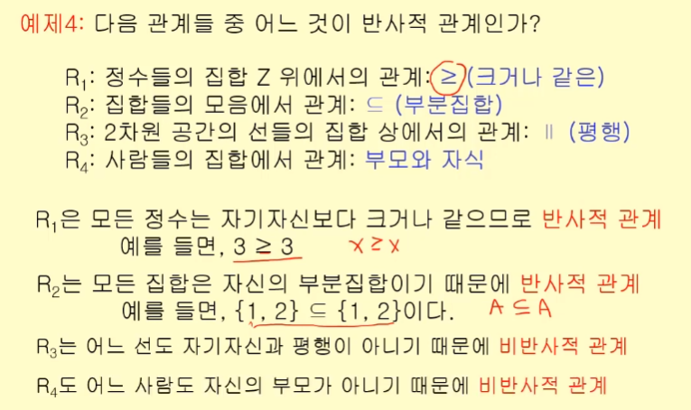
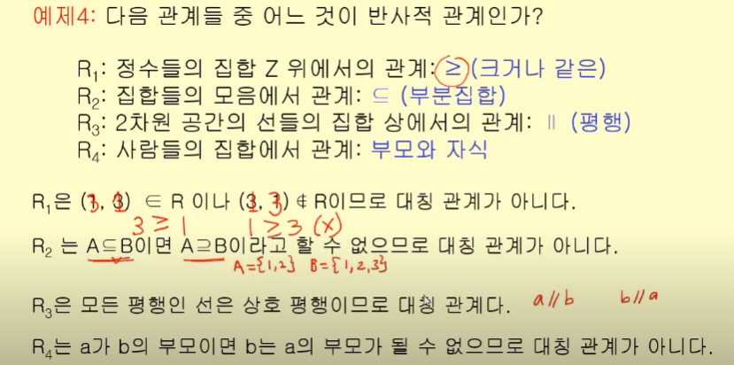
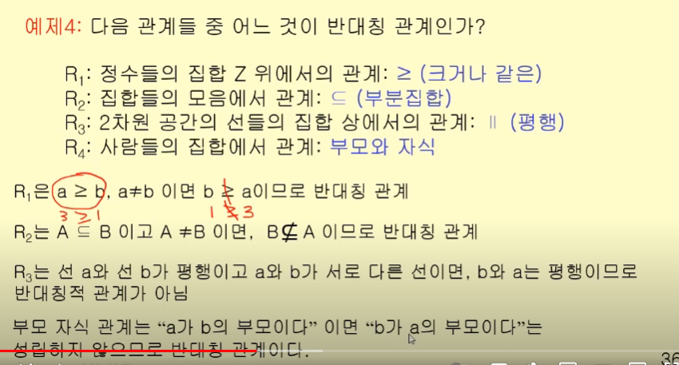
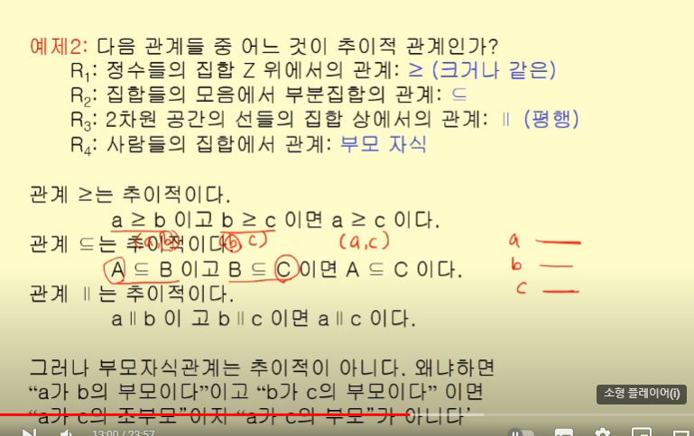
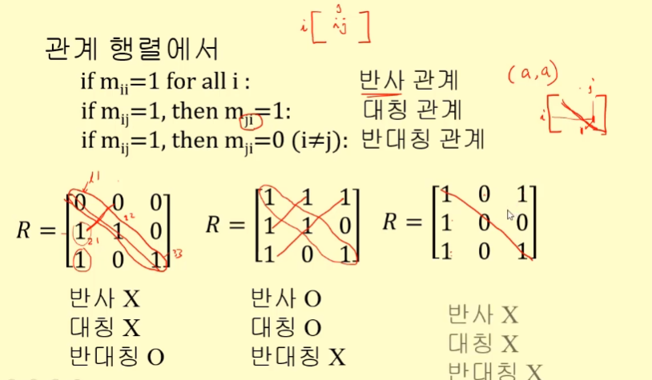
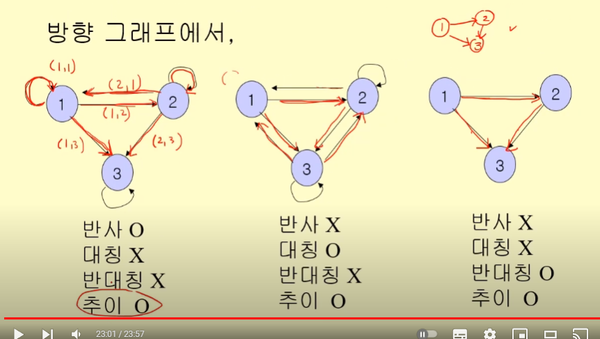

## 관계의 유형

- 반사적 관계
- 대칭적 관계
- 반대칭적 관계
- 추이적 관계

## 반사적 관계

집합 A안의 모든 원소 a에 대해서, (a,a)가 성립한다면 반사적 관계

## 대칭적 관계

집합 A의 모든 원소 a,b에 대해서 관계 (a,b)이면, 이에 대한 역관계도 해당 관계에 속해있는지

(a,b)가 관계 R에 속해있으면, (b,a)도 마찬가지인지

== 부부관계

## 반대칭적 관계

(a,b)가 R에 속한 상태에서, a와 b가 같지 않은 경우 (b,a)가 R에 속하지 않는다면.

## 추이적 관계

(a,b)이고 (b,c)일 때, (a,c)도 가능하다면

> 위의 4개 관계를 행렬로 표현한다면

> 방향 그래프로 표현한다면

