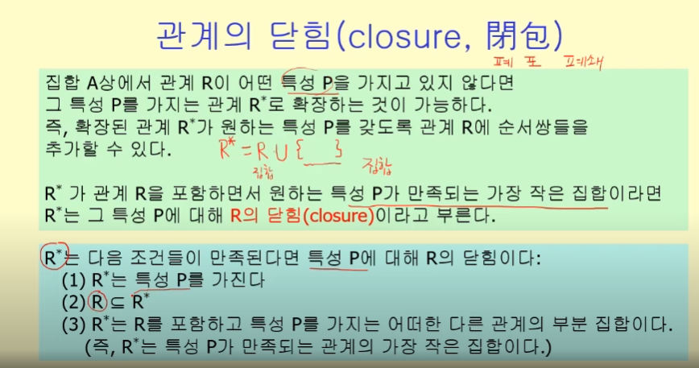
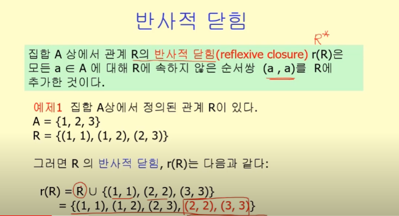
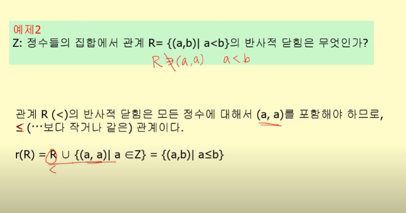
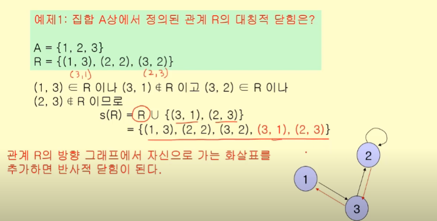
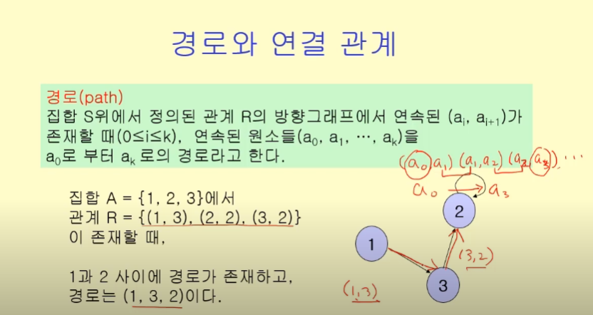
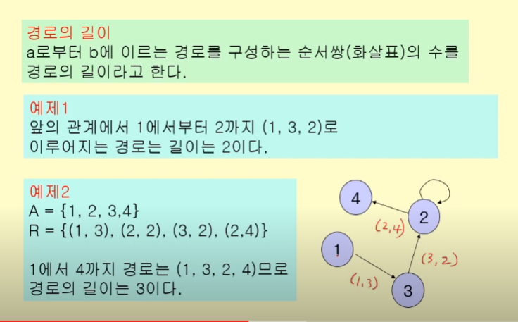
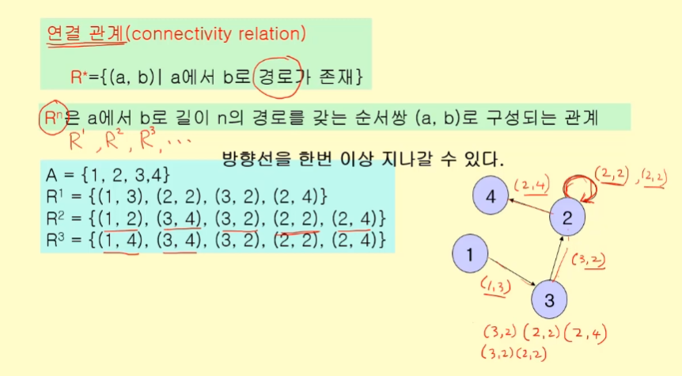

# 관계의 닫힘

- closure == 폐포, 폐쇄

관계 R에서 특성 P(앞에서 배운 4가지 중 하나)를 만들 수 있도록 제작하는 최소한의 순서쌍.

## 반사적 닫힘

## 대칭적 닫힘

### 경로와 연결 관계

- 경로

  - 순서쌍이 서로 연결되는 것
  - (a,b),(b,c),(c,d),(d,e)...

- 경로의 길이
  - 목적지에 도착할 때까지 들리는 순서쌍의 수

## 연결 관계

- 새로운 관계
- a에서 b로의 경로가 존재할 때
- R1은 (a,b)의 경로수가 1일 때, R2는 2개,R3는 3개...

- 주의 : 방향선을 한 번 이상 지나갈 수 있다.

모든 연결이 포함된 연결관계는 R1,R2,R3...들의 합집합이다.

### 추이적 닫힘

연결관계를 만족시키는 닫힘 원소
