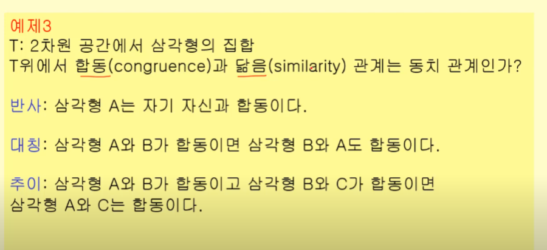
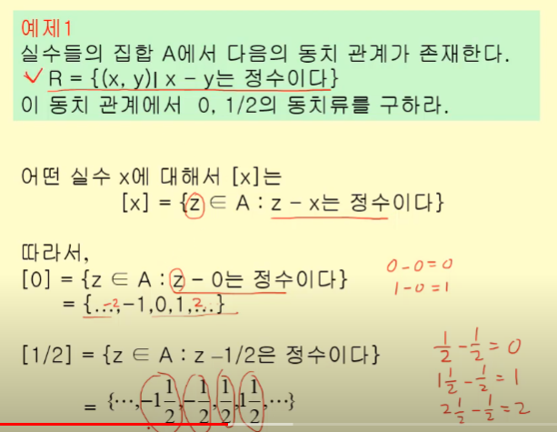

# 동치관계

값이 같은 관계

- 어떤 관계가 반사적, 대칭적, 추이적이면 동치관계
- 가장 대표적으로 equality(=)

## 동치류

- 특정 원소와 동치를 이루는 원소들의 집합
- 대괄호로 표현 [x]

- 본인도 동치류에 속할 수 있다

### 집합의 분할

- 동치류가 갖는 중요한 의미
1) S = A1 U A2 U A3 U ... An = UAi
2) Ai와 Aj는 공통된 원소가 ㅇ벗다

> 같은 집합 Ai 원소들 간의 관계는 동치관계다
> 따라서 동치 관계는 집합 S를 분할한다

#### 모듈러 연산

- 나머지 연산

.... 이해를 잘 못하겠는데요....?
