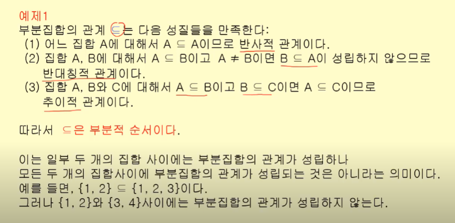
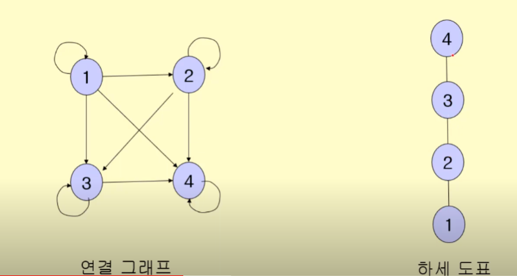
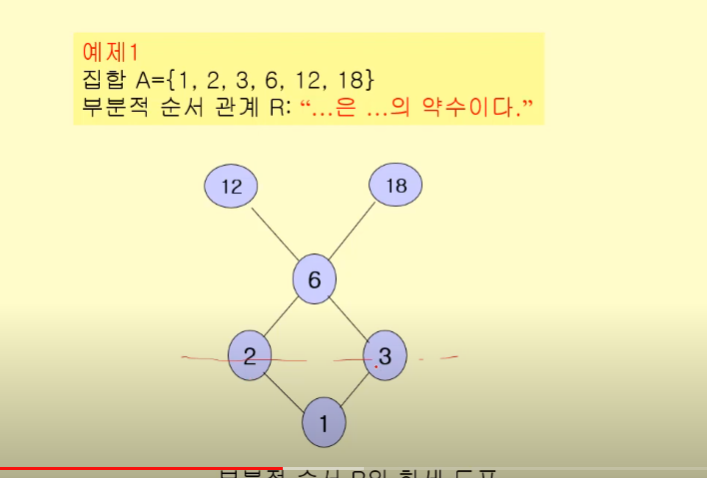
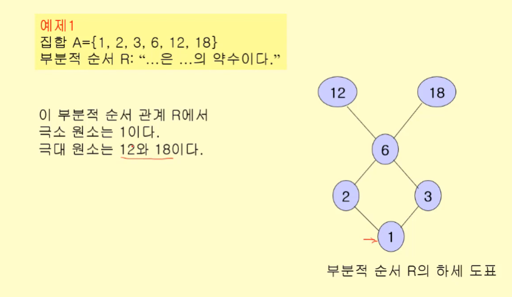
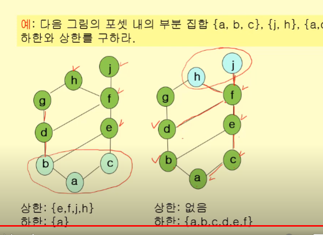
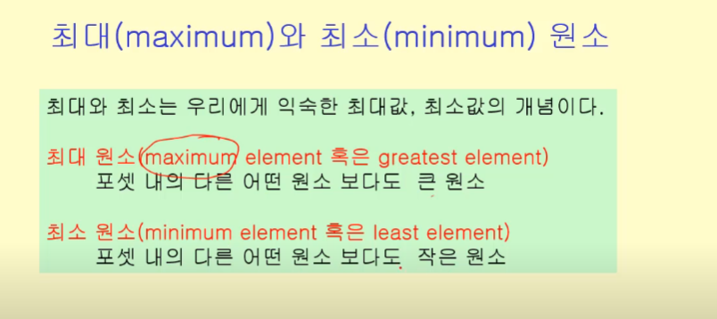

# 부분순서

- 반사적,반대칭적,추이적이면 부분적순서관계
- 부분적 순서의 관계를 갖는 요소들의 집합을 '부분순서집합'(poset)이라고 함
- '부분'? 모든 요소가 순서관계를 갖는게 아니기 때문

## 포셋

- 부분적 순서가 정의되는 원소들의 집합
- 반대칭적이므로 순서가 존재함
  - 선행요소와 후행요소
    - (x,y)에서 x가 선행, y가 후행
- 직전선행요소: (x,z),(z,y)에서 추이적이므로 (x,y)가 성립. 이 때, 이를 만족시키는 z가 없다면 x를 y의 직전선행요소라 함. 일종의 parents

### 하세 도표

- 부분 순서 관계를 방향 그래프로 표현할 때, 모든 연결선 표시 필요 없음
- 직전선행요소와 직전후행요소만 연결선으로 연결
- 직전선행요소를 아래에 그림

> shb: 일종의 트리처럼 표현

# 전체순서
- 모든 요소들간에 순서관계가 성립할 때
- 실수간의 <=가 대표적인 전체순서관계
- 알파벳 순서도 마찬가지

### 극대 원소와 극소 원소

a-> b

- a의 후행요소가 더이상 존재하지 않을 때 '극대'(리프)
- b의 선행요소가 더 이상 존재하지 않을 떄 '극소'(루트)
- 한 집합 A에서 극대 극소는 여러개가 존재할 수 있다.

### 상한과 하한

- 상한 : 포셋 내 부분 집합의 어떤 원소보다 큰 원소
- 하한 : 반대 개념

### 최소상한, 최대하한

- 상한 중 최소값과 하한 중 최대값

### 최대와 최소 원소

