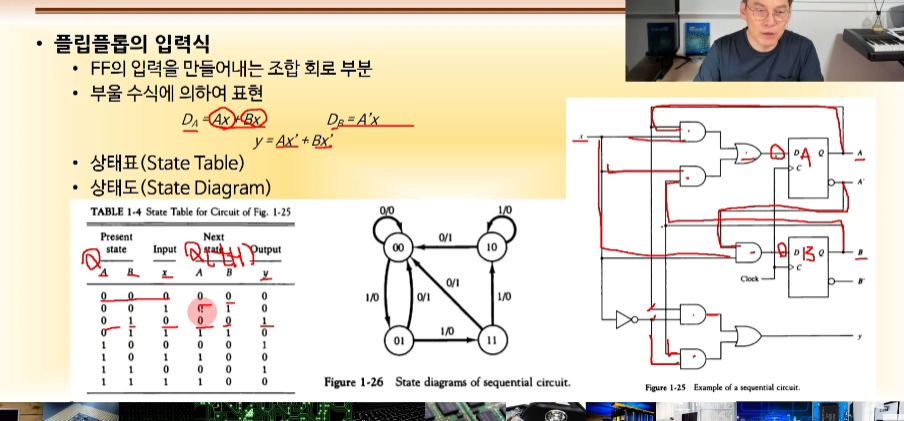

영상: [CSA2021 컴퓨터시스템구조](https://www.youtube.com/playlist?list=PLc8fQ-m7b1hCHTT7VH2oo0Ng7Et096dYc)

## 강의 소개

-

## [제 1장 Part-1](https://www.youtube.com/watch?v=SG89LOgT7Vc&list=PLc8fQ-m7b1hCHTT7VH2oo0Ng7Et096dYc&index=2)

### 디지털 컴퓨터(Digitial Computer)

- 정의
  - 이진 시스템을 사용하여 계산을 수행하는 디지털 시스템
- 컴퓨터 하드웨어
  - CPU : 중앙처리 장치, **컴퓨터 그 자체**로 정의. 산술 논리 처리와 데이터의 저장, 제어 기능 수행
  - 주변장치: 메모리, 저장장치, 입출력장치
- 컴퓨터 소프트웨어
  - 운영체제 : OS
  - 시스템 프로그램
    - 유틸리티, 데이터베이스, Editor
    - OS에 포함되거나 연결되어 시스템 운영을 보조
- 응용프로그램

### 논리 게이트(Logic Gates)

- 이진 정보의 표시
  - 0과 1의 전압 신호
  - 0V - 5V 시스템
  - 0.5V - 3V 시스템
- 논리게이트
  - 기본게이트
  - 진리표로 동작 정의

### [부울 대수(Boolean Algebra)](/이산-수학/명제,추론,귀납,부울대수/부울-대수.md)

- 이진 변수와 논리 동작을 취급하는 대수
- 우리가 공부한 부울대수 내용 생각
- 여기에 논리회로를 섞을 수 있다.

### 맵의 간소화 (Karnaugh Map)

- [4강 동치 관계](/이산-수학/이산수학-기초/동치-관계.md)

> 부울대수화 하면 이런 식으로 간소화 하는데 훨씬 편하다.(카르노맵)

## [제 1장 Part-2](https://www.youtube.com/watch?v=gn5z3Un_qqM&list=PLc8fQ-m7b1hCHTT7VH2oo0Ng7Et096dYc&index=3)

### 조합회로 (Combinational Circuit)

- 입력과 출력을 가진 논리 게이트의 집합
- 출력의 값은 입력의 0,1 조합에 의하여 결정되는 함수의 결과로 표시
- 입력이 n개의 조합이라면, 출력은 2^n개 (0,1씩 있으니깐)

< 조합회로의 예시 >

### 플립플롭 (Flip-Flop)

- 1 비트의 디지털 정보를 저장하는 이진 셀(디지털 메모리)
- 동기식 순차회로의 기본 요소
- 입력의 상태가 변화하기 전까진 이전 출력 상태 유지

- 플립 플롭의 종류
  - SR
  - D
  - JK
  - T

플립 플랍의 동작 원리 정도만 알고 있으면 된다.

> 주의 : 상향, 하향은 clock C에 대한 것/ 타임은 입력 D에 대한 것

### 순차회로 (Sequential Circuit)

- 플립플롭과 게이트(또는 조합회로)를 서로 연결한 회로
- 클럭 펄스에 의하여 동기화된 입력 순차에 의하여 제어
- 출력은 외부 입력과 플립 플롭의 현 상태의 함수로 표시
- 출력값이 다시 입력값으로 들어간다

< 순차 회로의 설계 >

