## [제 2장 Part-1](https://www.youtube.com/watch?v=aj74NlGUAk4&list=PLc8fQ-m7b1hCHTT7VH2oo0Ng7Et096dYc&index=4)

### 집적회로 (Integrated Circuits)

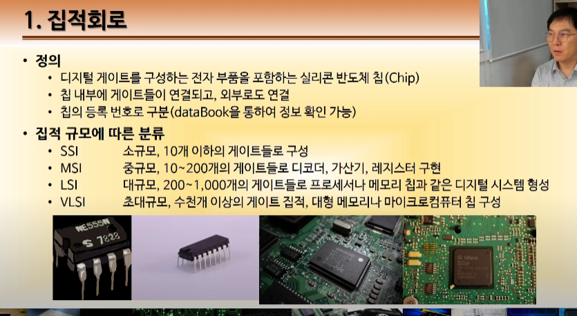

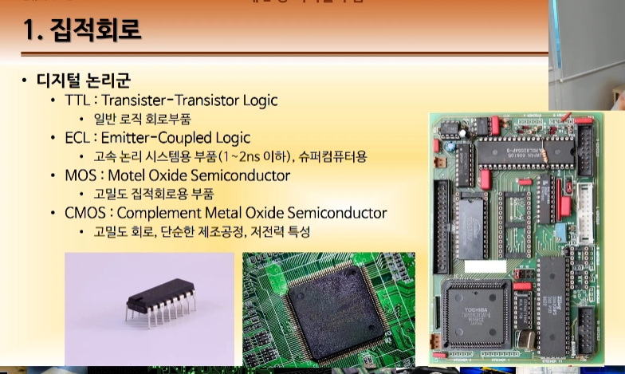

- 칩으로 이루어진 전자회로
- 칩: 논리 회로의 집합
- IC 칩의 구분은 특정 정렬 번호로 확인 가능(너무 수가 많다)
- 회로가 얼마나 많냐(집적도, 집적 규모)에 따라 4가지로 나누기도 함
- 또한, 어떤 논리구조가 들어가냐에 따라(디지털 논리군) 4가지로 나누기도 함

### 디코더 (Decoders)

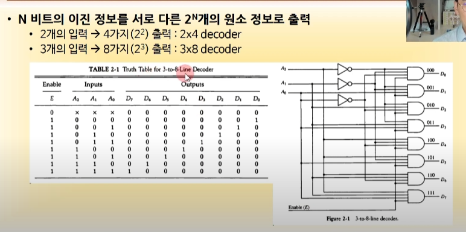

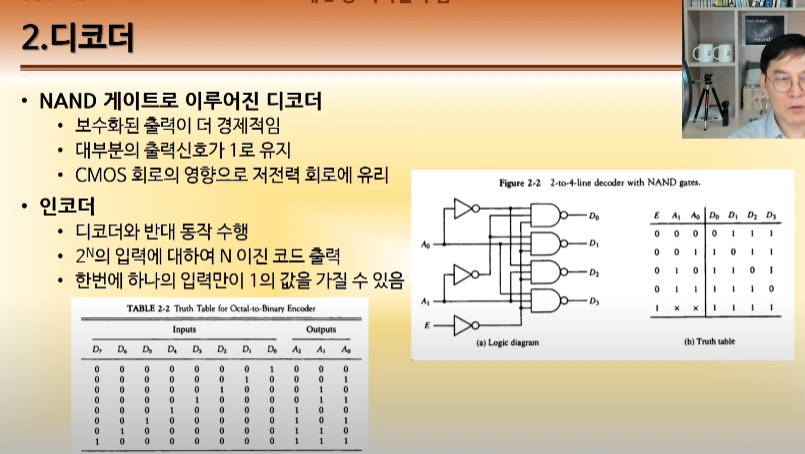

- N개의 입력에 따른 출력 결과 2^N개를 따로 보여주는거
- 언제 사용됨? 여러개의 회로 구성 요소 중에서 딱 하나만 킨다던가 하는 경우
- 사실 NAND 게이트를 이용해서 만드는게 훨씬 경제적임 why? CMOS 회로의 영향

#### 인코더

- 디코더의 반대 동작
- 디코더가 결과를 _풀어서_ 표현했다면, 얘는 오히려 묶어서 표현=> 이진코드 출력

> 주의!

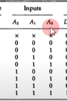

> 인풋이 101이면 A0 A1 A2 순서가 아니라 반대 순서

입력 순서는 높은 비트가 먼저!

why? 그냥 규칙임. 의미는 없음

### 멀티플렉서 (Multiplexers)

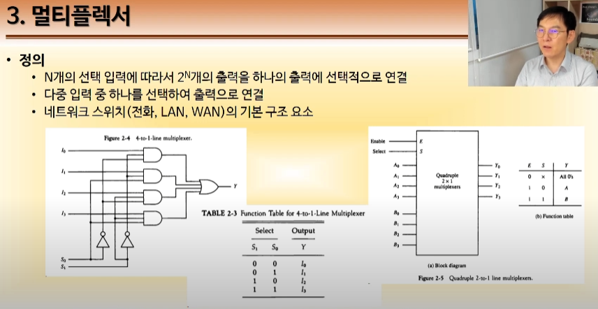

- 디코더와 완전히 반대라고 생각
- shb) 그럼 인코더와 뭐가 다름?
- N개의 입력 중 하나만 골라서 그에 대한 출력만 내보낸다.
- 이를 위해서 Selector가 존재(S0.S1,S2) -> 입력 갯수만큼 존재
- 특정 입력에 대해서 필터링을 한다.
- 마치 여러개의 전화기 중 하나를 골라서 다른 하나의 연결한다고 생각

### 레지스터 (Registers)

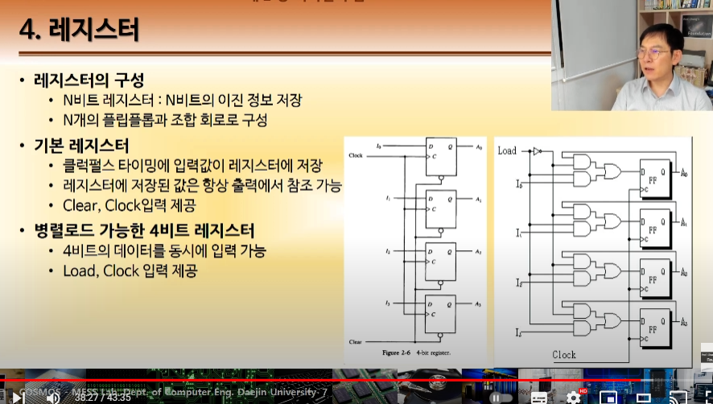

- N비트의 데이터를 가져다가 저장

## [제 2장 Part-2](https://www.youtube.com/watch?v=7VPjQMeiHg0&list=PLc8fQ-m7b1hCHTT7VH2oo0Ng7Et096dYc&index=5)

### 시프트 레지스터 (Shift Registers)

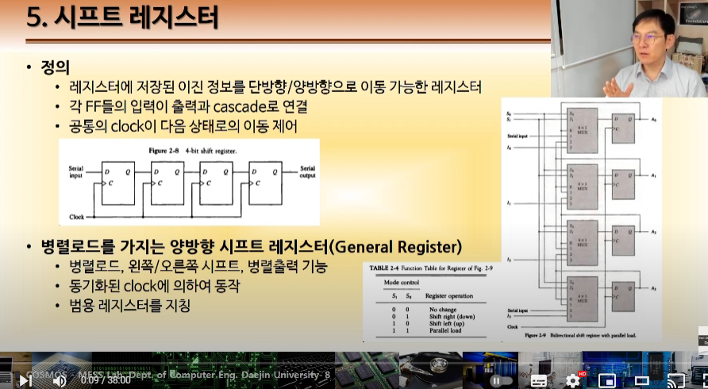

- 레지스터에 클럭이 들어왔을 떄, 단방향/양방향으로 정보를 이동시킴
- 양방향 레지스터가 디폴트. 그냥 레지스터라고 하면...

### 이진 카운터 (Binary Counters)

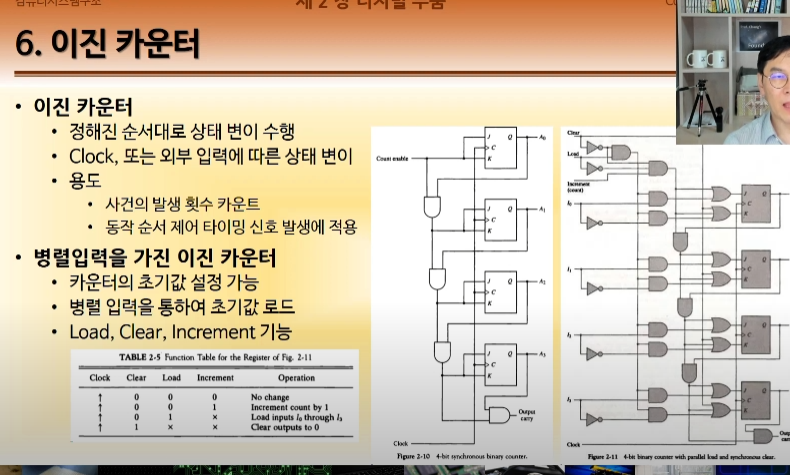

- 레지스터의 일종
- 외부 입력에 대한 상태 변이 수행

### 메모리 장치 (Memory Unit)`

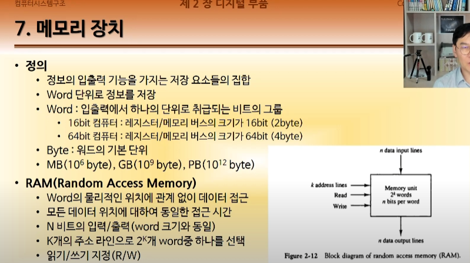

- 메모리의 종류는 생각보다 굉장히 많음
- 레지스터도 비트의 단위
- 정보의 입출력 기능을 가지는 저장 요소들의 집합
- Word단위(입 출력에서 한 번에 들어가는 비트 수)

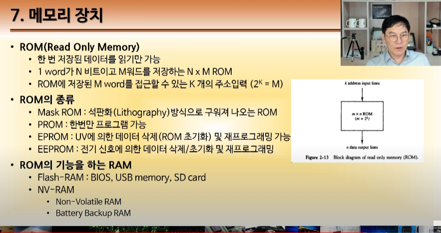

24
