## [제 3장 Part-1](https://www.youtube.com/watch?v=aSocCv3SC2k&list=PLc8fQ-m7b1hCHTT7VH2oo0Ng7Et096dYc&index=6)

> 우리 눈에 보이는 데이터가 컴퓨터에선 어떻게 저장될까?

### 데이터의 종류 (Data Types)

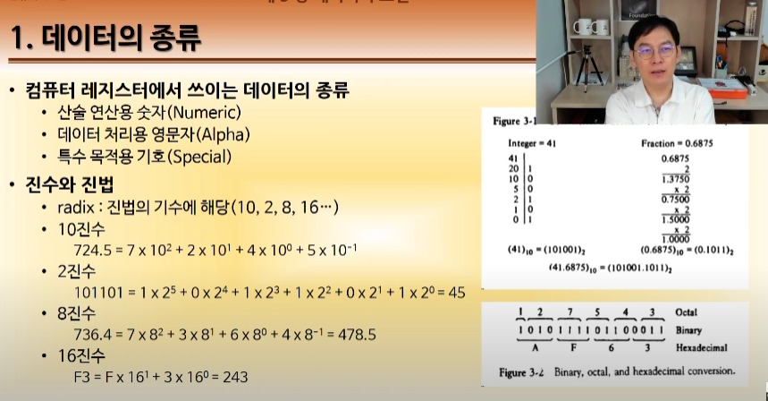

- 크게 3가지. 숫자, 영문자, 특수문자
- 컴퓨터는 결국 산술계산을 위해 만들어진 기계
- 진법의 경우. 10 2 8 16 등 -> 이 진법의 기수를 radix라고 함
- n진화 m 진수 -> n진수로 표현된 m진수
- 영숫자 -> 영어와 숫자의 합, 영문자도 아스키코드(아메리칸 스탠디드 코드) 등을 통해서 숫자로 표현할 수 있다 -> 결국 아스키코드를 외우면 이진법도 글로 읽을 수 있다.

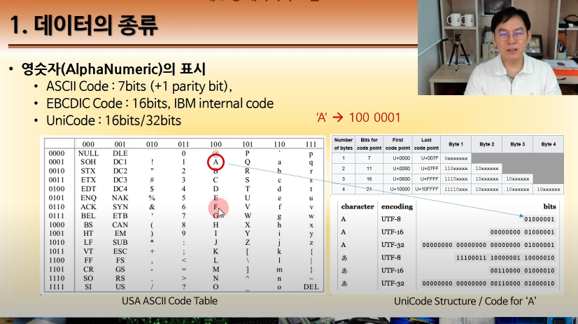

시작값을 외워두면 외우기 편하다.

- 특수한 데이터 유형 -> 모스 부호, 깃발 부호

### 보수 (Complements)

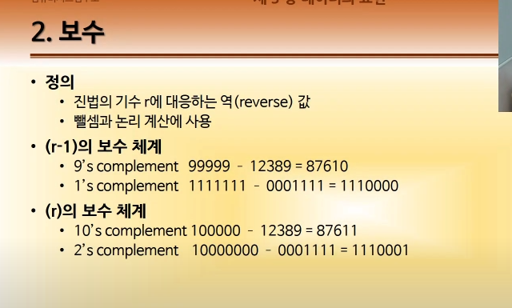

- 보충하는 수
- 진법의 기수 r에 대한 역값 -> 반대값
- 두 가지 체계가 있다. (r-1)체계(해당 진법에서 최대값), (r)체계(최대값 +1)
- 뺼셈과 논리 계산에 사용

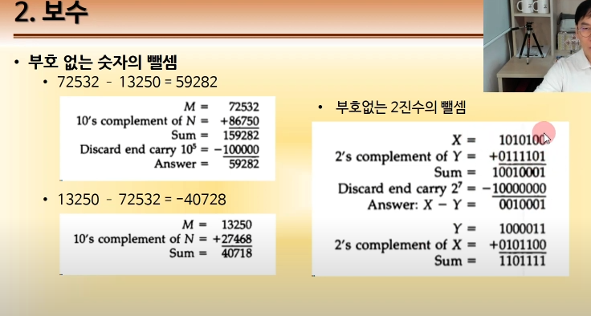

- 왜 쓰냐? 사실 컴퓨터는 빼기를 하지 않는다.
  - 모든 연산은 덧셈으로 한다. 보수 연산을 통해 뺄셈을 구현

## [제 3장 Part-2](https://www.youtube.com/watch?v=bysGzutpRgc&list=PLc8fQ-m7b1hCHTT7VH2oo0Ng7Et096dYc&index=7)

> 여기서부턴 실제로 데이터를 어떻게 표현하느냐의 문제

### 고정 소수점 표현 (Fixed Point Representation)

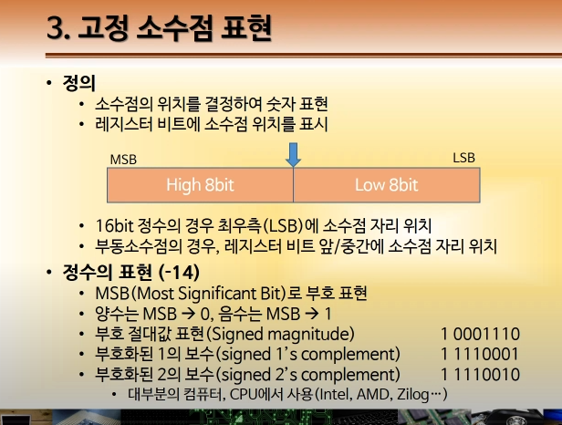

- 부호는 맨 앞 값으로 표현
- 대부분 정수를 표현할 때 부호 + 1의 보수로 표현한다.

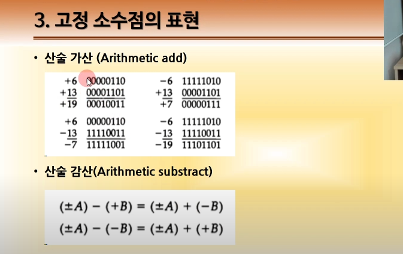

- 결국 모두 더하기로 표현한다는 점을 확인

#### 문제점

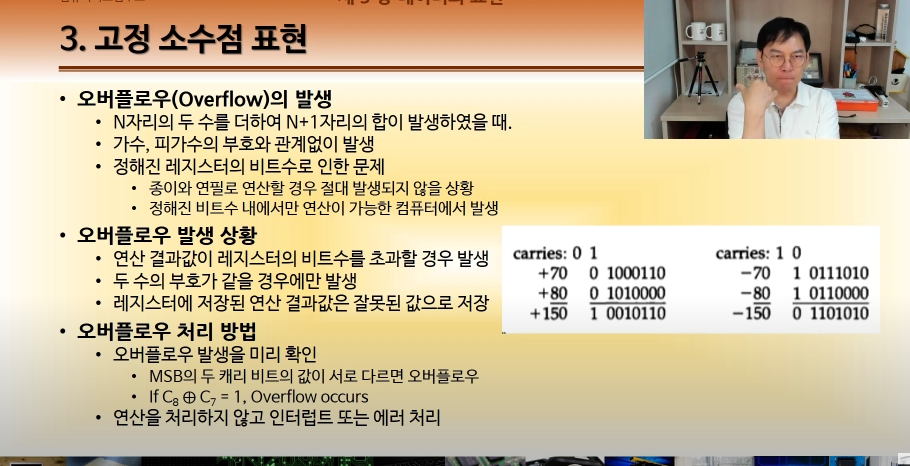

- 오버플로우 : 자리수 늘어나서 저장할 공간이 없는거 (레지스터의 사전 선언의 문제) - 고정 소수점은 자리가 고정되어 있으니깐

### 부동 소수점 표현 (Floating Point Representation)

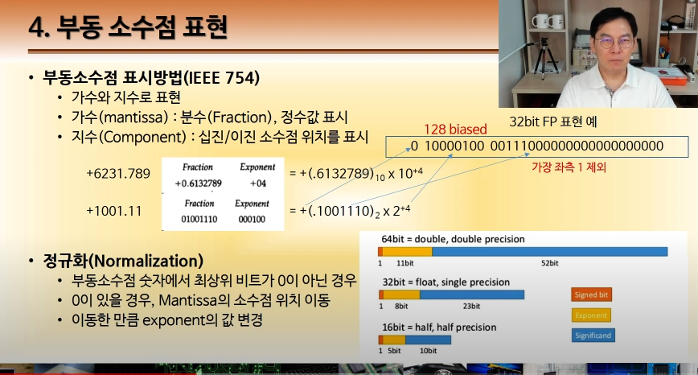

- 소수점 뒷자리 첫번째는 무조건 1이기 때문에 그냥 뺴고 넣는다 -> 1바이트만큼 정밀도가 높아진다(하나 더 표현할 수 있기 때문에)

### 기타 이진 코드 (Other Binary Codes)

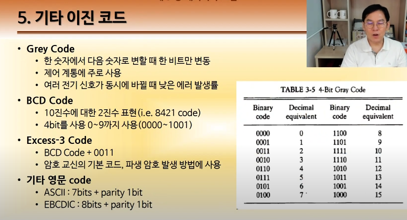

- 이외에도 데이터를 표현하는 여러개의 코드가 존재
- 그림은 그레이 코드
  - 비트의 '변동'에 집중 -> 여러 전기 신호가 동시에 바뀔 때 에러 발생률이 낮다.

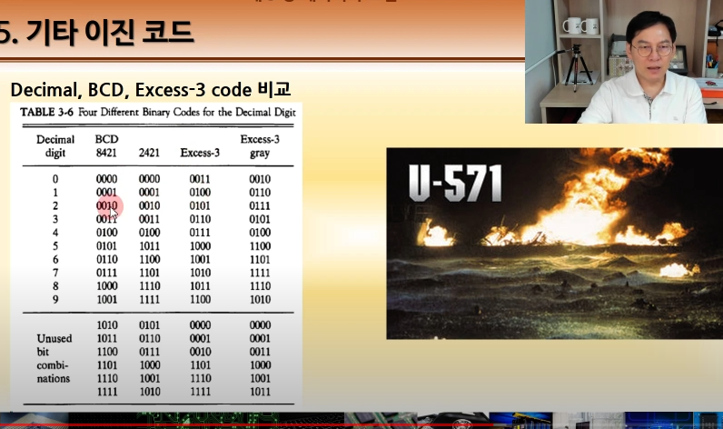

- excess-3는 일반 이진법 코드에 3을 더한거. -> 암호화
  - 암호 교신의 기본 코드, 이에 대한 파생 암호 발생 방법에 사용함
  - 최근까지는 이게 기본이었음
  - 에니그마가 가장 대표적인 암호화 기계

### 에러 검출 코드 (Error Detection Codes)

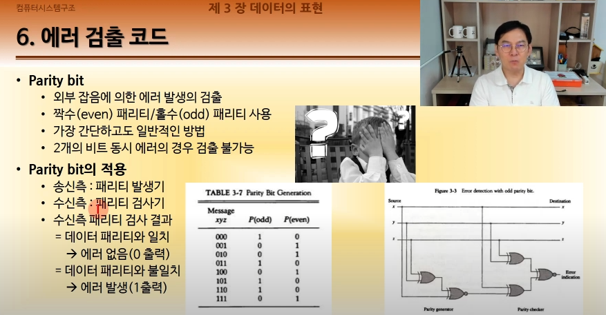

- 데이터의 에러 발생 여부를 확인해야함
- 1의 갯수에 따라 P(odd) P(even)이 나뉨
- 데이터 전체를 확인하는건 힘드니깐 1의 갯수를 기준으로 생각함.
- 만약 1의 갯수가 다르다면 애초에 다른 데이터이므로 에러가 발생했다는 얘기
