## [제 4장 Part-1](https://www.youtube.com/watch?v=LDjco5XJH1E&list=PLc8fQ-m7b1hCHTT7VH2oo0Ng7Et096dYc&index=8)

> CPU의 한 레지스터에서 다른 레지스터로 데이터를 옮길 떄 발생하는걸 공부

### 레지스터 전송 언어 (Register Transfer Language)

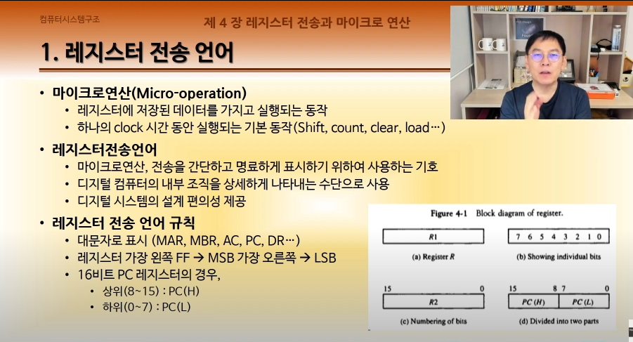

- 마이크로 연산
  - 하나의 레지스터에서 다른 레지스터로 움직이는 기본 연산
  - 기호로 표시하는게 중요
  - 규칙이 중요
  - 1 모든 레지스터는 대문자로 표시해야 함
  - 2 가장 왼쪽에 있는 플립플롭이 갖는 비트값(MSB)와 가장 오른쪽(LSB)

### 레지스터 전송 (Register Transfer)

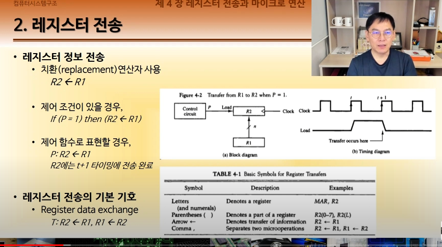

- P가 True면 : 전, False면 후를 실행하라는 C언어 표현
- 전송에 대한 시간 지연도 잘 생각해라

### 버스와 메모리 전송 (Bus and Memory Transfers)

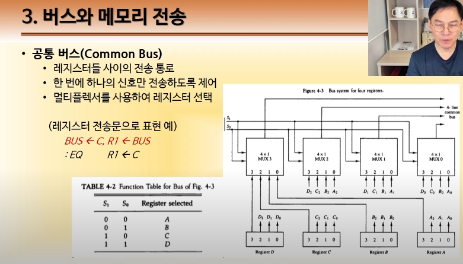

- 데이터를 주고 받는 통로
- 버스는 동시에 한 디바이스만 사용할 수 있어야 한다 -> 이걸 정리하는게 멀티플렉서

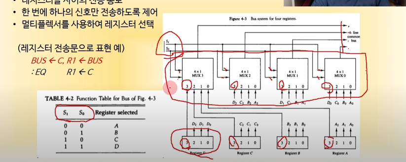

- 가운데에 있는 것들이 버스 제어기.

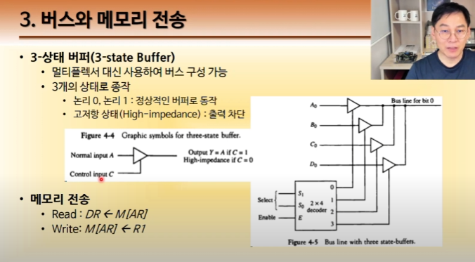

- 레지스터 동작에서 훨씬 간단함

## [제 4장 Part-2](https://www.youtube.com/watch?v=IUapFpDKhKI&list=PLc8fQ-m7b1hCHTT7VH2oo0Ng7Et096dYc&index=9)

### 산술 마이크로 연산 (Arithmetic Micro-operations)

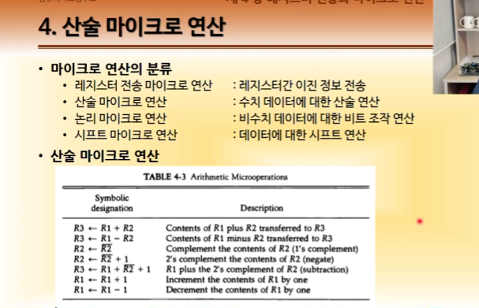

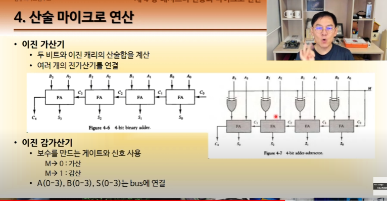

- 컴퓨터가 할 수 있는 연산은 덧셈말고는 없다
- 감가산기에서 빼기를 하려 한다면 결국 보수를 이용해서 더하는 것

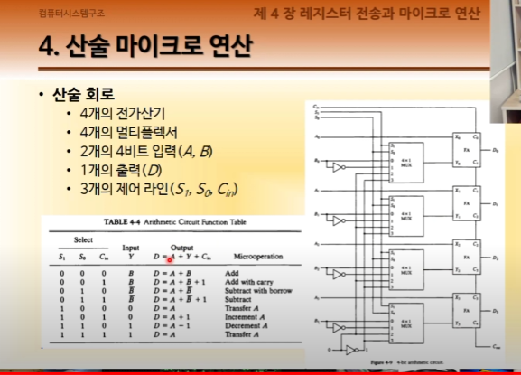

-

### 논리 마이크로 연산 (Logic Micro-operations)

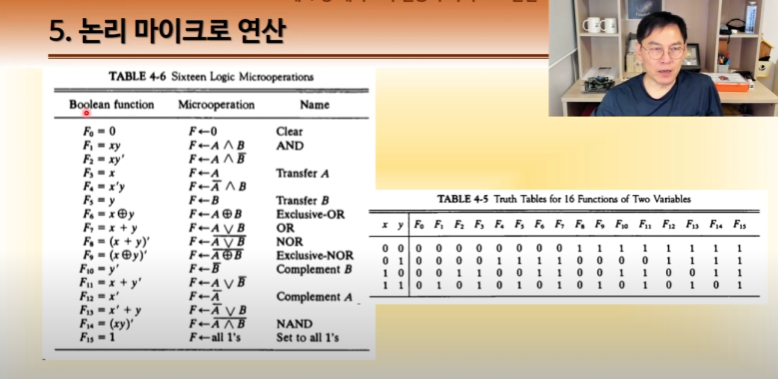

- 산술 연산과 마찬가지로 논리 연산 또한 가능
- 부울 대수로 표현된 부울 함수로 확인
- 오른쪽 테이블을 굳이 외우려 할 필요 없음. 그냥 수식에다가 하나씩 넣어보면 된다.

> 실제로 하드로 구현하려면?

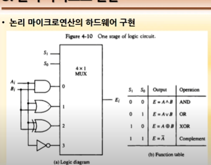

- 생각보다 훨씬 간단함
- 딱 4개의 논리 연산만 들어가면 된다.
- AND OR XOR NOT

### 시프트 마이크로 연산 (Shift Micro-operations) : 비트를 옮기는거

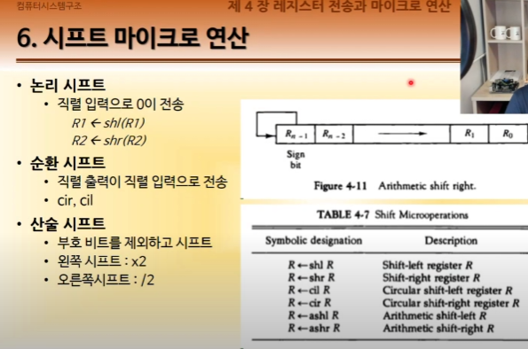

- 논리 시프트
- 비트를 계속 옮기다 보면 맨 끝쪽은 한 비트가 비게 된다. 이 빈 공간엔 0이 들어간다.
- 순환 시프트
  - 끝점에 있는 비트가 빈 자리로 들어가는거 (순환 힙 생각)
- 산술 시프트
  - 산술 -> 숫자
  - 이 때 존재하는 부호를 제외하고 시프트 한다
  - 왼쪽으로 옮길 때는 \*2 , 오른쪽으로 옮길 때는 /2
  - 이건 이진법 자릿수 옮기는걸 생각

> 하드웨어 구현

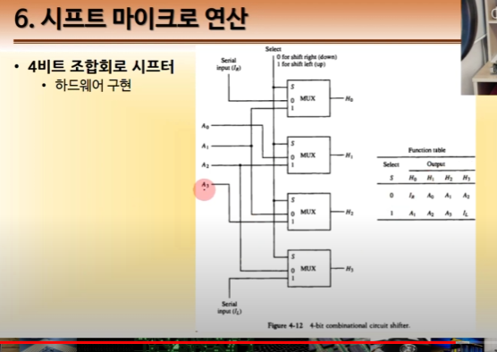

### 산술 논리 시프트 장치 (Arthmetic-Logic Shift Unit)

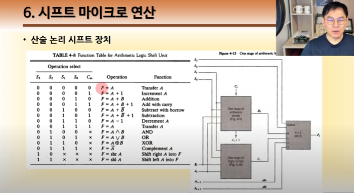

- 산술연산, 논리연산, 시프트연산을 다 합쳐서 쓸 수 있는거
